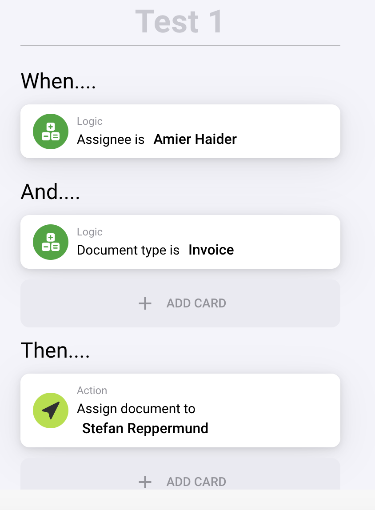
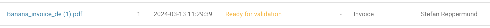
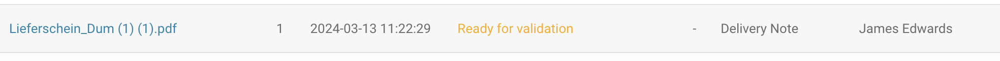
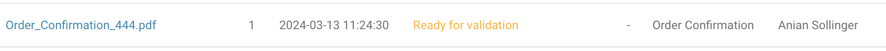
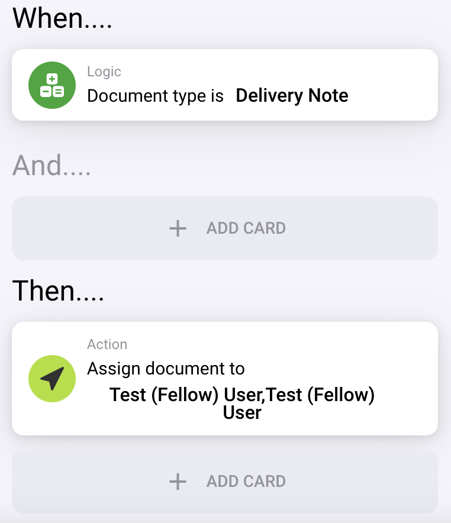
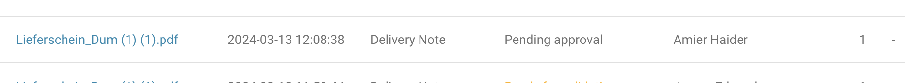
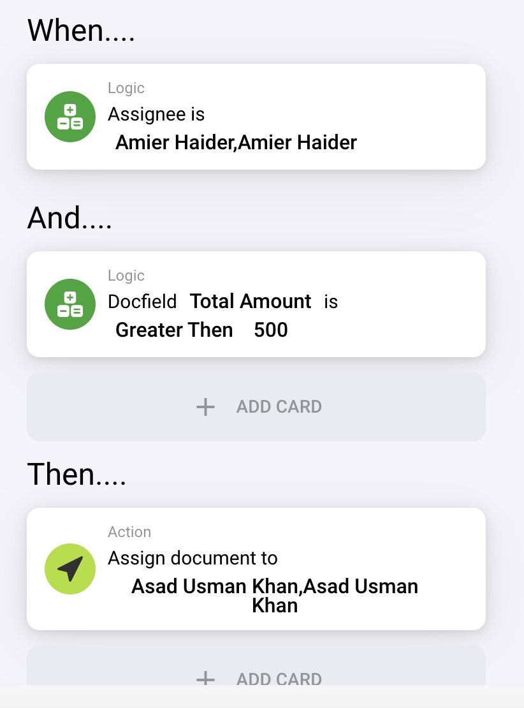
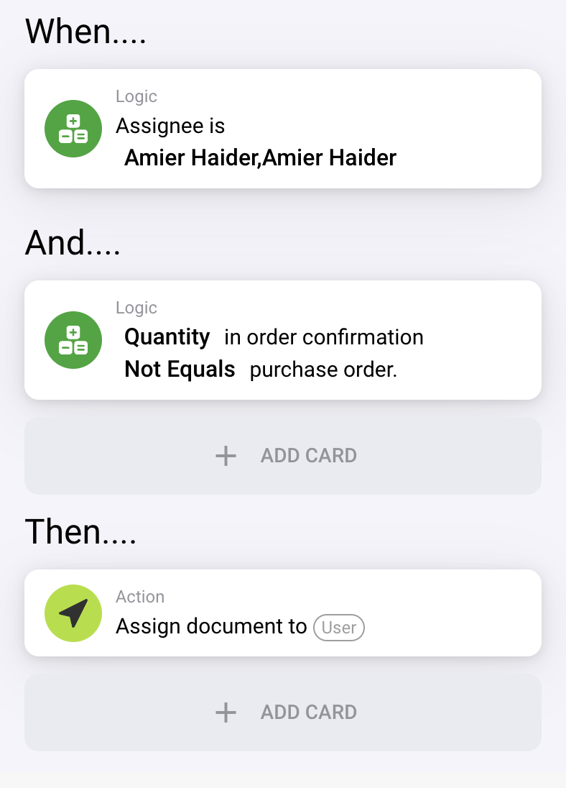

# Overview

### &#x20;

### &#x20;

### &#x20;

### &#x20;

### &#x20;

### &#x20;

### &#x20;

### &#x20;

### &#x20;

### &#x20;

### &#x20;

### &#x20;

### &#x20;

### &#x20;

### **INDEX** 

**INDEX 2**

**Key Features of DocBits 7**

**User Support 7**

**Dashboard 7**

Filtering Documents 8

Dashboard Tools 9

Overview of Uploaded Documents 10

Validate Extracted Fields 10

Change Document Columns 11

Import Log 12

Document Merging 13

Leave with ESC 13

Document Status 14

**How to Import Documents 15**

Manual Import 15

Other Import Options 16

Email 16

IMAP 18

OAuth Office365 19

FTP 21

Watchdog 23

Webhook 34

**Settings 35**

Global Settings 35

Company Information 35

Groups, Users and Permissions 36

Users 37

Sub-Organizations 39

Groups and Permissions 41

Custom Filters 44

Integration 47

Document Expiry 51

Email Notification 53

Document Types 56

Document Processing 62

Module 62

Approval Before Export 62

Doc Script 65

Doc Scan 68

IDM ACL Updater 76

Swiss QR Code 78

Annotation 81

**Technical Support in DocBits 89**

Help Icons 89

Create a Ticket 89

### &#x20;

### Key Features of DocBits 

### &#x20;

### User Support 

If you encounter any issues or have questions while using DocBits, refer to this user manual or contact our support team for assistance. We are dedicated to ensuring a smooth experience for our users.

### Dashboard 

After logging in with your credentials, you will be redirected to the DocBits Dashboard homepage. This is the main page where you can manage all your imported documents.

### Filtering Documents 

If you are looking for a specific document or documents, then you have the following available to you. Within the search bar we have provided you with various tools to find the document you are searching for, in order to access them, select the following icon.

The following filter options will become available to you.

We provide you with the option to filter by document type, status of the document, the assignee of the document and by the date.

### &#x20;

### Dashboard Tools 

To the right of the search bar, you will find other dashboard tools.

* **Refresh List**: This is used to update the dashboard without having to refresh your browser tab.
* **Advanced Settings**: More information on this topic is available further down this page.
* **Scan Document**: Learn more about this feature here.
* **Analytics**: This provides you with further insight about the documents you have uploaded to DocBits.
* **Upload**: More information on this topic in the next section.

### Overview of Uploaded Documents 

The second part of the dashboard is an overview of all the uploaded documents. You can view all documents or just the ones assigned to you. You can also search for documents by name.

Data will be extracted within seconds, and the status will change from “Running” to “Ready for Validation”.

### Validate Extracted Fields 

The validation screen allows you to check, edit, and validate all the imported documents. You can see the name of the document, how many pages it consists of, the date it was imported, and its status. The actions button allows you to assign, restart, validate, or delete the document.

### Change Document Columns 

From the Dashboard, click on the Advanced Settings icon as shown below

The following menu will then be displayed

Select the button labeled “Set dashboard columns for organization” and a list of all the column names will be shown.

From this menu, you can select the column names and use the arrows to add and remove the columns you desire.

### Import Log 

If you would like to see a detailed log of all documents imported to your DocBits environment, then follow these steps.

From your DocBits Dashboard, select the Advanced Settings option.

After the Advanced Settings bar appears, select the Import Log button

A table will then appear with all recently imported documents as well as other relevant information regarding them.

### Document Merging 

Document merging allows you to combine multiple documents.

First, you need to select the documents you would like to merge. This can be done by selecting the checkboxes of the documents. Once you have selected the documents, click on the icon with three dots.

A menu will then be displayed, select the “Merge” option which can be found at the bottom.

### Leave with ESC 

While navigating your documents in DocBits, if you would like to return to the main area of the Dashboard, you can simply press the escape (ESC) button on your keyboard and you will be returned to the main Dashboard menu (on the page which you entered the document you just exited from).

### Document Status 

If you’re using DocBits software for document processing, it’s essential to understand the different document statuses that your files can have. Here’s a complete list of all the possible document statuses in DocBits:

* WatchDog Start: The Watchdog module is starting.
* WatchDog Split: The document is being split in Watchdog.
* WatchDog Upload: The document is being uploaded in Watchdog.
* Upload: The document is being uploaded.
* OCR: Optical Character Recognition (OCR) is currently running on the document.
* Classification: The document is being classified.
* Zugferd import: A Zugferd document is being imported.
* Ready for Validation: The document is ready for validation.
* Zugferd export: A Zugferd document is being exported.
* Workflow: A workflow is currently running with this document.
* Pending approval: The document needs to be approved.
* Pending second approval: The document needs to be approved a second time.
* Auto Accounting: Automatic accounting is running.
* Export: The document is being exported.
* Error: An error occurred in the document.

### &#x20;

### How to Import Documents 

### Manual Import 

If you’re looking to import documents manually into [DocBit](https://docbits.com/doc/docbits-getting-started/)s, follow these simple steps:

* Click on the Upload button on the DocBits [Dashboard](https://docbits.com/doc/docbits-dashboard/).
* A window will appear where you can upload your documents via file browser or drag and drop. You can upload up to 10 documents at once.
* To upload documents via file browser, click on the Upload Documents button and select the files you want to upload. Once you’ve selected the files, click on Confirm to start the upload process.
* Alternatively, you can drag and drop your files onto the DocBits import window.
* After the files have been uploaded, they will have the initial [status](https://docbits.com/doc/docbits-dashboard/document-status/) of “Running”. During this time, the upload is being processed and editing the file is not possible. The processing time may vary depending on the size and complexity of the file.
* Once the file has been processed, it will receive the [status](https://docbits.com/doc/docbits-dashboard/document-status/) of “Ready For Validation”. You can now start the [validation](https://docbits.com/doc/document-validation/) process.

### Other Import Options 

#### Email 

Go to the Settings menu and select “Import”.

Scroll to the bottom of the page and select the NEW button to create a new email import.

After pressing NEW, the following menu will be shown to you

Here you can select which Protocol you would like

#### &#x20;

#### IMAP 

Here you just need to enter the required information for your email provider, encryption, server name, port, username, email address, password as well as the email folder.

**Things to Note**

* Input all needed information into the UI. Other information like the server, port, etc. Depends on the host (a quick Google search should help).
* Folder and Move-Imported have the same Function here. Folder can not be disabled, but will use Inbox by default if left empty
* Make sure to enable IMAP on your Email-Account-Settings
* If you have OAuth enabled on your Email, you will most likely have to provide a “App-Password”\
  generated from your Email-Account-Settings, instead of your regular Password

#### &#x20;

#### OAuth Office365 

Here you just need to enter your desired sub-organization and press ‘Authenticate’

You will be taken to this Microsoft page and you will need to enter a code.

This code can be found by clicking back to DocBits and the code will be displayed there like below, simply copy the code and enter it into the Microsoft page. Thereafter you will need to enter your own Microsoft credentials.

Press the FINISH AUTHENTICATION button and you will be taken to this menu

**Use Folder**

If you are using a folder other than your inbox, enter the folder name after enabling the slider.

**Use Shared Mailbox**

If you want the email import to access an inbox or a folder of a shared mailbox, input the email address here after enabling the slider.

**Move imported emails to trash**

If you want to import all emails, not just the unread ones, and have them moved to trash then activate this. If not, it will only check for unread emails, import the documents, set the email to read and leave it in its current place.

In the event of you receiving an error message indicating you do not have the rights to establish such a connection, someone with admin rights within Azure would need to authorize this connection. For more information, visit the following page: **https://learn.microsoft.com/en-us/entra/identity/enterprise-apps/grant-admin-consent?pivots=portal#grant-tenant-wide-admin-consent-in-enterprise-apps**

### FTP 

If you would like to integrate your SFTP with [DocBits](https://docbits.com/doc/docbits-getting-started/) in order to import documents.

**Requirements**

Correctly configured, Linux compatible SFTP Server

SFTP Hostname, Username and Password

Dedicated Import folder

**Import Configuration**

From the [Dashboard](https://docbits.com/doc/docbits-dashboard/), open [Settings](https://docbits.com/doc/settings/) and navigate to Import. Under FTP Import, select to add a new configuration.

Enter SFTP credentials in the given spaces and select save (The API Key field will automatically be filled with the API Key of the environment you are working on).

Once you have entered all the necessary details of your SFTP, click **SAVE**.

### &#x20;

### Watchdog 

**Installation and Settings**

After downloading the WatchDog.exe file, search for Command Prompt → Run as administrator on your Windows device.

Once this is opened, call the file by typing the path of where the WatchDog.exe file is stored on your device like below

Type install after the file path and press ENTER on your keyboard

You should receive the following error message as it will start the application in UI mode and there is no configuration present yet.

The application will automatically open up after installation. At the top, navigate to Einstellungen (Settings) and here you will see 2 separate sections.

**Folder settings (Ordner Einstellungen)**

This is where you will configure the file pathways for where the documents will be read and processed. The read pathway will be for the documents that you want WatchDog to extract and process, whereas the processed pathway will be used to indicate which documents from the read folder where extracted and processed.

**General settings (Allgemeine Einstellungen)**

This is where you will configure your DocBits application with WatchDog. You will be required to enter your DocBits environment, API key and the document type (as indicated above). To add more than one document type, separate the names of the document types with a comma (INVOICE,DELIVERY-NOTE,PURCHASE-ORDER, etc.)

If an invalid configuration is entered for any of the fields, you will receive an error message like the one below.

Once this is complete, go back to the Command Prompt area and re-run the WatchDog.exe file and this time it will be correctly installed due to the configurations now being present

To start the application is UI mode, run the following command

If you just want to start the application, run this command instead.

**Auto Start**

In order to set up the WatchDog app in a manner that allows it to automatically start once you turn your system on.

Simply open “Services” in the settings of your Windows machine.

Search for WatchDog in the local services and open the service (double-click on the entry)

In the above menu you will have the following options for automatic starting:

* Select Automatic, the service will start on boot
* Automatic (Delayed Start), this will wait 2 minutes after boot to start the service

### **Webhook** 

With the Webhook API provided below, you can easily transfer documents directly to DocBits with a simple POST request. This API is designed to simplify the process of uploading files to DocBits, and all the necessary parameters are already filled in for you.

To get started, simply go to the following page (depending on the environment you are using):

PROD: https://api.docbits.com/docs#/document/process\_documents\_document\_process\_documents\_post

SANDBOX: https://sandbox.api.docbits.com/docs#/document/process\_documents\_document\_process\_documents\_post

STAGE: https://stage.api.docbits.com/docs#/document/process\_documents\_document\_process\_documents\_post

Make a call to the API using your API key. You can also include the file you want to upload as a parameter in your call.

### Settings 

### Global Settings 

#### Company Information 

To fill in your company information, follow these steps:

* Go to the Company Information section in DocBits.
* Enter your company-specific information, such as your company name, address, and contact details.
* Click on SAVE when you’re done.

**Subscription Plan and Usage**

In the Company Information section, you can also find information about your subscription plan, including the start and end dates. You can also view your processed pages for a selected period using the calendar.

Make sure to keep your subscription plan up-to-date to ensure uninterrupted access to DocBits features and services.

**Exporting with ZUGFeRD**

If you want to export your documents in ZUGFeRD format, you need to fill in your company information in DocBits. This will ensure that your exports are successful and compliant with ZUGFeRD standards. Please note that a valid address is required for the export to work.

#### Groups, Users and Permissions 

Our user management system allows you to:

* Add and remove users
* Create sub-organizations for better organization
* Configure groups and permissions for different document types

### Users 

Managing users in DocBits is easy with our simple step-by-step guide.

**Adding a User**

To add a new user to your DocBits account, follow these steps:

* Log in to your DocBits account and navigate to the Settings page.
* Click on Users to access the user management page.
* Click on Add User to create a new user.
* Enter the user’s information, including their name, email address, and password.
* If the user is an administrator, check the “Admin” box.
* Click Save to create the new user.

**Resetting a Password**

If a user forgets their password, you can easily reset it by following these steps:

1. Go to the DocBits login page and click on Forgot Password.
2. Enter the user’s email address and click Submit.
3. The user will receive an email with a link to reset their password.
4. Click on the link in the email and follow the instructions to reset the password.

#### **Sub-Organizations** 

In Settings, Global Settings → Groups, Users and Permissions → Sub-Organizations as shown below.

You will then be taken to a page that looks similar to this

This is where you will find your previously created sub-organizations, as well as where you can create new sub-organizations.

**How to create a Sub-Organization**

Click on the +NEW button

The following menu will be displayed

Enter the details of the sub-organization you want to create, the name and description, then click on the SAVE button. You should then find your newly created sub-organization at the bottom of the list of existing sub-organizations.

#### **Groups and Permissions** 

**What is a group?**

A group is a set of users that can be granted specific permissions for one or multiple document types. The groups can be created, changed and deleted by the organization admins. Every organization admin has the rights to do this.

If no group is configured all privileges are granted to the users within the organization.

**Groups and privileges management**

Groups are managed in DocBits under Settings > Global Settings > Groups, Users and Permissions > Groups and Permissions

**DocBits Group User Management**

The organization admin can add users to the groups by pressing the “Manage Users” button.

**DocBits Group Permission Management**

The organization admin can set the group permissions by pressing the “View Permissions” button.

**Group permissions**

When creating a group, you can specify what privileges the users have for each document type.

The different types of Privileges are:

* View
* Update
* Delete
* First Approval
* Second Approval

**View**

If a user doesn’t have the view permission, the document type will not be shown to him on the dashboard.

**Update**

Exporting documents is only possible if the user has the update permission.

**Delete**

Permission to delete documents.

**First Approval**

Permission to grant the first approval, if configured. For more information, read the section on approval.

**Second Approval**

Permission to grant the second approval, if configured. For more information, read the section on approval.

#### **Custom Filters** 

Navigate to SETTINGS → Dashboard

**Customize your filter**

Navigate to the Filters section

To create a Custom Filter, select CUSTOM in the “Status filter style”

Underneath that, you can select the various statuses a document can be in to create your custom filter. Once you press APPLY, this custom filter will be active on the Dashboard.

**Dashboard**

Select ADVANCED SETTINGS

Custom Filters can then be accessed by selecting the MORE SETTINGS option.

#### **Integration** 

**What is API Integration?**

API Integration is the process of connecting two or more applications via APIs to enable them to communicate with each other. This allows the applications to perform a common function or exchange information, ensuring data integrity.

**How to Get Your API Key**

To get started with API Integration in DocBits, you will need your API Key. You can find your API Key in the Integration menu item in the settings. Simply copy and paste your API Key into your application to start integrating with DocBits.

**API Calls and Examples**

**API Calls for Document Upload and Status Check**

API integration provides functions and services that connect applications and processes. In this guide, we will show you how to make API calls through api.polydocs.io for document upload and status check.

**Authentication**

To make API calls, authentication is the first step. Follow the steps below to authenticate:

1. Open [api.docbits.com](https://api.docbits.com/).
2. Click on Authorize in the upper right corner.
3. Enter your [API Key](https://docs.fellowpro.com/docbits/settings/integration/api-integration/) and confirm by clicking Authorize.

**Upload Document**

To upload a document, follow the steps below:

* After authentication, scroll down to the POST /document/process endpoint.
* Open the tab and click on Try it out in the upper right corner.
* Enter the following value in the source field: email:{Pattern name}.
* Select the file you want to upload and click Execute.

Your document will be uploaded to your dashboard with the rules you set in DocBits.

Document Status Check

To check the status of a document, follow the steps below:

* After authentication, scroll down to the GET /document/status endpoint.
* Open the tab and click on Try it out in the upper right corner.
* Enter the document ID in the doc-id field. You can find the document ID when you open the document on the dashboard. This is the last part of the URL when the document is open.

You will receive the following response

If the status is “Ready For Validation,” it means that the user can check the document.

**Uploading a Document with Metadata**

To upload a document with metadata, follow the steps below:

* After authentication, scroll down to one of these endpoints: /document/process\_documents, /document/process, or /document/process\_base64.
* Open the tab and click on Try it out in the upper right corner.
* Enter the metadata in the metadata field. The metadata needs to be in a valid JSON format. An example of a metadata entry would be: {"custom-key": "the custom value", "custom\_doc\_id": "8a5cf33b-c923-4879-96ca-94d69965d508"}.
* Select a file to upload.
* Click Execute.
* Wait for the response. If the metadata field is not a valid JSON, an error message will appear. If “success”: true, then your document will be uploaded to your dashboard with the rules you set in DocBits.

#### **Document Expiry** 

If you would like to keep your DocBits Dashboard tidy and up to date, consider the document expiry function.

This feature is located in Settings, under Document Processing.

**Delete Document After**

We supply you with a dropdown list of various time frames. Once a document has been in DocBits for the time frame you chose, the document will be removed.

**Delete Finished Document After**

Deletes any finished (exported) document once the time frame you selected has been reached.

#### **Email Notification** 

In this section you can configure all types of email notifications for your document types. Easily set employees to be notified when a document has a certain status.

Go to Settings and open the Email notification menu.

**Configure New Email Notification**

To add a new notification, click + NEW in the top right corner and the following window will open.

In this you can define a custom name for the notification, select the document type and status as well as the time unit and enter the email address of the person who should receive the corresponding notification.

**The following statuses can be selected**

* Ready For Validation
* Pending Approval
* Pending Second Approval

**Time Units**

* Minutes
* Hours
* Days

\
The Delay has to be set to a minimum of 5 minutes as the email server will need that time to respond. The email will be sent after selected time duration, if document status remains unchanged.

#### **Document Types** 

In DocBits you will find the SETTINGS menu in the upper bar on the DASHBOARD.

If you are logged in to DocBits as an admin, you will find all fields of a document that can be extracted under the respective document type.

Open the menu for Document Types.

In the following overview you will find all standard document types available for you

**Activate/Extraction Type**

To the right of each document type, you will see Activate and Extraction Type sliders.

Activate: This document type is active in your DocBits environment.

Extraction Type: This slider allows you to enable or disable a set of predefined rules for the document type when it is processed by DocBits. By selecting the gear icon to the right of the slider, the following menu will appear.

To see which fields can be extracted, for example from an invoice, click on FIELDS for this document type.

**Field Settings**

Here you will find all the fields that can be extracted

You can also CREATE FIELDS like freight, postage or any field with an amount you want to extract from your invoices.

For each field you can check the boxes if they are:

* **REQUIRED**: Here you can define if the field must contain a value to continue.
* **READ ONLY**: Here you can define if a field can only be displayed but not edited.
* **HIDDEN**: Here you can define whether a field should be hidden or displayed in the extraction view.
* **FORCE VALIDATION**: Here you can define whether a field must always be validated manually, even if it has been read 100% by DocBits.
* **OCR** and **MATCH SCORE**: Setting as described below, per field.
* **FORMULA**: Creation of a formula per field.

If all settings are made and should be saved, please confirm this with the SAVE SETTINGS button at the bottom of the page, otherwise the settings will not be applied.

**Recognition Settings**

**OCR**

Here you can set the sensitivity of the OCR (Optical Character Recognition) function for all fields at once. This value determines the sensitivity with which a field is marked in red if it could not be extracted with 100% certainty (OCR related!).

**Match Score**

Here you can set the sensitivity of the MATCH SCORE function for all fields at once. This value determines when a field is marked in red if DocBits has not extracted the field with 100% probability. In this case the field needs to be validated manually.

The button RESTORE DEFAULTS will set back both values to “50”.

**Profile**

Here you can define the profile that shall be used. Either Default or ZUGFeRD.\
In profile ZUGFeRD there are predefined fields that are mandatory for this type of invoice.\
If you do not explicitly use ZUGFeRD, please select “Default”.

### Document Processing 

#### **Module** 

**Approval Before Export**

This feature can be accessed via Settings → Document Types, select the document type you would like to enable this feature for and then select the settings/gear icon.

You will then be able to enable the approval before export feature, you can activate first approval as well as second approval if two people need to approve of a document before it can be exported.

In order to assign members of your organization to these approval roles, click [here](https://docbits.com/doc/settings/groups-users-and-permissions/). To modify the permissions, select “View Permissions” and you will be directed to this screen.

Once you have accessed the permissions menu, you can select the permissions you wish to assign.

Now you can customize the Approval features according to your requirements.

Understanding the Document Exporting Process in DocBits

When you are ready to export a document, select the export option at the bottom of the validation screen.

If the feature is enabled, the document’s status will change to “Pending Approval”.

The document is now in queue for approval.

Assign the approver using the “assign” button on the Dashboard. You can also manage email notifications for the approver(s) through Settings → Email Notification.

Use the Approval Before Export feature to streamline your document management process in DocBits, making your workflows more efficient.

**Doc Script**

If you want to use scripts that, for example, **convert currency characters or written-out currency names into ISO codes**, activate this first in the Settings → Modules → Doc Script.

After that, go to the desired document type. Once here, select the Scripts option.

You will be taken to the Scripts Menu. Once here, click on +NEW.

From here you have the choice of a Label, the document type, when the script for the document type should be triggered and also a specific sub document type if necessary. After adding the script in the provided area, click on SAVE.

For example:

currency\_map = {

"€": "EUR",

"EURO": "EUR",

"$": "USD",

"£": "GBP"

}

currency\_value = get\_field\_value(fields\_dict, "currency", None)

if currency\_value:

currency\_value = currency\_value.upper()

if currency\_value in currency\_map:

currency\_value = currency\_map\[currency\_value]

set\_field\_value(fields\_dict, "currency", currency\_value)



In the next step, upload a document with one of the following criteria: “€”, “EURO”, “$” or “£”.

When the document is ready for validation, open this and click in the Currency validation field. You will be prompted to select the appropriate area on the image. Now do this with the € sign.

You will then immediately see that € is converted to EUR by the script. The same is done by the script when you mark EURO on the invoice.

**Doc Scan**

**Download Scanner Software**

Click Scan Document on the DocBits Dashboard

As your scanner is not installed yet, you’ll get the following message

Depending on which operating system you use, press the appropriate button to download.

Open the installation file and you will see the following

Click on \`Continue\`, accept the Software License Agreement with \`Agree\` and continue to install the software.

Installing this software requires 33,6 MB of space. You can change the install location before clicking \`Install\` in the next step. As soon as the following screen is displayed you’re almost done.

Open web browser to test if the app works by entering: https://local.polydocs.io:12500/

If you see this message on the screen, you must first configure some settings in your FritzBox network settings if you are using one.

When you see this screen you are ready to click on DocBits.

You will be redirected to the DocBits login page where you can enter your credentials to access your dashboard.

All you have to do now is activate Doc Scan in the settings under Modules.

**FritzBox network settings**

If you get the following error after installing and calling up the url https://local.polydocs.io:12500/, the reasons are:

* DNS resolution of private IP addresses not possible.
* DNS resolution for domain names that refer to private IP addresses in the FRITZ!Box home network is not possible via the FRITZ!Box. This means that server services in the FRITZ!Box home network cannot be accessed via the domain name.

You may see one of the following error messages:

* “DNS timed out”
* “DNS request timed out”

For security reasons, the FRITZ!Box suppresses DNS responses that refer to IP addresses in your own home network. This is a security feature of the FRITZ!Box to protect against so-called DNS rebinding attacks.

If you use a FritzBox, you must first make the following settings in the FritzBox menu:

* In the FRITZ!Box user interface, click on \`Heimnetz\`.
* \`Heimnetz\` Click in the menu \`Netzwerk\`.
* Click on the tab \`Netzwerkeinstellungen\`.

In the Hostname exceptions \`DNS-Rebind-Schutz section\`, enter local.polydocs.io for which DNS rebind protection should not apply. Confirm with \`Übernehmen\`

Uninstall Doc2Scan Service Manager

Run the following command to uninstall Doc2Scan Manager:

sudo bash /Library/doc2scan/uninstall.sh

DocScan is compatible with a variety of scanners, to see the full list of compatible scanners, visit: https://docbits.com/doc/settings/modules/doc-scan/

**IDM ACL Updater**

**Feature Description**

This is a feature which, every 6 hours, uses the ION-API file to connect to your Infor-IDM and check through the newest/latest documents of the IDM-document-type(s) the DocBits team has configured at your request, and if the document type has an incorrect ACL-Setting (for example public), it will then be changed to the ACL-Setting you want (for example private). The image below illustrates the configuration of the API performing this feature

The API is called “DocBits-Error” and is situated at the end in the above dataflow. The endpoint mapped to the API (DocBits\_Import) is the endpoint that carries out the functions discussed earlier.

**How to enable the IDM ACL Updater**

To enable this feature, from the Dashboard, go to Settings.

Navigate to Document processing → Module

Once in the Module menu, you will find the slider to enable the IDM ACL Updater at the bottom of the page.

Once enabled, you simply need to upload the corresponding ION API file in the space provided as well as other data (eg. the document type) from INFOR as indicated. This data can be added by pressing the ADD button.

**Swiss QR Code**

Feature Description

This feature extracts the QR code from a document (for example, a Swiss invoice) and uses the QR code to display the embedded information from the document.

This way information is automatically extracted from the document.

What can be extracted?

QR code extraction is able to extract all necessary information from a document such as recipient data, supplier data, amounts, dates, etc.

How to enable this feature

From the Dashboard, navigate to Settings → Document Processing → Module.

Once at this menu, you will find the “QR Code extraction” slider near the bottom of the page.

This feature can be turned on and off from this menu depending on if you would like to use it or not.

**Annotation**

**Validation Screen**

After uploading a document to DocBits, once it is ready for validation, enter the validation screen.

Click on the Annotation icon indicated below

By clicking anywhere on the document, while Annotation mode is active, you will create an editable section like this

* Edit button

This option (the pencil icon) allows you to add various annotations to the document. Once clicked, the following menu will be displayed.

Here you can type text, change the font, change the character size, add bold and italics, as well as change the color of the text for the annotation you wish to add. For example, If I wish to have the word “TEXT” in RED indicated on the document, it would look as follows.

Then simply press the SAVE button indicated below

The result will look like this

From here, you can move the annotation freely around the document so that it is placed where you would like it to be.

* Save Button

Once you have created your annotation and moved it to your desired location on the document, press the SAVE icon like below

* Delete Button

If you wish to delete an annotation, simply press the DELETE icon indicated below

**Approval**

When approving a document, there are slight changes to the annotation system. These are explored below.

Once you upload your document to DocBits, validate it and attempt to export it. If you have **Approve before Export** enabled in the settings, you will need to first approve the document before it gets exported. This screen will look like this

You have the following tools when it comes to annotations on this approval menu

* Stamp Icon

This is the icon on the far left, it gives you the option to add a stamp to the document. When clicked, you are given a drop-down menu of stamp options to apply to the document.

Select the stamp you wish to add to the document and then click the ADD button

A stamp, like the one above, will be added to the document. From there you can change the size of the stamp and where it is located on the document, once the stamp is added, the same icons and functions are present as there were on the validation screen.

* Text Annotation

By clicking the text annotation icon like below

You will be given the same functionalities as were present on the validation screen annotation mode, the only difference here is that we have provided shortcut options to the right of the button. The multi-colored “T” icons can be used to quickly add annotations in the color represented by the icon, to ensure as little time is wasted when processing your documents.

### &#x20;

### Technical Support in DocBits 

### **Help Icons** 

Help icons have been placed all around DocBits in order to assist you in learning and understanding what a feature really does and how it can assist you with your document processing.

These help icons look as follows

### **Create a Ticket** 

This is a tool available to you, on the validation screen, in the event of some sort of issue occurring when validating your document in DocBits.

This feature is located in the menu above the document preview area, like below

Once clicked, the following ticket form will be displayed to you.

This is where you will fill in your details as well as describe the error. You can also ,if applicable, attach a screenshot of the issue and attach a relevant file.
