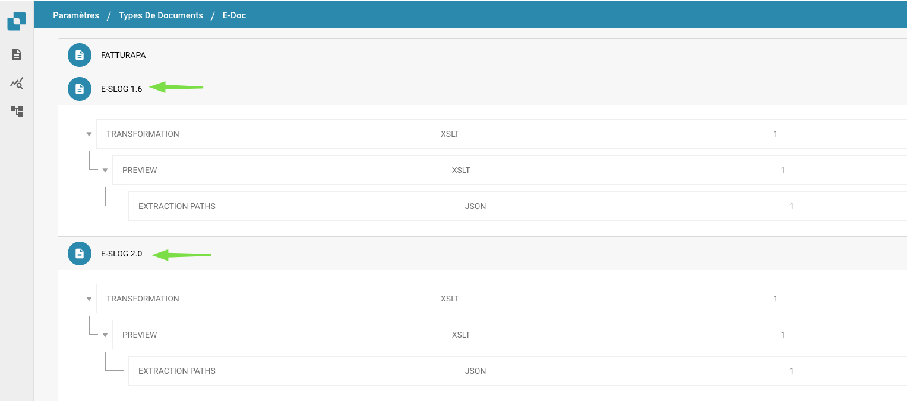

# Gestione della Cache

<figure><figcaption></figcaption></figure>

Nelle impostazioni "Gestione della Cache", sarai in grado di attivare la cancellazione automatica per la Cache delle Consegne Ricevute, la Cache degli Ordini di Acquisto e la Cache di Attività e Notifiche.&#x20;

Con il Tempo di vita, breve TTL, puoi configurare quanto tempo deve passare prima che una cache venga cancellata.&#x20;