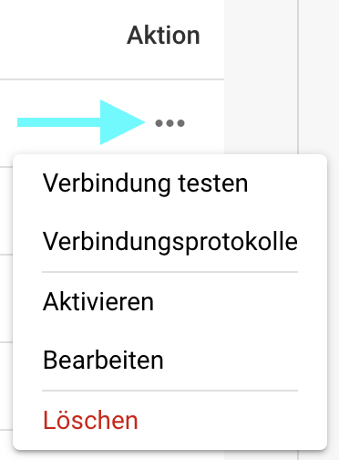

# Import

## Übersicht

In den **Import**-Einstellungen können Sie dokumentenspezifische Optionen für den Import konfigurieren oder automatisierte Importe über FTP oder E-Mail einrichten. Diese Seite bietet einen detaillierten Überblick über alle verfügbaren Einstellungen.

## So greifen Sie zu

1.  Navigieren Sie zu **Einstellungen** -> **Verarbeitung von Dokumenten** -> **Import**

    <figure><figcaption></figcaption></figure>

## **Dokument-Einstellungen**

* **Auf Seiten beschränken**: Diese Einstellung ermöglicht es Ihnen, die Verarbeitung auf eine bestimmte Anzahl von Seiten pro Dokument zu beschränken. Der Standardwert beträgt **60 Seiten**, was bedeutet, dass Dokumente, die diesen Grenzwert überschreiten, auf **60 Seiten** gekürzt werden und alle **verbleibenden Seiten verworfen werden.**
* **Zahlungsbedingungen Tage**: Definiert die standardmäßigen Zahlungsbedingungen (in Tagen), die auf Dokumente angewendet werden können.
* **Datum Muster**: Legt das Muster fest, wie Daten innerhalb importierter Dokumente erkannt und formatiert werden sollen.

<figure><figcaption></figcaption></figure>

## **FTP-Import**

### Anforderungen

Um FTP für den automatischen Import von Daten zu verwenden, stellen Sie sicher, dass die folgenden Anforderungen erfüllt sind:

* Korrekt konfigurierten, Linux-kompatiblen FTP-Server
* FTP-Hostname, Benutzername und Passwort
* Dediziertes Importverzeichnis

### Neue Verbindung hinzufügen

1.  Um eine neue Verbindung hinzuzufügen, klicken Sie auf die Schaltfläche **Hinzugefügt** im FTP-Bereich.

    <figure><figcaption></figcaption></figure>
2.  Geben Sie Ihre FTP-Anmeldeinformationen in die vorgesehenen Felder ein. Das Feld API-Schlüssel wird automatisch ausgefüllt.

    * **Typ:** Gibt das zu verwendende FTP-Protokoll an. Sie können zwischen **FTP**, **FTPS** oder **SFTP** wählen.
    * **Port:** Gibt die Portnummer an, die für das ausgewählte FTP-Protokoll verwendet werden soll.
    * **Servername (erforderlich):** Die Adresse des Servers, von dem Dokumente abgerufen werden.
    * **Benutzername (erforderlich):** Der Anmeldename, der zum Zugriff auf den FTP-Server verwendet wird.
    * **Passwort (erforderlich):** Das Passwort, das mit dem Benutzernamen zum Zugriff auf den FTP-Server verknüpft ist.
    * **Muster für den Abgleich von Dateinamen:** Um anzugeben, welche Dateien basierend auf ihren Namen importiert werden sollen.
    * **Unter-Organisationen:** Wählen Sie aus, auf welche Unter-Organisation der FTP-Import angewendet werden soll.
    * **API-Schlüssel (erforderlich):** Dieses Feld wird automatisch basierend auf der Organisation ausgefüllt, in die Sie eingeloggt sind.
    * **Primäres Verzeichnis:** Gibt das Verzeichnis auf dem FTP-Server an, von dem Dateien importiert werden.
    * **Importverzeichnis:** Ermöglicht es Ihnen, ein Unterverzeichnis innerhalb des primären Verzeichnisses anzugeben, aus dem Dateien importiert werden.
    * **Archivieren nach dem Import:** Ermöglicht es Ihnen, Dateien nach dem Import zu archivieren. Sobald dies aktiviert ist, können Sie das Verzeichnis angeben, in das Dateien nach einem erfolgreichen Import verschoben werden sollen.
    * **Unterordner-Dateien einbeziehen:** Wenn aktiviert, werden auch Unterverzeichnisse im Hauptverzeichnis nach Dateien zum Import durchsucht.

    <figure><figcaption></figcaption></figure>
3. Sobald Sie alle erforderlichen Details Ihres FTP eingegeben haben, klicken Sie auf **SPEICHERN**.
4. Nach dem Speichern Ihrer Verbindung können Sie sie aktivieren, indem Sie auf die drei Punkte in der **Aktion**-Spalte Ihrer Verbindung klicken und dann **Aktivieren** auswählen.

### Aktionen für FTP

Sie können auf die drei Punkte in der **Aktion**-Spalte klicken, um auf die folgenden Optionen für Ihre Verbindung zuzugreifen:

<figure><figcaption></figcaption></figure>

* **Verbindung testen:** Testet die Verbindung zu Ihrem FTP-Server.
* **Verbindungsprotokolle:** Öffnet die Protokolle für Ihre FTP-Verbindung, einschließlich Fehlermeldungen, falls Probleme auftreten.
* **Aktivieren/Deaktivieren:** Aktiviert/deaktiviert Ihre Verbindung.
* **Bearbeiten:** Ermöglicht es Ihnen, Änderungen an Ihrer Verbindung vorzunehmen.
* **Löschen:** Löscht Ihre Verbindung.

## **E-Mail-Import**

Sie können einen E-Mail-Import einrichten, der automatisch Dokumente aus Ihrem Posteingang importiert, sobald sie ankommen. Sie können wählen, ob Sie eine IMAP- oder eine OAuth-Verbindung konfigurieren möchten.

### Neue IMAP-Verbindung hinzufügen

1.  Um eine neue IMAP-Verbindung hinzuzufügen, klicken Sie auf die Schaltfläche **Hinzugefügt** im **E-Mail-Import**-Bereich.

    <figure><figcaption></figcaption></figure>
2. Wählen Sie IMAP als Protokoll aus.
3. Geben Sie Ihre E-Mail-Anmeldeinformationen in die vorgesehenen Felder ein. Das Feld API-Schlüssel wird automatisch ausgefüllt.
   * **Verschlüsselung:** Wählen Sie die Art der zu verwendenden Verschlüsselung — entweder **SSL** oder **TLS**.
   * **Servername:** Die Adresse des E-Mail-Servers.
   * **Benutzername:** Der Identifikator, der für Ihre Mail-Import-Konfiguration in DocBits verwendet wird.
   * **E-Mail:** Die E-Mail-Adresse, die zum Importieren von Dokumenten in das System verwendet wird.
   * **Passwort:** Das Passwort, das mit der angegebenen E-Mail-Adresse verknüpft ist.
   * **Unter-Organisationen:** Wählen Sie die Unter-Organisation aus, auf die der E-Mail-Import angewendet werden soll.
   * **API-Schlüssel:** Dieses Feld wird automatisch basierend auf der Organisation ausgefüllt, in die Sie eingeloggt sind.
   * **Import-Fehlermeldung an diese Email-Adresse senden:** Geben Sie eine E-Mail-Adresse an, um Fehlermeldungen zu erhalten, falls während des Importvorgangs etwas schiefgeht.
   * **Port:** Gibt die Portnummer an, die für die ausgewählte E-Mail-Importkonfiguration verwendet werden soll.
   *   **Ordner:** Wählen Sie einen Ordner aus, aus dem die Dokumente importiert werden.

       <mark style="color:red;">**Hinweis**</mark>: Die **Ordner**-Option wird erst verfügbar, nachdem Sie erfolgreich eine IMAP-Verbindung erstellt haben. Um einen Ordner nach der Erstellung hinzuzufügen, klicken Sie auf die drei Punkte in der **Aktion**-Spalte und wählen Sie dann **Bearbeiten**. Die Option sollte jetzt verfügbar sein.
   *   **E-Mails in einen anderen Ordner verschieben:** Wenn aktiviert, können Sie einen Ordner angeben, in den E-Mails nach einem erfolgreichen Import verschoben werden.

       <mark style="color:red;">**Hinweis**</mark>: Die **E-Mails in einen anderen Ordner verschieben**-Option wird erst verfügbar, nachdem Sie erfolgreich eine IMAP-Verbindung erstellt haben. Um diese Einstellung zu aktivieren, klicken Sie auf die drei Punkte in der **Aktion**-Spalte und wählen Sie dann **Bearbeiten**. Die Option sollte jetzt verfügbar sein.
   * **Angehängte Dokumente zusammenführen:** Kombiniert mehrere angehängte Dokumente zu einem einzigen Dokument.
   * **Nach dem Import eine E-Mail an den Absender senden:** Sendet eine Bestätigungs-E-Mail an den ursprünglichen Absender, nachdem der Import abgeschlossen ist. Sobald aktiviert, können Sie den Betreff und den Text der E-Mail angeben.
   * **Importieren doppelter Dateinamen blockieren:** Verhindert den Import, wenn ein Dokument mit demselben Namen bereits existiert.
4. Nach dem Speichern Ihrer Verbindung können Sie sie aktivieren, indem Sie auf die drei Punkte in der **Aktion**-Spalte Ihrer Verbindung klicken und dann **Aktivieren** auswählen.

### Aktionen für IMAP

Sie können auf die drei Punkte in der **Aktion**-Spalte klicken, um auf die folgenden Optionen für Ihre Verbindung zuzugreifen:

<figure><figcaption></figcaption></figure>

* **Verbindung testen:** Testet die Verbindung zu Ihrem IMAP-Client.
* **Verbindungsprotokolle:** Öffnet die Protokolle für Ihre E-Mail-Verbindung, einschließlich aller Fehlermeldungen, die während des Prozesses auftreten.
* **Importprotokoll:** Öffnet die Protokolle vergangener Importe für die jeweilige Verbindung, einschließlich aller Fehlermeldungen, die während des Prozesses aufgetreten sind.
* **Aktivieren/Deaktivieren:** Aktiviert/deaktiviert Ihre Verbindung.
* **Bearbeiten:** Ermöglicht es Ihnen, Änderungen an Ihrer Verbindung vorzunehmen.
* **Löschen:** Löscht Ihre Verbindung.

### Neue OAuth Office365-Verbindung hinzufügen

1.  Um eine neue OAuth Office365-Verbindung hinzuzufügen, klicken Sie auf die Schaltfläche **Hinzugefügt** im **E-Mail-Import**-Bereich.

    <figure><figcaption></figcaption></figure>
2.  Wählen Sie **OAuth Office365** als Protokoll aus und klicken Sie dann auf "Authentifizieren."

    <figure><figcaption></figcaption></figure>
3.  Sie werden zu einer Microsoft-Seite weitergeleitet, auf der Sie aufgefordert werden, einen Code einzugeben. Um diesen Code abzurufen, kehren Sie zu DocBits zurück — der Code wird dort angezeigt, wie unten gezeigt. Kopieren Sie den Code und geben Sie ihn auf der Microsoft-Seite ein. Danach werden Sie aufgefordert, Ihre Microsoft-Anmeldeinformationen einzugeben.

    <figure><figcaption></figcaption></figure>
4. Folgen Sie den Schritten auf der Microsoft-Seite. Sobald Sie fertig sind, kehren Sie zu DocBits zurück und klicken Sie auf **Authentifizierung abschließen**.
5.  Sie können jetzt die folgenden Einstellungen konfigurieren:

    * **Unter-Organisationen:** Wählen Sie die Unter-Organisation aus, auf die der E-Mail-Import angewendet werden soll.
    * **Ordner verwenden:** Wählen Sie einen Ordner aus, aus dem die Dokumente importiert werden.
    * **Gemeinsame Mailbox verwenden:** Geben Sie die gemeinsame E-Mail-Adresse an, von der Dokumente importiert werden sollen.
    * **E-Mail in einen anderen Ordner verschieben:** Geben Sie einen Ordner an, in den E-Mails nach einem erfolgreichen Import verschoben werden sollen.
    * **Import-Fehlermeldung an diese Email-Adresse senden:** Geben Sie eine E-Mail-Adresse an, um Fehlermeldungen zu erhalten, falls während des Importvorgangs etwas schiefgeht.

    <figure><figcaption></figcaption></figure>
6. Sobald Sie das gewünschte Verhalten konfiguriert haben, können Sie entweder mit dem Import von E-Mails beginnen, indem Sie auf **Importieren** klicken, oder Ihre Änderungen speichern, indem Sie auf **Speichern** klicken.
7. Nach dem Speichern Ihrer Verbindung können Sie sie aktivieren, indem Sie auf die drei Punkte in der **Aktion**-Spalte Ihrer Verbindung klicken und dann **Aktivieren** auswählen.

### Aktionen für OAuth Office365

Sie können auf die drei Punkte in der **Aktion**-Spalte klicken, um auf die folgenden Optionen für Ihre Verbindung zuzugreifen:

<figure><figcaption></figcaption></figure>

* **Verbindungsprotokolle:** Öffnet die Protokolle für Ihre E-Mail-Verbindung, einschließlich aller Fehlermeldungen, die während des Prozesses auftreten.
* **Importprotokoll:** Öffnet die Protokolle vergangener Importe für die jeweilige Verbindung, einschließlich aller Fehlermeldungen, die während des Prozesses aufgetreten sind.
* **Aktivieren/Deaktivieren:** Aktiviert/deaktiviert Ihre Verbindung.
* **Bearbeiten:** Ermöglicht es Ihnen, Änderungen an Ihrer Verbindung vorzunehmen.
* **Löschen:** Löscht Ihre Verbindung.

### Importprotokoll

Sie können das Importprotokoll aller erstellten E-Mail-Verbindungen einsehen, einschließlich aller Fehlermeldungen, die während des Prozesses aufgetreten sind, indem Sie auf die Schaltfläche **Importprotokoll** in der oberen rechten Ecke des E-Mail-Importbereichs klicken.

<figure><figcaption></figcaption></figure>

Sie können die Protokolle nach Betreff oder Absender filtern, die Spalten in aufsteigender oder absteigender Reihenfolge sortieren, indem Sie auf die Spaltenüberschriften klicken, und die Spalten per Drag-and-Drop neu anordnen.
