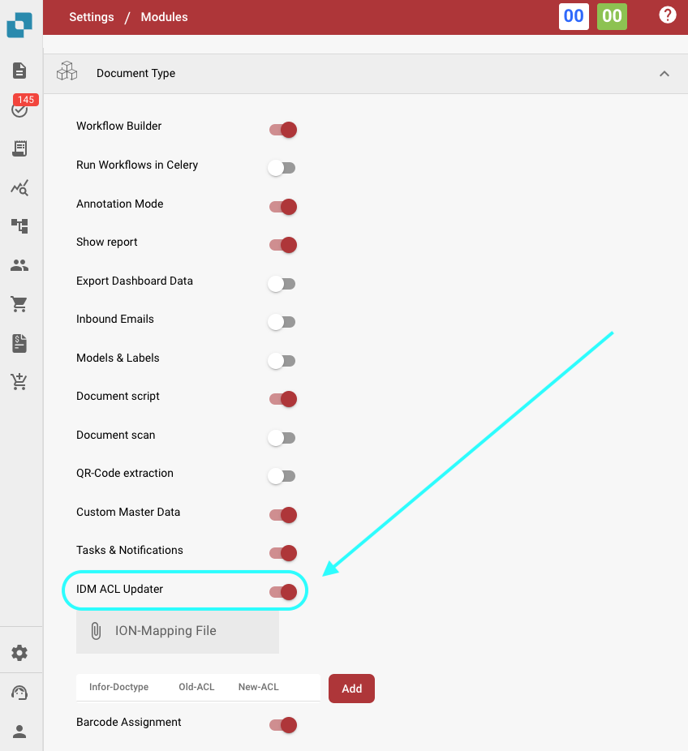
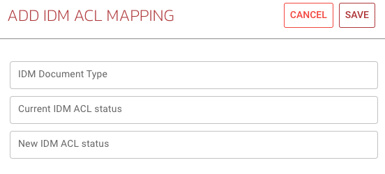

# IDM ACL Updater

## Overview

The ACL-Updater module is responsible for updating and managing Access Control Lists (ACLs) within DocBits. This ensures that appropriate permissions and security measures are in place for document access and handling.

## Activation Instructions

To activate the ACL-Updater module, follow these steps:

1. Navigate to **Settings**.
2. Select **Document Processing**.
3. Select **Module**.
4. Go to **Document Type**.
5. Activate the **IDM ACL-Updater** by enabling the corresponding slider.

Once the module is activated, you can select an **ION Mapping File** to use.

<figure><figcaption></figcaption></figure>

### Adding ACL Information

To add ACL information, click the **Add** button. You can then specify the following details:

* **IDM Document Type**
* **Current IDM ACL Status**
* **New IDM ACL Status**

<figure><figcaption></figcaption></figure>

