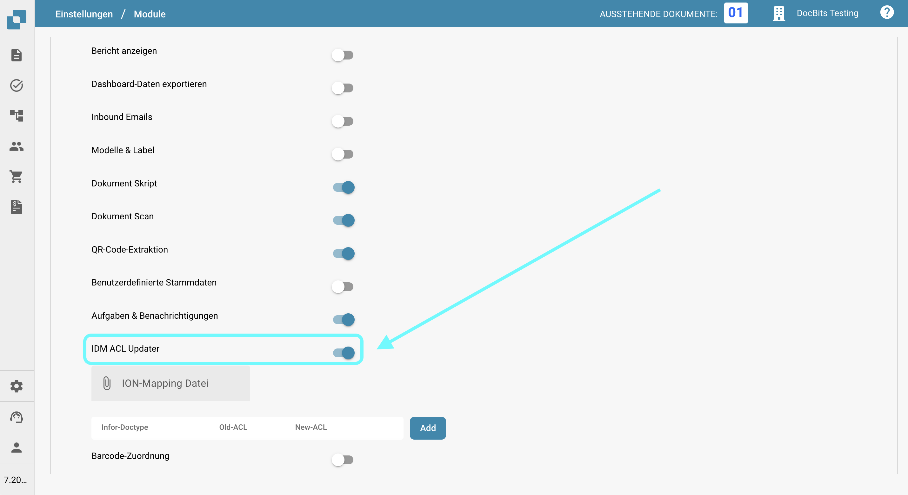
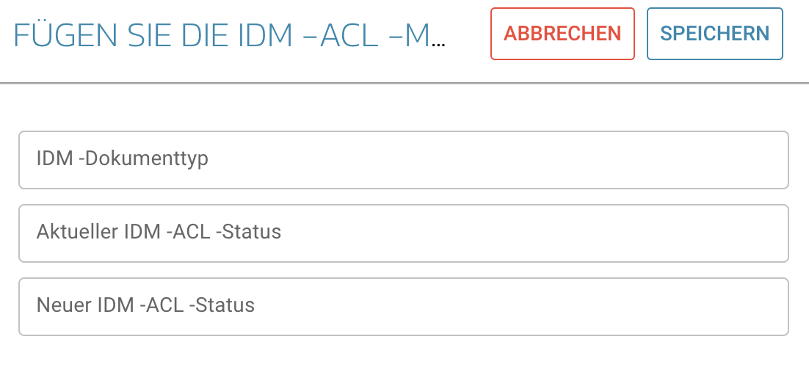

# IDM ACL Updater

## Übersicht

Das ACL-Updater-Modul ist verantwortlich für die Aktualisierung und Verwaltung von Access Control Lists (ACLs) innerhalb von DocBits. Dies stellt sicher, dass angemessene Berechtigungen und Sicherheitsmaßnahmen für den Zugriff auf und die Handhabung von Dokumenten vorhanden sind.

## Aktivierungsanweisungen

Um das ACL-Updater-Modul zu aktivieren, befolgen Sie diese Schritte:

1. Navigieren Sie zu **Einstellungen**.
2. Wählen Sie **Dokumentenverarbeitung**.
3. Wählen Sie **Module**.
4. Gehen Sie zu **Dokumenttyp**.
5. Aktivieren Sie den **IDM ACL-Updater**, indem Sie den entsprechenden Schieberegler aktivieren.

Sobald das Modul aktiviert ist, können Sie eine **ION Mapping-Datei** auswählen, die Sie verwenden möchten.

<figure><figcaption></figcaption></figure>

### Hinzufügen von ACL-Informationen

Um ACL-Informationen hinzuzufügen, klicken Sie auf die Schaltfläche **Hinzufügen**. Sie können dann die folgenden Details angeben:

* **IDM Dokumenttyp**
* **Aktueller IDM ACL-Status**
* **Neuer IDM ACL-Status**

<figure><figcaption></figcaption></figure>
