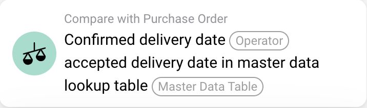

# Swiss QR Code

## QR Code Extraction Feature

The QR Code Extraction feature enables automatic extraction and matching of QR code data from documents, such as Swiss invoices, with stored information like supplier details. Activating this feature allows you to streamline data processing, retrieving essential information without the need for manual entry.

### Feature Overview

QR Code Extraction detects QR codes within uploaded documents, extracts the encoded data, and matches it to existing records. This automated process promotes efficient document handling, particularly beneficial for invoices and other standardized documents that include QR codes.

<figure><figcaption></figcaption></figure>

#### Key Benefits

* **Automated Data Capture**: Reduces manual data entry by automatically extracting information from QR codes.
* **Improved Accuracy**: Minimizes human error by directly matching QR code information with stored data.
* **Time Efficiency**: Accelerates document processing by eliminating repetitive tasks.

***

### How to Enable QR Code Extraction

To enable the QR Code Extraction feature, follow these steps:

1. **Navigate to Settings**:
   * From the Dashboard, go to **Settings**.
   * Select **Document Processing** and then choose **Module**.
2. **Enable the Feature**:
   * Scroll down to locate the **QR Code Extraction** option.
   * Toggle the slider to enable QR Code Extraction.

<figure><figcaption></figcaption></figure>
