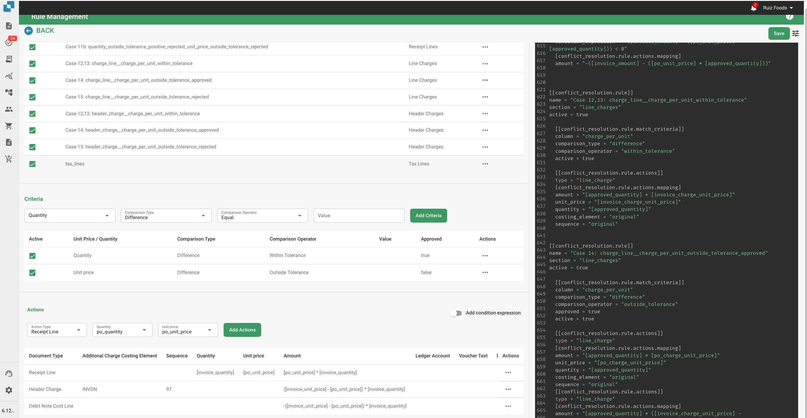

# Gerenciador de Regras

\

Este documento fornece uma explicação detalhada das regras de resolução de conflitos usadas no sistema de faturamento DocBits. Essas regras são projetadas para lidar automaticamente com discrepâncias entre os detalhes da fatura e os dados do pedido de compra (PO), garantindo uma reconciliação financeira precisa. O sistema aplica essas regras para processar linhas de fatura, encargos e impostos, e gera ajustes ou notas apropriadas quando necessário.

## Estrutura das Regras

### &#x20;1. Metadados

• versão: Identifica a versão do arquivo de mapeamento.

• revisão: Número de revisão para rastreamento de alterações.

• autor: Indica o criador do arquivo de mapeamento.

• descrição: Uma breve descrição do propósito do arquivo.

• created\_at & updated\_at: Carimbos de data e hora para quando o arquivo foi criado e atualizado pela última vez.

### &#x20;2. Configuração de Exportação

A seção de configuração de exportação define o mapeamento entre os campos de dados no sistema e os campos correspondentes nos arquivos de exportação.

• Cabeçalho: Define os campos de cabeçalho para os dados da fatura exportada.

• Linhas de Imposto: Especifica os campos para itens de linha de imposto na exportação.

• Encargos de Cabeçalho do Pedido: Mapeia campos relacionados a encargos adicionais no nível do cabeçalho do pedido.

• Linhas de Recibo: Mapeia campos para itens de linha individuais em um recibo.

• Encargos de Linha do Pedido: Define os campos para encargos relacionados a linhas de pedido específicas.

• Linhas de Custo: Especifica campos para linhas de alocação de custo.

• Nota de Débito & Nota de Crédito: Define campos para gerar notas de débito e crédito em casos de discrepâncias.

### 3. Regras de Resolução de Conflitos

Essas regras lidam com discrepâncias entre os dados da fatura e os dados correspondentes do PO. Cada regra é composta por vários componentes:

• Nome: O nome descritivo da regra, indicando o tipo de discrepância que ela aborda.

• Seção: Indica qual parte da fatura (por exemplo, receipt\_lines, line\_charges) a regra se aplica.

• Ativo: Valor booleano (verdadeiro ou falso) indicando se a regra está atualmente ativa.

• Critérios de Correspondência: Condições que acionam a regra com base em comparações entre os dados reais da fatura e os dados esperados do PO.

• Ações: Define o que o sistema deve fazer quando a regra é acionada, incluindo ajustar valores, aplicar encargos ou gerar notas de crédito/débito.

## Elementos Comuns nas Regras

### Operadores de Comparação

Esses operadores definem como os valores reais da fatura são comparados aos valores esperados do PO:

• igual

• maior que

• maior ou igual a

• menor que

• menor ou igual a

• dentro da tolerância

• fora da tolerância

\

### Status de Aprovação

Indica se uma discrepância é aprovada ou não:

• aprovado

• rejeitado

• qualquer

\

### Tipos de Ação

Define ações específicas a serem tomadas quando uma discrepância é detectada:

\
• linha de recibo

• linha de custo

• encargo de cabeçalho

• encargo de linha

• linha de imposto

• linha de recibo da nota de débito

• linha de custo da nota de débito

• encargo de cabeçalho da nota de débito

• encargo de linha da nota de débito

• linha de recibo da nota de crédito

• linha de custo da nota de crédito

• encargo de cabeçalho da nota de crédito

• encargo de linha da nota de crédito

• linha de imposto da nota de crédito

\

### Exemplos de Regras

#### [Caso 1, 2, 3: Quantidade e Preço Unitário Dentro da Tolerância](transactionconfig-pro-template/case-1-2-3-quantity-and-unit-price-within-tolerance.md)

\
• Propósito: Lida com cenários onde tanto a quantidade quanto o preço unitário na fatura estão dentro dos limites de tolerância aceitos em comparação com o PO.

• Ação: O sistema aceita os valores da fatura e calcula o valor total.

#### [Caso 4, 5: Quantidade Dentro da Tolerância, Preço Unitário Fora da Tolerância (Aprovado)](./#case-4-5-quantity-within-tolerance-unit-price-outside-tolerance-approved)

• Propósito: Aplica-se quando a quantidade está dentro da tolerância, mas o preço unitário está fora da tolerância e foi aprovado.

• Ação: O sistema ajusta o preço unitário para corresponder ao PO e aplica quaisquer encargos de linha necessários.

\

#### [Caso 6: Quantidade Dentro da Tolerância, Preço Unitário Fora da Tolerância Negativa (Rejeitado)](transactionconfig-pro-template/case-6-quantity-within-tolerance-unit-price-outside-negative-tolerance-rejected.md)&#x20;

• Propósito: Trata de casos onde o preço unitário é menor do que o esperado e está fora da faixa de tolerância, levando à rejeição.

• Ação: O sistema ajusta o preço unitário para corresponder ao PO, gera uma nota de crédito pela diferença e aplica encargos de cabeçalho conforme necessário.

### Tratamento de Encargos e Impostos

### Encargo por Tolerância de Unidade

• Regras sob esta categoria lidam com discrepâncias em encargos por unidade, com ações específicas com base em se o encargo está dentro ou fora da tolerância e se está aprovado ou rejeitado.

### Ajustes de Linha de Imposto

• Essas regras gerenciam discrepâncias fiscais ajustando as linhas de imposto ou gerando notas de crédito ou débito correspondentes com base nas diferenças entre os dados fiscais da fatura e do PO.

### Enums e Opções

• Enums: Listas predefinidas de valores que garantem consistência em todas as regras (por exemplo, operadores de comparação, tipos de aprovação).

• Opções: Escolhas predefinidas para lidar com quantidades ou preços unitários, oferecendo flexibilidade nas definições de regras.

## Explicação das Capturas de Tela

### Captura de Tela 1: Interface de Gerenciamento de Regras

<figure><figcaption></figcaption></figure>

Esta captura de tela mostra a interface de Gerenciamento de Regras onde os administradores podem visualizar e gerenciar todas as regras de resolução de conflitos. Os elementos principais incluem:

• Botão Adicionar Regra: Permite adicionar novas regras.

• Lista de Regras: Exibe todas as regras ativas com detalhes como nome, seção e status ativo.

• Dropdown de Seção: Filtra as regras com base na seção à qual se aplicam (por exemplo, Linhas de Recibo, Encargos de Linha).

### Captura de Tela 2: Edição Detalhada da Regra

<figure><figcaption></figcaption></figure>

Esta captura de tela ilustra a visão detalhada de uma regra específica sendo editada. Os elementos principais incluem:

• Seção de Critérios: Define as condições sob as quais a regra é acionada. Por exemplo, os critérios podem especificar que se a quantidade e o preço unitário diferirem do PO, mas estiverem dentro da tolerância, a regra deve ser aplicada.

• Seção de Ações: Especifica quais ações devem ser tomadas quando os critérios são atendidos. Isso pode incluir ajustar as linhas da fatura, gerar notas de crédito ou débito, ou aplicar encargos adicionais.

• Tipo de Documento e Elementos de Custo: Permite ao administrador mapear ações específicas para tipos de documentos e elementos de custo, proporcionando flexibilidade no tratamento de diferentes cenários.