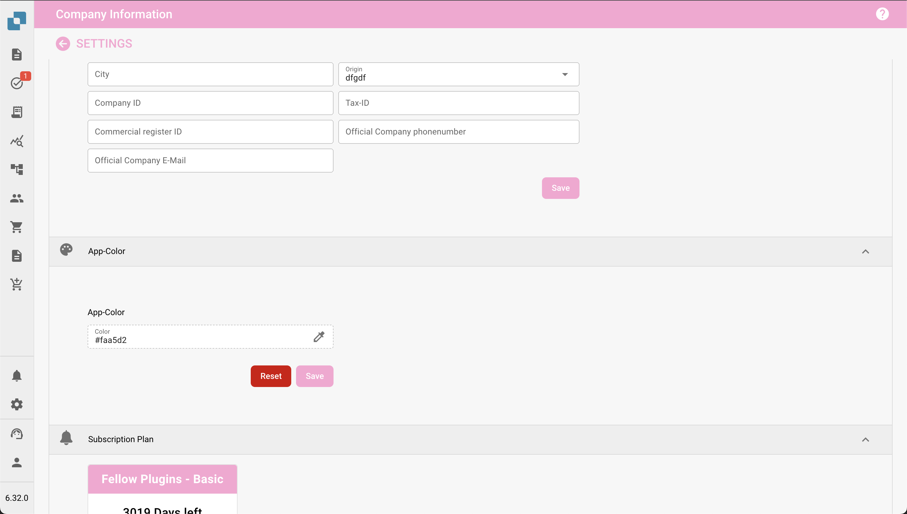

# Definiowanie koloru aplikacji w ustawieniach firmy

### Przegląd

Ustawienie **Kolor aplikacji** pozwala administratorom zdefiniować schemat kolorów interfejsu aplikacji. Ta funkcja jest szczególnie przydatna do rozróżniania różnych środowisk, takich jak testowe, piaskownica i produkcyjne. Przypisując różne kolory do każdego środowiska, użytkownicy mogą łatwo zidentyfikować, w którym środowisku pracują, co zmniejsza ryzyko wykonywania krytycznych działań w niewłaściwym środowisku.

<figure><figcaption></figcaption></figure>

### Uzyskiwanie dostępu do ustawienia koloru aplikacji

1. **Przejdź do ustawień firmy**:
   * Z głównego menu kliknij sekcję **Informacje o firmie**.
2. **Zlokalizuj sekcję Kolor aplikacji**:
   * Przewiń w dół do sekcji **Kolor aplikacji** w ustawieniach Informacji o firmie.

### Ustawianie koloru aplikacji

1. **Wybierz kolor**:
   * Kliknij na pole koloru lub wprowadź kod hex bezpośrednio w polu tekstowym.
   * Pojawi się wybierak kolorów, który pozwoli Ci wybrać pożądany kolor.
   * Możesz wprowadzić konkretny kod hex, jeśli masz ustalony kolor dla środowiska.
2. **Zapisz kolor**:
   * Po wybraniu koloru kliknij przycisk **Zapisz**, aby zastosować zmianę.
   * Interfejs aplikacji natychmiast zaktualizuje się, aby odzwierciedlić nowy kolor.
3. **Przywróć domyślny**:
   * Jeśli chcesz wrócić do domyślnego koloru, kliknij przycisk **Resetuj**.

### Najlepsze praktyki dotyczące kolorów środowisk

Aby uniknąć zamieszania, zaleca się ustalenie standardowego schematu kolorów dla każdego środowiska:

* **Produkcja**: Użyj neutralnego lub domyślnego koloru, takiego jak **#FFFFFF** (biały) lub **#f0f0f0** (jasnoszary), aby wskazać środowisko na żywo.
* **Testowanie**: Użyj jasnego lub alarmującego koloru, takiego jak **#ffcc00** (żółty) lub **#ffa500** (pomarańczowy), aby wskazać środowisko testowe.
* **Piaskownica**: Użyj wyraźnego koloru, takiego jak **#007bff** (niebieski) lub **#6c757d** (szary), aby wskazać środowisko piaskownicy lub deweloperskie.

### Powiadomienie o planie subskrypcyjnym

W sekcji Kolor aplikacji administratorzy zobaczą również informacje związane z **Planem subskrypcyjnym**. Obejmuje to bieżący plan, jego status oraz pozostałe dni subskrypcji.

### Znaczenie koloru aplikacji

Ustawienie koloru aplikacji jest prostym, ale skutecznym narzędziem, które pomaga użytkownikom szybko rozpoznać środowisko, w którym pracują. Starannie wybierając i zarządzając tymi kolorami, organizacje mogą minimalizować błędy i poprawiać efektywność pracy.