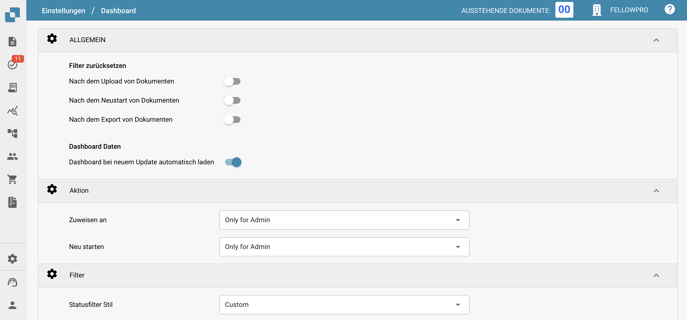
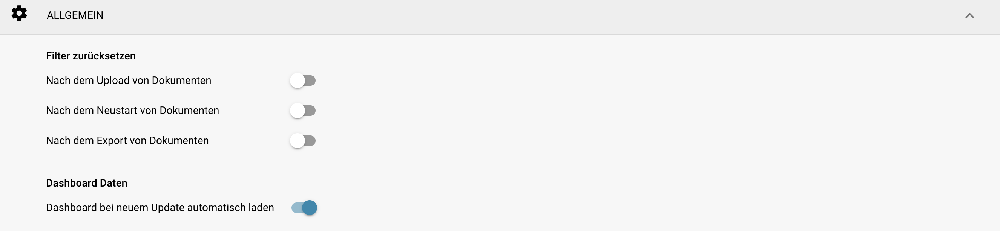
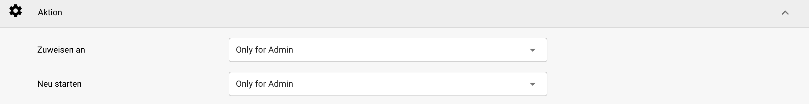
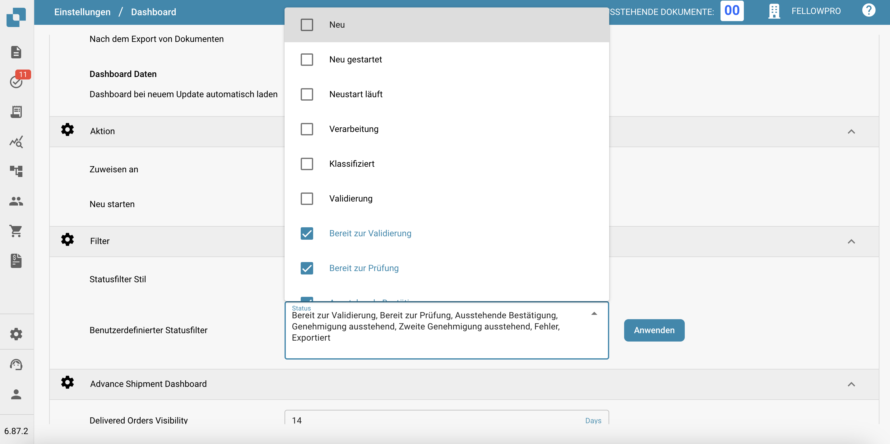

# Dashboard

## Übersicht

Die Dashboard-Einstellungen sind darauf ausgelegt, Administratoren dabei zu helfen, die Datenpräsentation und Interaktion innerhalb des DocBits-Dashboards zu steuern. Diese Einstellungen bestimmen, welche Informationen sofort nach dem Einloggen verfügbar sind, um sicherzustellen, dass die Benutzer schnellen Zugriff auf die relevantesten Daten für ihre Aufgaben haben.

<figure><figcaption></figcaption></figure>

## Hauptmerkmale und Optionen

### **Allgemeine Dashboard-Einstellungen**:

* **Filter zurücksetzen**: Ermöglicht die Konfiguration, wann die Dashboard-Filter zurückgesetzt werden sollen, z. B. nach dem Hochladen von Dokumenten, dem Neustart von Dokumenten oder dem Export von Dokumenten. Dies hilft, eine saubere Grundlage für die Datenansicht entsprechend spezifischer Arbeitsabläufe zu erhalten.
* **Dashboard Daten**: Steuert, ob das Dashboard beim Zugriff des Benutzers automatisch Daten laden soll, was helfen kann, die Ladezeiten zu reduzieren und die Benutzererfahrung zu verbessern, indem Daten nur bei Bedarf geladen werden.

<figure><figcaption></figcaption></figure>

### **Aktion:**

* **Zuweisen an:** Diese Funktion ermöglicht es Benutzern, Berechtigungen für die Zuweisung von Dokumenten zu definieren
  * **Only for Admin:** Nur Admin-Benutzer können Dokumente zuweisen, unabhängig von den Berechtigungen, die nicht-Admin-Benutzern gewährt wurden.
  * **All Users:** Alle Benutzer, die die erforderlichen [Berechtigungen](../../../administration-and-setup/settings/global-settings/groups-users-and-permissions/groups-and-permissions/activating-permissions.md) erhalten haben, können Dokumente zuweisen.
* **Neu starten:** Diese Funktion ermöglicht es Benutzern, Berechtigungen für den Neustart von Dokumenten zu definieren
  * **Only for Admin:** Nur Benutzer mit Admin-Rechten können Dokumente neu starten, unabhängig von den Berechtigungen, die nicht-Admin-Benutzern gewährt wurden.
  * **Only Admin and Assignee:** Nur Benutzer mit Admin-Rechten und der zugewiesene Benutzer können das Dokument neu starten.
  * **All Users:** Alle Benutzer, die die erforderlichen [Berechtigungen](../../../administration-and-setup/settings/global-settings/groups-users-and-permissions/groups-and-permissions/activating-permissions.md) erhalten haben, können Dokumente neu starten.

<figure><figcaption></figcaption></figure>

### **Filter**:

* **Status filter style:** Bestimmt den Präsentationsstil der Statusfilter, der auf Standard oder angepasst an den betrieblichen Fokus der Benutzer eingestellt werden kann.
* **Custom status filter:** Ermöglicht die Erstellung und Anwendung benutzerdefinierter Filter, die auf spezifische Dokumentstatus wie "Neu", "Validierung" oder "Export" abzielen. Dies ermöglicht es Benutzern, schnell auf Dokumente in bestimmten Verarbeitungsphasen zuzugreifen.

<figure><figcaption></figcaption></figure>

### Advance Shipment Dashboard:

* **Delivered Orders Visibility:** Diese Funktion ermöglicht es dem Benutzer, die Dauer anzugeben, für die gelieferte Bestellungen sichtbar sein werden.

<figure><figcaption></figcaption></figure>

Diese Dashboard-Einstellungen sind entscheidend, um sicherzustellen, dass die DocBits-Plattform so reaktionsschnell und nützlich wie möglich ist und den Benutzern ein leistungsstarkes Werkzeug zur Verfügung stellt, um Dokumentenverarbeitungsaktivitäten direkt vom Dashboard aus zu überwachen und zu verwalten.
