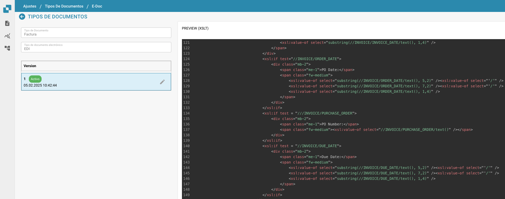

# e-docs

### Panoramica

In Docbits, le impostazioni EDI forniscono strumenti per definire e gestire la struttura e il formato dei messaggi EDI che corrispondono a vari tipi di documenti, come fatture o ordini di acquisto. Le impostazioni consentono la personalizzazione dei messaggi EDI per conformarsi agli standard e ai requisiti specifici dei diversi partner commerciali e settori.

### Caratteristiche e Opzioni Chiave

1. **Elementi di Configurazione EDI**:
   * **Descrittore di Struttura**: Definisce la struttura di base del documento EDI, inclusi l'ordinamento dei segmenti, i campi obbligatori e i qualificatori necessari affinché il documento EDI sia valido.
   * **Trasformazione**: Specifica le trasformazioni applicate per convertire i dati del documento in un messaggio formattato EDI. Questo comporta tipicamente la specifica delle mappature dai campi del documento ai segmenti e agli elementi EDI.
   * **Anteprima**: Consente agli amministratori di visualizzare come apparirà il messaggio EDI dopo la trasformazione, aiutando a garantire l'accuratezza prima della trasmissione.
   * **Percorsi di Estrazione**: Mostra i percorsi utilizzati per estrarre i valori dal documento, che vengono poi utilizzati per popolare il messaggio EDI.
2. **Editor XSLT**:
   * Utilizzato per modificare e convalidare l'XSLT (eXtensible Stylesheet Language Transformations) utilizzato nel processo di trasformazione. L'XSLT è un linguaggio potente progettato per trasformare documenti XML in altri documenti XML o in altri formati come HTML, testo o anche altre strutture XML.

<figure><figcaption></figcaption></figure>
