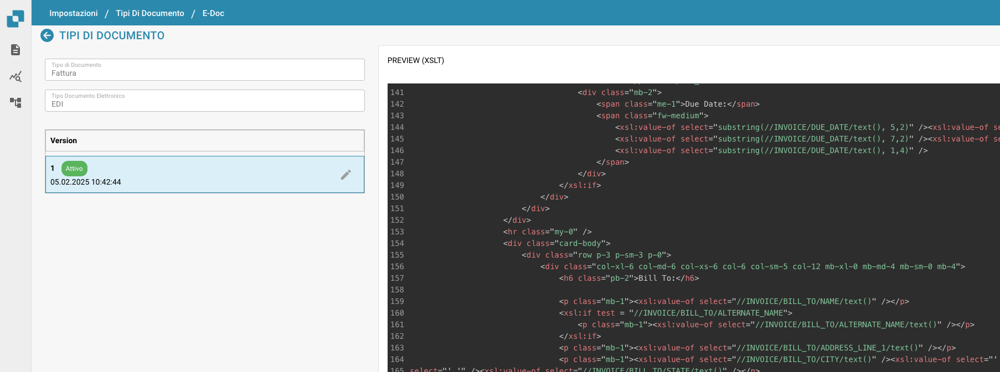

# e-docs

## Aperçu

Dans Docbits, les paramètres EDI fournissent des outils pour définir et gérer la structure et le format des messages EDI qui correspondent à divers types de documents, tels que les factures ou les bons de commande. Les paramètres permettent la personnalisation des messages EDI pour se conformer aux normes et exigences spécifiques à différents partenaires commerciaux et industries.

## Fonctionnalités et options clés

1. **Éléments de configuration EDI**:
   * **Descripteur de structure** : Définit la structure de base du document EDI, y compris l'ordre des segments, les champs obligatoires et les qualificateurs nécessaires pour que le document EDI soit valide.
   * **Transformation** : Spécifie les transformations appliquées pour convertir les données du document en un message au format EDI. Cela implique généralement de spécifier des mappages des champs du document vers les segments et éléments EDI.
   * **Aperçu** : Permet aux administrateurs de voir à quoi ressemblera le message EDI après transformation, aidant à garantir l'exactitude avant la transmission.
   * **Chemins d'extraction** : Montre les chemins utilisés pour extraire des valeurs du document, qui sont ensuite utilisées pour remplir le message EDI.
2. **Éditeur XSLT**:
   * Utilisé pour éditer et valider le XSLT (eXtensible Stylesheet Language Transformations) utilisé dans le processus de transformation. Le XSLT est un langage puissant conçu pour transformer des documents XML en d'autres documents XML ou d'autres formats comme HTML, texte, ou même d'autres structures XML.

<figure><figcaption></figcaption></figure>
