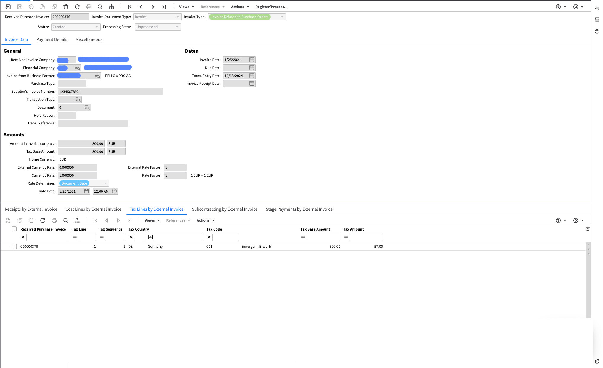

# XRechnung 2.2

Exports to the document management system (IDM):

<figure><figcaption></figcaption></figure>

Exported to Infor LN:

<figure><figcaption></figcaption></figure>

Exported to Infor M3:

<figure><figcaption></figcaption></figure>
