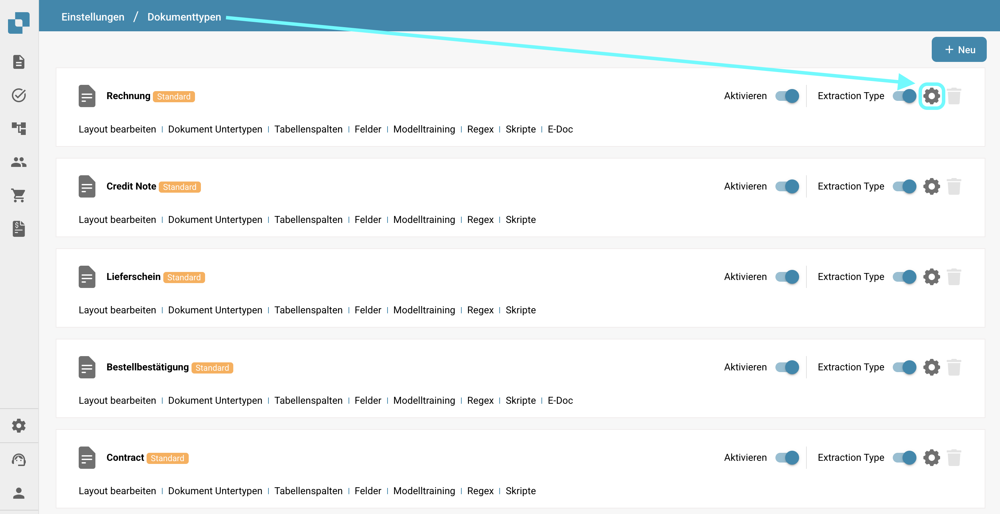

# Weitere Einstellungen&#x20;

## Übersicht

Im Abschnitt "Weitere Einstellungen" finden Sie verschiedene Optionen zu einzelnen Dokumenttypen. Sobald eine Einstellung aktiviert ist, gilt sie nur für diesen spezifischen Dokumenttyp. Diese Seite bietet einen kurzen Überblick darüber, was jede Einstellung bewirkt.

## So greifen Sie zu

1.  Navigieren Sie zu **Einstellungen** -> **Globale Einstellungen** -> **Dokumenttypen**.

    <figure><figcaption></figcaption></figure>
2.  Wählen Sie den gewünschten Dokumenttyp aus und klicken Sie auf **Weitere Einstellungen**.

    <figure><figcaption></figcaption></figure>

## Tabelle Extraktion

* **Tabellenvalidierung überspringen**: Ermöglicht das Umgehen des Validierungsprozesses für Tabellendaten, was in Szenarien nützlich sein kann, in denen die Datenvalidierung flexibel sein muss.

## Erkennung von Duplikaten

* [**Erkennung von doppelten Dokumenten**](../../../../../administration-and-setup/settings/global-settings/document-types/more-settings/duplicate-document-handling.md): Damit können Sie doppelte Dokumente erkennen und verwalten.

## In Überprüfung

* **Entwerfen des Überprüfungsformulars**: Konfiguriert das Layout und die Felder, die in den Überprüfungsformularen erscheinen, die während des Dokumentenüberprüfungsprozesses verwendet werden.

## Ablehnen

* **Entwerfen Sie das Ablehnungsformular**: Konfiguriert das Layout und die Felder, die im Ablehnungsformular angezeigt werden, das während des Dokumentenüberprüfungsprozesses verwendet wird.

## PDF-Generation

* **Design-Vorlage**: Gibt die Vorlage an, die zur Erstellung von PDF-Versionen der Dokumente verwendet wird, was für die Archivierung oder externe Kommunikation entscheidend sein kann.

## PDF-Format exportieren

* **Dateiformat exportieren**: Ermöglicht Ihnen, das PDF-Format anzugeben, das beim Export von Dokumenten verwendet werden soll.

## Genehmigung

* **Erste Genehmigung**: Stellt sicher, dass Dokumente genehmigt werden müssen, bevor sie aus dem System exportiert werden können. Darüber hinaus können Sie die Vorlage für den Genehmigungsbildschirm entwerfen.
* **Vor dem Export genehmigen V2**: Aktiviert Genehmigung V2, die die Verwendung von dynamischen Feldern anstelle von statischen ermöglicht. Sie können auch die Vorlage für den Genehmigungsbildschirm anpassen.
* **Zweite Genehmigung**: Fügt eine zusätzliche Genehmigungsebene für weitere Validierung hinzu, um die Kontrolle über die Dokumentenverarbeitung zu verbessern. Sie können auch die Vorlage für den Genehmigungsbildschirm anpassen.
* [**Genehmigungsstempel**](../../../../../administration-and-setup/settings/global-settings/document-types/more-settings/approval/approval-stamp.md): Fügt dem Dokument einen Stempel hinzu, wenn es genehmigt wird.
* **Genehmigungsverlauf**: Ermöglicht die Anzeige des Genehmigungsverlaufs sowohl im Genehmigungsbildschirm als auch in der Feldvalidierung.

## Bestellung

* [**PO-Tabelle im Layout-Builder**](../../../../../administration-and-setup/settings/global-settings/document-types/more-settings/purchase-order/po-table-in-layout-builder.md): Ermöglicht die Einbeziehung von Bestelltabellen im Layout-Builder für angepasste Dokumentlayouts.
* [**Automatische Prüfung auf PO-Aktualisierungen**](../../../../../administration-and-setup/settings/global-settings/document-types/more-settings/purchase-order/auto-check-for-po-updates.md): Wenn aktiviert, zeigt das System einen visuellen Indikator im Bildschirm zur PO-Zuordnung an, um zu zeigen, wann eine Bestellung aktualisiert wurde, und fordert die Benutzer auf, die neuesten Informationen abzurufen.
* **Automatische Aktualisierung der PO-Daten**: Aktivieren Sie dies, um die PO-Daten automatisch zu aktualisieren, wenn neue Daten verfügbar sind.
* **Status der verbrauchten Bestellposition**: Aktivieren Sie dies, um den farbigen Farbton auf den Bestellpositionen zu deaktivieren.
* [**Berechnung des PO-Einzelpreises**](../../../../../administration-and-setup/settings/global-settings/document-types/more-settings/purchase-order/calculate-po-unit-price.md): Damit können Sie den PO-Einzelpreis anhand des Nettobetrags und der Menge berechnen, anstatt ihn zu extrahieren.
* [**Bestellung**](../../../../../administration-and-setup/settings/global-settings/document-types/more-settings/purchase-order/purchase-order.md): Schaltet um, ob das Dokument im Bildschirm zur PO-Zuordnung verarbeitet werden soll. Sie können auch angeben, auf welchem Mengenbegriff der Zuordnungsprozess basieren soll.
* [**Nicht übereinstimmende PO-Zeilen exportieren**](../../../../../administration-and-setup/settings/global-settings/document-types/more-settings/purchase-order/export-not-matched-po-lines.md): Diese Funktion steuert den Export von Bestellzeilen. Wenn deaktiviert, werden nur übereinstimmende Zeilen exportiert. Wenn aktiviert, werden alle Bestellzeilen exportiert, auch wenn sie nicht mit einer Auftragsbestätigungszeile übereinstimmen.
* [**PO-Toleranzeinstellung**](../../../../../administration-and-setup/settings/global-settings/document-types/more-settings/purchase-order/purchase-order-tolerance-settings-additional-purchase-order-tolerance.md): Diese Funktion ermöglicht es Ihnen, Toleranzwerte für Menge und Einzelpreis festzulegen, um geringfügige Abweichungen zu berücksichtigen, ohne sie als Unstimmigkeiten zu kennzeichnen.
* [**Zusätzliche PO-Toleranzeinstellung**](../../../../../administration-and-setup/settings/global-settings/document-types/more-settings/purchase-order/purchase-order-tolerance-settings-additional-purchase-order-tolerance.md#einstellung-zur-konfiguration-zusatzlicher-bestelltoleranzeinstellungen): Diese Funktion ermöglicht es Ihnen, zusätzliche Toleranzwerte für Fracht, Gebühren und Steuern festzulegen, um geringfügige Abweichungen zu berücksichtigen, ohne sie als Unstimmigkeiten zu kennzeichnen.
* [**Alternativer Export**](../../../../../administration-and-setup/settings/global-settings/document-types/more-settings/purchase-order/alternate-export.md): Damit können Sie einen alternativen Export für spezifische Status festlegen.
* [**PO-Deaktivierungsstatus**](../../../../../administration-and-setup/settings/global-settings/document-types/more-settings/purchase-order/purchase-order-disable-statuses.md): Ermöglicht es Ihnen, spezifische Status von der Berücksichtigung im Zuordnungsprozess auszuschließen.
* **Bereits übereinstimmende Zeilen ignorieren**: Aktivieren Sie dies, um Zeilen zu überspringen, die bereits während eines neuen Zuordnungsprozesses übereinstimmt wurden.
* [**Lieferantenartikelnummernkarte**](../../../../../administration-and-setup/settings/global-settings/document-types/more-settings/purchase-order/lieferantenartikelnummernkarte-administrationsdokumentation.md): Eine Dienstprogrammeinstellung, die Lieferantenartikelnummern internen Artikelnummern zuordnet, um die Genauigkeit in der Bestands- und Bestellverwaltung sicherzustellen.
