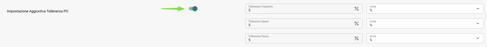
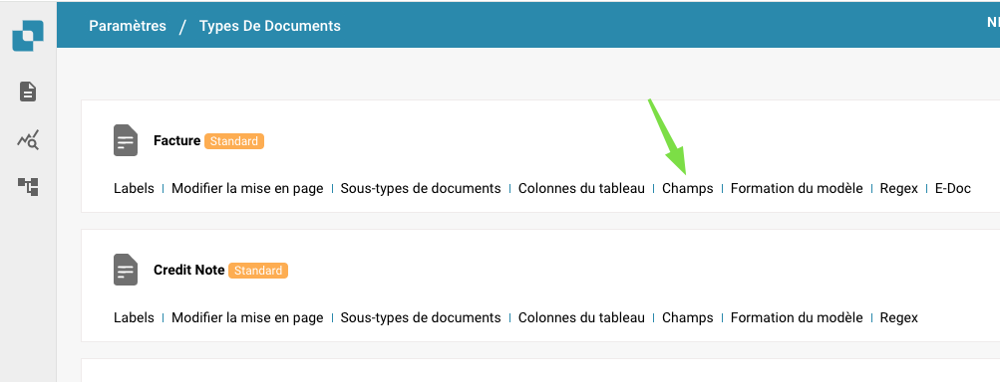
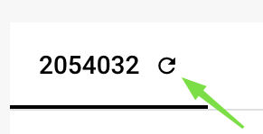

# Gestión de Notificaciones

Para editar, desactivar o eliminar notificaciones existentes y adaptarlas a los cambios en los flujos de trabajo de procesamiento de documentos o responsabilidades de los usuarios, puedes hacer lo siguiente:

**Navegar a la configuración de notificaciones:** Ve a la configuración de tu sistema donde puedes gestionar las notificaciones. Puedes encontrar estas en la sección “Configuración”, “Configuración Global” y luego bajo “Notificación por correo electrónico”.

<figure><figcaption></figcaption></figure>

<figure><figcaption></figcaption></figure>

**Buscar la lista de notificaciones existentes:** En la configuración de notificaciones encontrarás una lista de notificaciones existentes. Esta lista te muestra todas las notificaciones que están actualmente configuradas.

<figure><figcaption></figcaption></figure>

**Editar una notificación:** Para editar una notificación existente, encuentra la notificación en la lista y selecciona la opción de editar. Esto te permite cambiar la configuración de la notificación, como el tipo de documento, estado, eventos desencadenantes o destinatarios.

<figure><figcaption></figcaption></figure>

<figure><figcaption></figcaption></figure>

**Desactivar una notificación:** Si deseas desactivar temporalmente una notificación, encuentra la notificación en la lista y selecciona la opción para desactivarla. Esto detendrá temporalmente la notificación sin eliminarla, para que puedas reactivarla más tarde si es necesario.

<figure><figcaption></figcaption></figure>

**Eliminar una notificación:** Para eliminar permanentemente una notificación, encuentra la notificación en la lista y selecciona la opción de eliminar. Esto eliminará completamente la notificación del sistema y no podrá ser restaurada.

<figure><figcaption></figcaption></figure>

**Adaptarse a los Cambios:** Revisa periódicamente la configuración de tus notificaciones y ajusta según sea necesario para reflejar cambios en los flujos de trabajo de procesamiento de documentos o responsabilidades de los usuarios. Esto podría incluir la actualización de notificaciones debido a nuevos eventos, responsabilidades cambiadas u otros cambios organizacionales.

**Guardar los cambios:** Después de realizar tus cambios, no olvides guardarlos para que surtan efecto.

<figure><figcaption></figcaption></figure>

Al revisar y ajustar regularmente la configuración de tus notificaciones, puedes asegurarte de que tus notificaciones siempre satisfagan las necesidades y flujos de trabajo actuales. Esto ayuda a garantizar una comunicación eficiente y asegura que las personas adecuadas sean notificadas de eventos importantes de manera oportuna.