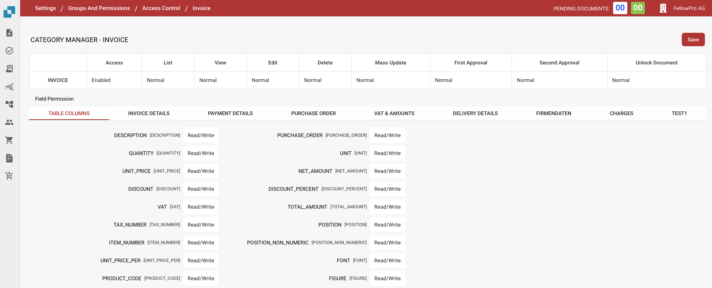
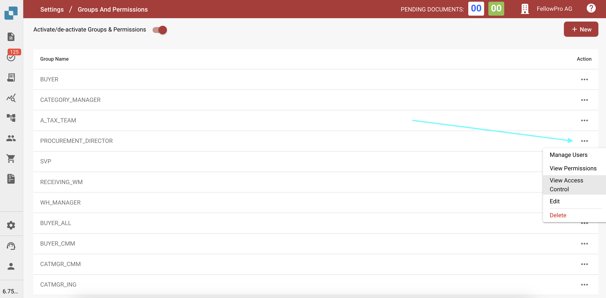

# Access Control

## Overview

This guide explains how administrators can define access control settings for different user groups in DocBits. Each group can be configured with custom permissions at the document and field level.

## Access Control Groups

The access control panel allows the admin to manage user groups and their respective permissions. Each group can have specific configurations related to:

* **Document Access**: Whether the group can access a document type.
* **Field-Level Permissions**: Whether the group can read, write, or view certain fields within a document.
* **Action Permissions**: What actions the group can perform, such as edit, delete, mass update, and approve documents.

## Activation

1. Navigate to **Settings**.
2. Select Document **Processing**.
3. Select **Module**
4. Activate **Access Control** by enabling the slider

<figure><figcaption></figcaption></figure>

## Accessing Group Settings

1. Navigate to **Settings**.
2. Go to **Global Settings.**
3. Select **Groups, Users and Permissions.**
4. Select **Groups and Permissions**.
5. To manage permissions for a group, such as PROCUREMENT\_DIRECTOR, click the three dots on the right side of the screen.
6. Select View Access Control.

<figure><figcaption></figcaption></figure>

## Configuring Permissions for Groups

1.  **Access Control Overview**:

    * In this section, you can enable or disable access for all document types, such as **Invoice**, **Credit Note**, **Purchase Order**, and more.
    * You can define access levels such as:
      * **Enabled**: Grants access to the document type.
      * **List**: Defines whether the document type is visible in the list view.
      * **View**: Specifies the default view for the document.
      * **Edit**: Grants permission to edit the document.
      * **Delete**: Allows the group to delete documents.
      * **Mass Update**: Enables mass updating of the document type.
      * **Approval Levels**: Sets the group’s ability to approve documents (First and Second level approval).
      * **Unlock Document**: Defines whether the group can unlock a document for further ediYou ts.

    Example settings for **PROCUREMENT\_DIRECTOR**:

    * **Invoice**: Enabled for all permissions, including edit and delete.
    * **Purchase Order**: Enabled with normal permissions for all actions.
2. **Field-Level Permissions**:
   * Inside each document type, specific fields can be configured with different levels of permissions.
   *   Permissions include:

       * **Read/Write**: Users can both read and write to the field.
       * **Read/Owner Write**: Only the owner of the document or field can write, others can read.
       * **Read Only**: Users can only view the field but not modify it.
       * **Owner Read/ Owner Write:** Only the owner of the document or field can write and read.
       * **Approval:** Changes must be approved by authorized users or admin.
       * **None**: No specific permissions are applied to the field.

<figure><figcaption></figcaption></figure>
