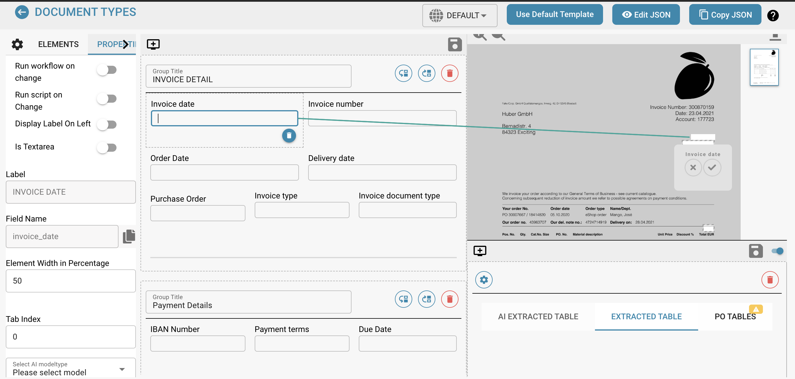

# Attivazione dei Permessi

## Abilitare o disabilitare il sistema di permessi utilizzando l'interruttore ha vari effetti sulla funzionalità in DocBits.

### Ecco alcune spiegazioni su come funziona:

**Abilitazione del sistema di permessi:**

<figure><figcaption></figcaption></figure>

* Quando il sistema di permessi è abilitato, vengono applicati i permessi di accesso per utenti e gruppi.
* Gli utenti hanno accesso solo alle risorse a cui sono esplicitamente autorizzati ad accedere in base ai permessi assegnati.

<figure><figcaption></figcaption></figure>

* Gli amministratori possono gestire i permessi per singoli utenti e gruppi e garantire che solo le persone autorizzate possano visualizzare o modificare i dati.

### Disattivazione del sistema di permessi:

<figure><figcaption></figcaption></figure>

* Quando il sistema di permessi è disabilitato, tutti i permessi di accesso vengono rimossi e gli utenti tipicamente hanno accesso illimitato a tutte le risorse.&#x20;
* Questo può essere utile quando è necessaria una collaborazione aperta temporanea senza le restrizioni del controllo degli accessi.&#x20;
* Tuttavia, potrebbe esserci un rischio maggiore di fuga di dati o accesso non autorizzato poiché gli utenti potrebbero essere in grado di accedere a informazioni sensibili a cui non sono autorizzati ad accedere.

Abilitare o disabilitare il sistema di permessi è una decisione importante basata sui requisiti di sicurezza e sul modo in cui opera l'organizzazione. In ambienti in cui la privacy e il controllo degli accessi sono critici, è comune lasciare il sistema di permessi abilitato per garantire l'integrità e la riservatezza dei dati. In altri casi, disabilitare il sistema di permessi può essere temporaneamente necessario per facilitare la collaborazione, ma dovrebbe essere utilizzato con cautela per ridurre al minimo i potenziali rischi per la sicurezza.