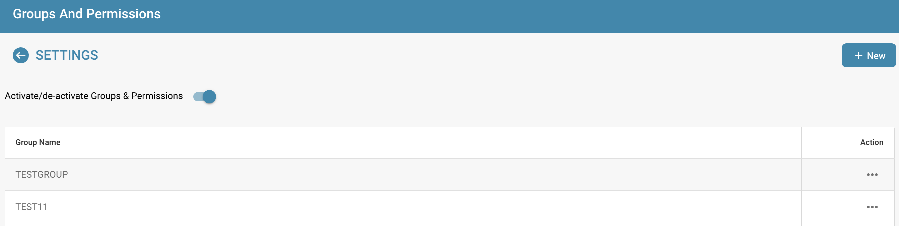

# Activation des permissions

Activer ou désactiver le système de permissions à l'aide de l'interrupteur a divers effets sur la fonctionnalité dans DocBits.

## **Activation du système de permissions:**

<figure><figcaption></figcaption></figure>

* Lorsque le système de permissions est activé, les autorisations d'accès pour les utilisateurs et les groupes sont appliquées.
* Les utilisateurs ne reçoivent l'accès qu'aux ressources qu'ils sont explicitement autorisés à accéder en fonction des permissions attribuées.
* Les administrateurs peuvent gérer les permissions pour les utilisateurs et les groupes individuels et s'assurer que seules les personnes autorisées peuvent voir ou modifier les données.

<figure><figcaption></figcaption></figure>

## Désactivation du système de permissions:

<figure><figcaption></figcaption></figure>

* Lorsque le système de permissions est désactivé, toutes les autorisations d'accès sont supprimées et les utilisateurs ont généralement un accès illimité à toutes les ressources.
* Cela peut être utile lorsque la collaboration ouverte est temporairement nécessaire sans les restrictions du contrôle d'accès.
* Cependant, il peut y avoir un risque accru de fuite de données ou d'accès non autorisé, car les utilisateurs peuvent être en mesure d'accéder à des informations sensibles qu'ils ne sont pas autorisés à consulter.

Activer ou désactiver le système de permissions est une décision importante basée sur les exigences de sécurité et la manière dont l'organisation fonctionne. Dans les environnements où la confidentialité et le contrôle d'accès sont essentiels, il est courant de laisser le système de permissions activé pour garantir l'intégrité et la confidentialité des données. Dans d'autres cas, désactiver le système de permissions peut être temporairement nécessaire pour faciliter la collaboration, mais doit être utilisé avec prudence pour minimiser les risques potentiels de sécurité.
