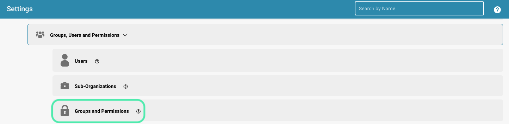
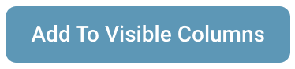

# Aggiunta/Modifica dei Gruppi

## Per aggiungere un nuovo gruppo o modificare i permessi di un gruppo esistente, puoi fare quanto segue:

* **Naviga alle Impostazioni del Gruppo:** Accedi al tuo account admin e vai alle Impostazioni del Gruppo nel pannello di amministrazione.

<figure><figcaption></figcaption></figure>

Si aprirà questa finestra:

<figure><figcaption></figcaption></figure>

* **Clicca sul pulsante + Nuovo:** Se desideri aggiungere un nuovo gruppo, clicca sul pulsante + Nuovo per avviare il processo di aggiunta di un nuovo gruppo.

<figure><figcaption></figcaption></figure>

* **Compila la tabella:** Fornisci il nome del gruppo e una descrizione del gruppo.
* **Salva i dettagli:** Una volta che hai compilato il nome e la descrizione del gruppo, clicca sul pulsante "Salva".

<figure><figcaption></figcaption></figure>

## Modifica dei Gruppi:

* **Modifica Gruppi:** Per modificare i gruppi, clicca su "modifica", qui puoi cambiare il nome del gruppo.

<figure><figcaption></figcaption></figure>

<figure><figcaption></figcaption></figure>

* **Abilita Gruppi e permessi:** Per rendere il gruppo visibile, "Gruppi e permessi" devono essere abilitati.

<figure><figcaption></figcaption></figure>

* **Controlla i risultati:** Dopo aver salvato, rivedi i risultati per assicurarti che il gruppo sia stato aggiunto, modificato o aggiornato con successo.