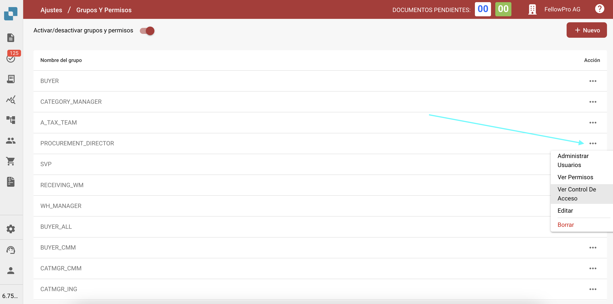
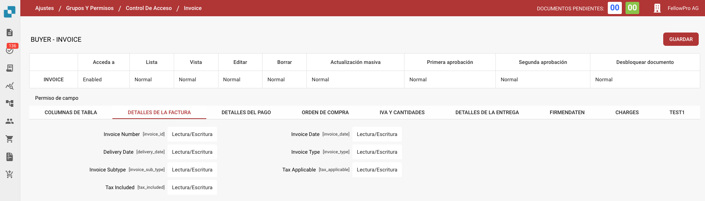

# Control de Acceso

## Descripción General

Esta guía explica cómo los administradores pueden definir configuraciones de control de acceso para diferentes grupos de usuarios en DocBits. Cada grupo puede ser configurado con permisos personalizados a nivel de documento y campo.

## Grupos de Control de Acceso

El panel de control de acceso permite al administrador gestionar grupos de usuarios y sus respectivos permisos. Cada grupo puede tener configuraciones específicas relacionadas con:

* **Acceso a Documentos**: Si el grupo puede acceder a un tipo de documento.
* **Permisos a Nivel de Campo**: Si el grupo puede leer, escribir o ver ciertos campos dentro de un documento.
* **Permisos de Acción**: Qué acciones puede realizar el grupo, como editar, eliminar, actualizar en masa y aprobar documentos.

## Activación

1. Navega a **Ajustes**.
2. Selecciona **Procesamiento de Documentos**.
3. Selecciona **Módulo.**
4. Activa el **Control de Acceso** habilitando el control deslizante.

<figure><figcaption></figcaption></figure>

## **Accediendo a la Configuración del Grupo**

1. Navega a **Ajustes**.
2. Navega a **Ajustes Globales**.
3. Selecciona **Grupos, Usuarios y Permisos**.
4. Selecciona **Grupos y Permisos**.
5. Para gestionar permisos para un grupo, como PROCUREMENT\_DIRECTOR, haz clic en los tres puntos en el lado derecho de la pantalla.
6. Selecciona Ver Control de Acceso

<figure><figcaption></figcaption></figure>

## Configurando Permisos para Grupos

1.  **Descripción General del Control de Acceso**:

    * En esta sección, puedes habilitar o deshabilitar el acceso para todos los tipos de documentos, como **Invoice**, **Credit Note**, **Purchase Order**, y más.
    * Puedes definir niveles de acceso tales como:
      * **Acceda a**: Concede acceso al tipo de documento.
      * **Lista**: Define si el tipo de documento es visible en la vista de lista.
      * **Vista**: Especifica la vista predeterminada para el documento.
      * **Editar**: Concede permiso para editar el documento.
      * **Borrar**: Permite al grupo eliminar documentos.
      * **Actualización Masiva**: Habilita la actualización masiva del tipo de documento.
      * **Niveles de Aprobación**: Establece la capacidad del grupo para aprobar documentos (Aprobación de Primer y Segundo nivel).
      * **Desbloquear Documento**: Define si el grupo puede desbloquear un documento para más ediciones.

    Ejemplo de configuraciones para **PROCUREMENT\_DIRECTOR**:

    * **Invoice**: Habilitado para todos los permisos, incluyendo editar y eliminar.
    * **Purchase Order**: Habilitado con permisos normales para todas las acciones.
2. **Permisos a Nivel de Campo**:
   * Dentro de cada tipo de documento, se pueden configurar campos específicos con diferentes niveles de permisos.
   * Los permisos incluyen:
     * **Lectura/Escritura:** Los usuarios pueden tanto leer como escribir en el campo.
     * **Lectura/Escritura propietario:** Solo el propietario del documento o campo puede escribir, otros pueden leer.
     * **Solo lectura:** Los usuarios solo pueden ver el campo pero no modificarlo.
     * **Lectura propietario/Escritura propietario:** Solo el propietario del documento o campo puede escribir y leer.
     * **Aprobación:** Los cambios deben ser aprobados por usuarios autorizados o el administrador.
     * **Ninguno:** No se aplican permisos específicos al campo.

<figure><figcaption></figcaption></figure>
