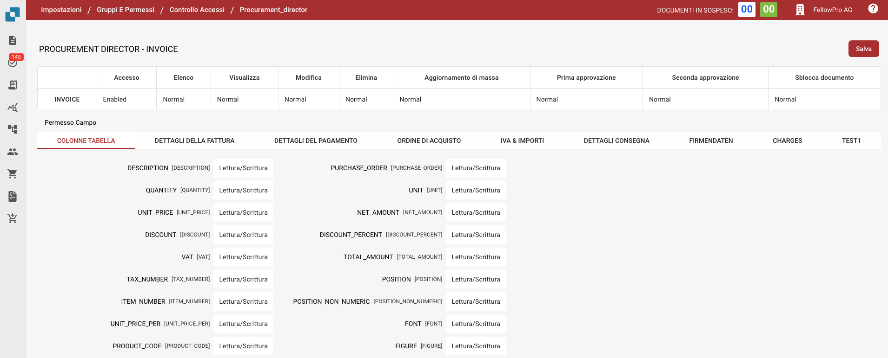

# Controllo Accessi

## Panoramica

Questa guida spiega come gli amministratori possono definire le impostazioni di controllo accessi per diversi gruppi di utenti in DocBits. Ogni gruppo può essere configurato con permessi personalizzati a livello di documento e di campo.

## Gruppi di Controllo Accessi

Il pannello di controllo accessi consente all'amministratore di gestire i gruppi di utenti e i loro rispettivi permessi. Ogni gruppo può avere configurazioni specifiche relative a:

* **Accesso ai Documenti**: Se il gruppo può accedere a un tipo di documento.
* **Permessi a Livello di Campo**: Se il gruppo può leggere, scrivere o visualizzare determinati campi all'interno di un documento.
* **Permessi di Azione**: Quali azioni il gruppo può eseguire, come modificare, eliminare, aggiornare in massa e approvare documenti.

## **Accesso alle Impostazioni del Gruppo**

1. Navigare su **Impostazioni**.
2. Selezionare **Gruppi e Permessi**.
3. Per gestire i permessi di un gruppo, come PROCUREMENT\_DIRECTOR, fare clic sui tre punti sul lato destro dello schermo.
4. Selezionare Visualizza Controllo Accessi

<figure><figcaption></figcaption></figure>

## Configurazione dei Permessi per i Gruppi

1.  **Panoramica del Controllo Accessi**:

    * In questa sezione, puoi abilitare o disabilitare l'accesso per tutti i tipi di documento, come **Invoice**, **Credit Note**, **Purchase Order**, e altro ancora.
    * Puoi definire i livelli di accesso come:
      * **Accesso:** Concede accesso al tipo di documento.
      * **Elenco**: Definisce se il tipo di documento è visibile nella vista elenco.
      * **Visualizza:** Specifica la vista predefinita per il documento.
      * **Modifica**: Concede il permesso di modificare il documento.
      * **Elimina**: Consente al gruppo di eliminare documenti.
      * **Aggiornamento di massa:** Abilita l'aggiornamento massivo del tipo di documento.
      * **Livelli di Approvazione**: Imposta la capacità del gruppo di approvare documenti (Approvazione di Primo e Secondo livello).
      * **Sblocca Documento**: Definisce se il gruppo può sbloccare un documento per ulteriori modifiche.

    Esempi di impostazioni per **PROCUREMENT\_DIRECTOR**:

    * **Invoice**: Abilitato per tutti i permessi, inclusi modifica ed elimina.
    * **Purchase Order**: Abilitato con permessi normali per tutte le azioni.
2. **Permessi a Livello di Campo**:
   * All'interno di ciascun tipo di documento, campi specifici possono essere configurati con diversi livelli di permessi.
   * I permessi includono:
     * **Lettura/Scrittura:** Gli utenti possono sia leggere che scrivere nel campo.
     * **Lettura/Scrittura proprietario:** Solo il proprietario del documento o del campo può scrivere, gli altri possono leggere.
     * **Solo Lettura**: Gli utenti possono solo visualizzare il campo ma non modificarlo.
     * **Lettura proprietario/Scrittura proprietario:** Solo il proprietario del documento o del campo può scrivere e leggere.
     * **Approvazione:** Le modifiche devono essere approvate da utenti autorizzati o dall'amministratore.
     * **Nessuno**: Nessun permesso specifico è applicato al campo.

<figure><figcaption></figcaption></figure>
