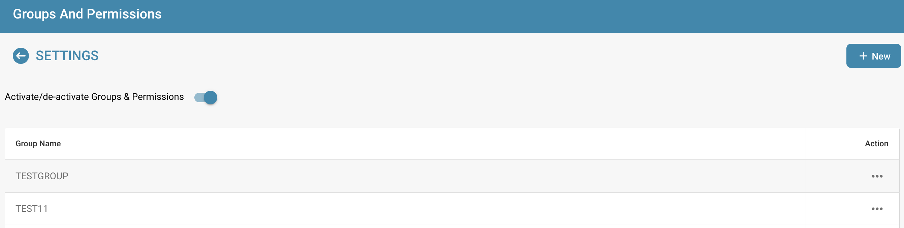
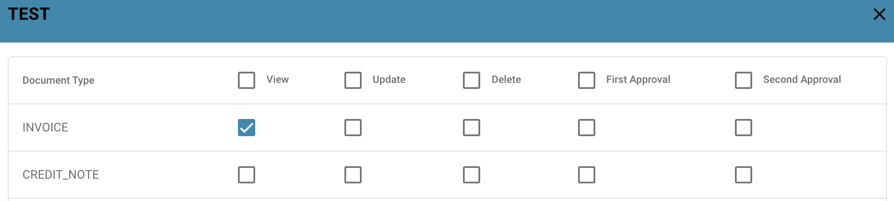
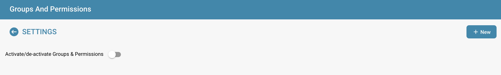

# Berechtigungen aktivieren

Das Aktivieren oder Deaktivieren des Berechtigungssystems mit dem Schalter hat verschiedene Auswirkungen auf die Funktionalität in DocBits.

## **Aktivieren des Berechtigungssystems:**

<figure><figcaption></figcaption></figure>

* Wenn das Berechtigungssystem aktiviert ist, werden die Zugriffsberechtigungen für Benutzer und Gruppen angewendet.
* Benutzern wird nur der Zugriff auf die Ressourcen gewährt, zu denen sie basierend auf den zugewiesenen Berechtigungen ausdrücklich autorisiert sind.

<figure><figcaption></figcaption></figure>

* Administratoren können die Berechtigungen für einzelne Benutzer und Gruppen verwalten und sicherstellen, dass nur autorisierte Personen die Daten anzeigen oder bearbeiten können.

## Deaktivieren des Berechtigungssystems:

<figure><figcaption></figcaption></figure>

* Wenn das Berechtigungssystem deaktiviert ist, werden alle Zugriffsberechtigungen entfernt und Benutzer haben in der Regel uneingeschränkten Zugriff auf alle Ressourcen.
* Dies kann nützlich sein, wenn vorübergehend eine offene Zusammenarbeit ohne die Einschränkungen der Zugriffskontrolle erforderlich ist.
* Es besteht jedoch ein erhöhtes Risiko für Datenlecks oder unbefugten Zugriff, da Benutzer möglicherweise auf sensible Informationen zugreifen können, zu denen sie nicht autorisiert sind.

Das Aktivieren oder Deaktivieren des Berechtigungssystems ist eine wichtige Entscheidung, die auf den Sicherheitsanforderungen und der Arbeitsweise der Organisation basiert. In Umgebungen, in denen Datenschutz und Zugriffskontrolle entscheidend sind, ist es üblich, das Berechtigungssystem aktiviert zu lassen, um die Datenintegrität und Vertraulichkeit zu gewährleisten. In anderen Fällen kann es vorübergehend notwendig sein, das Berechtigungssystem zu deaktivieren, um die Zusammenarbeit zu erleichtern, sollte jedoch mit Vorsicht verwendet werden, um potenzielle Sicherheitsrisiken zu minimieren.
