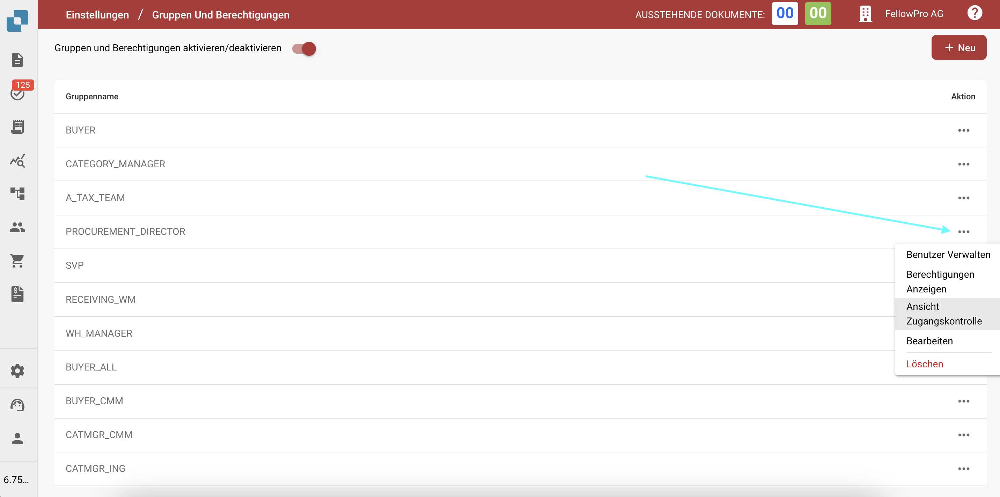
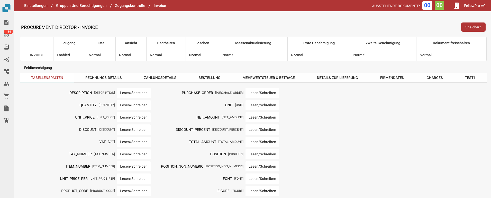

# Zugangskontolle

## Übersicht

Dieser Leitfaden erklärt, wie Administratoren Einstellungen für die Zugangskontolle für verschiedene Benutzergruppen in DocBits definieren können. Jede Gruppe kann mit benutzerdefinierten Berechtigungen auf Dokumenten- und Feldebene konfiguriert werden.

## Zugangskontrollgruppen

Das Zugangskontrollpanel ermöglicht es dem Administrator, Benutzergruppen und deren jeweilige Berechtigungen zu verwalten. Jede Gruppe kann spezifische Konfigurationen in Bezug auf Folgendes haben:

* **Dokumentzugriff**: Ob die Gruppe auf einen Dokumenttyp zugreifen kann.
* **Feldberechtigungen**: Ob die Gruppe bestimmte Felder innerhalb eines Dokuments lesen, schreiben oder anzeigen kann.
* **Aktionsberechtigungen**: Welche Aktionen die Gruppe durchführen kann, wie z. B. Dokumente bearbeiten, löschen, massenaktualisieren und genehmigen.

## **Zugang auf Gruppeneinstellungen**

1. Navigieren Sie zu **Einstellungen**.
2. Wählen Sie **Gruppen und Berechtigungen**.
3. Um die Berechtigungen für eine Gruppe, wie z. B. PROCUREMENT\_DIRECTOR, zu verwalten, klicken Sie auf die drei Punkte auf der rechten Seite des Bildschirms.
4. Wählen Sie Ansicht Zugangskontrolle

<figure><figcaption></figcaption></figure>

## Berechtigungen für Gruppen konfigurieren

1.  **Übersicht der Zugangskontolle**:

    * In diesem Abschnitt können Sie den Zugriff für alle Dokumenttypen aktivieren oder deaktivieren, wie z. B. **Invoice**, **Credit Note**, **Purchase Order** und mehr.
    * Sie können in der Zugangskontolle folgendes definieren:
      * **Zugang**: Gewährt Zugriff auf den Dokumenttyp.
      * **Liste**: Definiert, ob der Dokumenttyp in der Listenansicht sichtbar ist.
      * **Ansicht**: Gibt die Standardansicht für das Dokument an.
      * **Bearbeiten**: Gewährt die Berechtigung, das Dokument zu bearbeiten.
      * **Löschen**: Erlaubt der Gruppe, Dokumente zu löschen.
      * **Massenaktualisierung**: Ermöglicht die Massenaktualisierung des Dokumenttyps.
      * **Genehmigungsstufen**: Legt die Fähigkeit der Gruppe fest, Dokumente zu genehmigen (Erste und Zweite Genehmigungsstufe).
      * **Dokument freischalten**: Definiert, ob die Gruppe ein Dokument für weitere Bearbeitungen entsperren kann.

    Beispielkonfigurationen für **PROCUREMENT\_DIRECTOR**:

    * **Invoice**: Aktiviert für alle Berechtigungen, einschließlich Bearbeiten und Löschen.
    * **Purchase Order**: Aktiviert mit normalen Berechtigungen für alle Aktionen.
2. **Feldberechtigungen**:
   * Innerhalb jedes Dokumenttyps können spezifische Felder mit unterschiedlichen Berechtigungsstufen konfiguriert werden.
   * Berechtigungen umfassen:
     * **Lesen/Schreiben**: Benutzer können sowohl lesen als auch in das Feld schreiben.
     * **Lesen/Eigentümer schreiben**: Nur der Eigentümer des Dokuments oder Feldes kann schreiben, andere können lesen.
     * **Schreibgeschützt**: Benutzer können das Feld nur anzeigen, aber nicht ändern.
     * **Eigentümer lesen/Eigentümer schreiben:** Nur der Eigentümer des Dokuments oder Feldes kann schreiben und lesen.
     * **Genehmigung:** Änderungen müssen von autorisierten Benutzern oder dem Administrator genehmigt werden.
     * **Keine**: Es gelten keine spezifischen Berechtigungen für das Feld.

<figure><figcaption></figcaption></figure>
