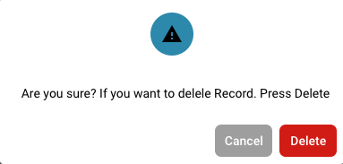

# Modyfikowanie szczegółów użytkownika

<figure><figcaption>
Ustawienia użytkownika
</figcaption></figure>

* **Logowanie jako administrator:** Zaloguj się z uprawnieniami administratora.
* **Dostęp do zarządzania użytkownikami:** Przejdź do ustawień użytkownika, gdzie możesz edytować istniejących użytkowników.
* **Wybieranie użytkowników:** Znajdź i wybierz użytkownika, którego szczegóły chcesz zmienić. Można to zrobić, klikając na nazwę użytkownika lub przycisk edycji obok użytkownika.

<figure><figcaption></figcaption></figure>

*   **Edycja szczegółów użytkownika:** Pojawi się formularz zawierający aktualne szczegóły użytkownika. Edytuj wymagane pola zgodnie z wprowadzanymi zmianami. Typowe szczegóły do edytowania to:

    * Imię i nazwisko
    * Adres e-mail
    * Rola użytkownika lub poziom uprawnień

    <figure><figcaption></figcaption></figure>
* **Zapisz zmiany:** Przejrzyj wszelkie wprowadzone zmiany i kliknij Zapisz, aby zapisać nowe szczegóły użytkownika.

<figure><figcaption></figcaption></figure>

* **Przejrzyj wpływ zmian ról:** Jeśli zmieniłeś rolę użytkownika, przejrzyj wpływ tej zmiany na poziomy dostępu do zabezpieczeń. Upewnij się, że po zmianie roli użytkownik ma wymagane uprawnienia do kontynuowania wykonywania swoich obowiązków.
* **Wyślij powiadomienie (opcjonalnie):** Możesz wysłać powiadomienie do użytkownika, aby poinformować go o wprowadzonych zmianach.

Po zakończeniu tych kroków szczegóły użytkownika zostaną pomyślnie zaktualizowane, a użytkownik będzie miał nowe informacje i uprawnienia zgodnie z wprowadzonymi zmianami.

## Usuwanie użytkowników:

* **Wybieranie użytkowników:** Znajdź i wybierz użytkownika, którego dostęp chcesz usunąć. Można to zrobić, klikając na nazwę użytkownika lub przycisk edycji obok użytkownika.

<figure><figcaption></figcaption></figure>

* **Usuwanie dostępu:** Kliknij "usuń", aby usunąć użytkownika.

<figure><figcaption></figcaption></figure>

* **Potwierdzenie:** Zostaniesz poproszony o potwierdzenie usunięcia użytkownika.

<figure><figcaption></figcaption></figure>

* **Opcjonalne powiadomienie:** Możesz opcjonalnie wysłać powiadomienie do użytkownika, aby poinformować go o usunięciu jego dostępu.
* **Przejrzyj zadania i dokumenty:** Przed usunięciem użytkownika przejrzyj, jakie zadania lub dokumenty są przypisane do użytkownika. Przenieś lub przekaż odpowiedzialność za te zadania lub dokumenty innemu użytkownikowi, aby upewnić się, że nic nie zostanie zgubione ani niedokończone.
* **Zapisz zmiany:** Potwierdź usunięcie użytkownika i zapisz zmiany.

Postępując zgodnie z tymi krokami, możesz zapewnić, że dostęp użytkownika zostanie bezpiecznie usunięty, jednocześnie właściwie zarządzając wszystkimi istotnymi zadaniami i dokumentami.