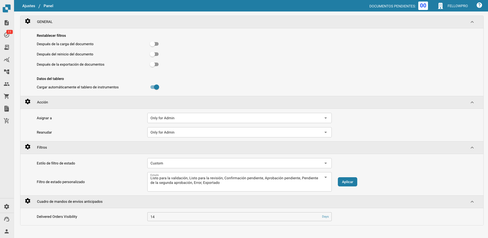
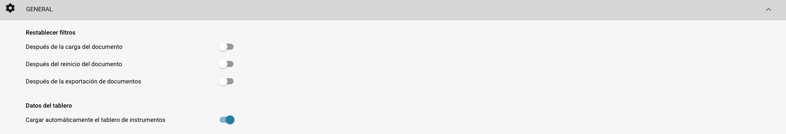
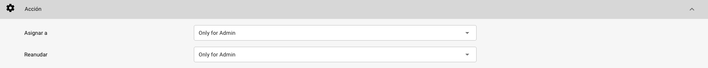
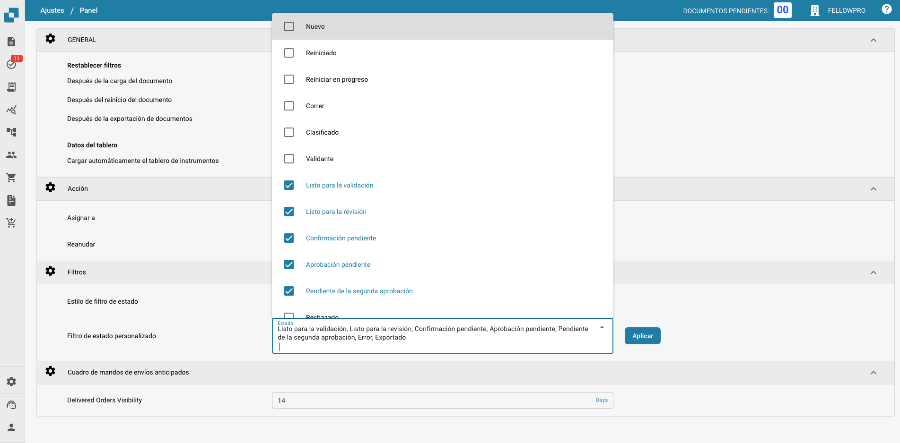
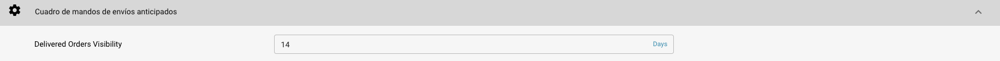

# Panel

## Resumen

La configuración del Panel está diseñada para ayudar a los administradores a controlar la presentación de datos y la interacción dentro del panel de DocBits. Estas configuraciones determinan qué información está disponible inmediatamente al iniciar sesión, asegurando que los usuarios tengan acceso rápido a los datos más relevantes para sus tareas.

<figure><figcaption></figcaption></figure>

## Características y Opciones General

### **Configuraciones Generales del Panel**:

* **Restablecer filtros**: Permite la configuración de cuándo deben restablecerse los filtros del panel, como después de la carga de documentos, reinicio de documentos o exportación de documentos. Esto ayuda a mantener una pizarra limpia para la visualización de datos según las etapas específicas del flujo de trabajo.
* **Datos del panel**: Controla si el panel debe cargar automáticamente los datos al acceder el usuario, lo que puede ayudar a reducir los tiempos de carga y mejorar la experiencia del usuario al cargar solo los datos cuando sea necesario.

<figure><figcaption></figcaption></figure>

### **Acción:**

* **Asignar a:** Esta función permite a los usuarios definir permisos para la asignación de documentos
  * **Only for Admin:** Solo los usuarios administradores pueden asignar documentos, independientemente de los permisos otorgados a los usuarios no administradores.
  * **All Users:** Todos los usuarios que han recibido los permisos necesarios pueden asignar documentos.
* **Reiniciar:** Esta función permite a los usuarios definir permisos para reiniciar documentos
  * **Only for Admin:** Solo los usuarios con privilegios de Admin pueden reiniciar documentos, independientemente de los permisos otorgados a los usuarios no administradores.
  * **Only Admin and Assignee:** Solo los usuarios con privilegios de Admin y el usuario asignado pueden reiniciar el documento.
  * **All Users:** Todos los usuarios que han recibido los permisos necesarios pueden reiniciar documentos.

<figure><figcaption></figcaption></figure>

### **Filtros**:

* **Estilo del filtro de estado**: Determina el estilo de presentación de los filtros de estado, que se puede establecer como predeterminado o personalizado según el enfoque operativo de los usuarios.
* **Filtro de estado personalizado**: Permite la creación y aplicación de filtros personalizados que pueden dirigirse a estados de documentos específicos como "Nuevo", "Validando" o "Exportando". Esto permite a los usuarios acceder rápidamente a documentos en etapas específicas de procesamiento.

<figure><figcaption></figcaption></figure>

### Cuadro de mandos de envíos anticipados:

* **Delivered Orders Visibility:** Esta función permite al usuario especificar la duración durante la cual los pedidos entregados serán visibles.

<figure><figcaption></figcaption></figure>

Estas configuraciones del panel son cruciales para asegurar que la plataforma DocBits sea lo más receptiva y útil posible, proporcionando a los usuarios una herramienta poderosa para monitorear y gestionar las actividades de procesamiento de documentos directamente desde el panel.
