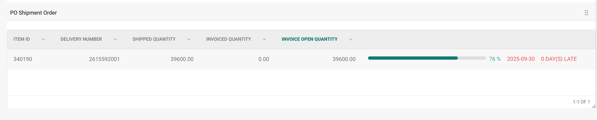

# Aufgabenverwaltung


DocBits Tasks & Notifications Tutorial: Assign Work, Track Status & Handle Workflow Tasks


Im Bereich "Aufgabenverwaltung" unter dem Abschnitt "Protokolleinstellungen" erhalten Sie einen Überblick über alle Celery-Aufgaben, deren Intervalle, wann die Aufgabe zuletzt ausgeführt wurde und wann sie erneut ausgeführt wird. Darüber hinaus haben Sie auch die Möglichkeit, eine Aufgabe erneut auszuführen. Wenn Sie nach einer bestimmten Aufgabe suchen, können Sie die Suchleiste dafür verwenden.&#x20;

<figure><figcaption></figcaption></figure>

Sie haben die Möglichkeit, die Liste mithilfe der kleinen Pfeile neben dem Spaltennamen zu sortieren.&#x20;

Spalten können neu angeordnet werden, indem Sie die linke Maustaste gedrückt halten und sie an die gewünschte Stelle ziehen.&#x20;