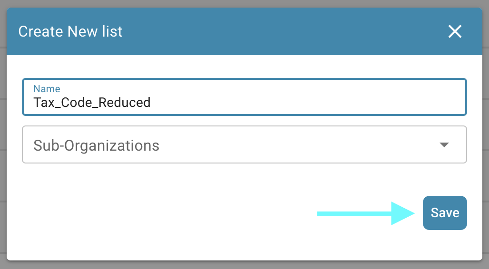
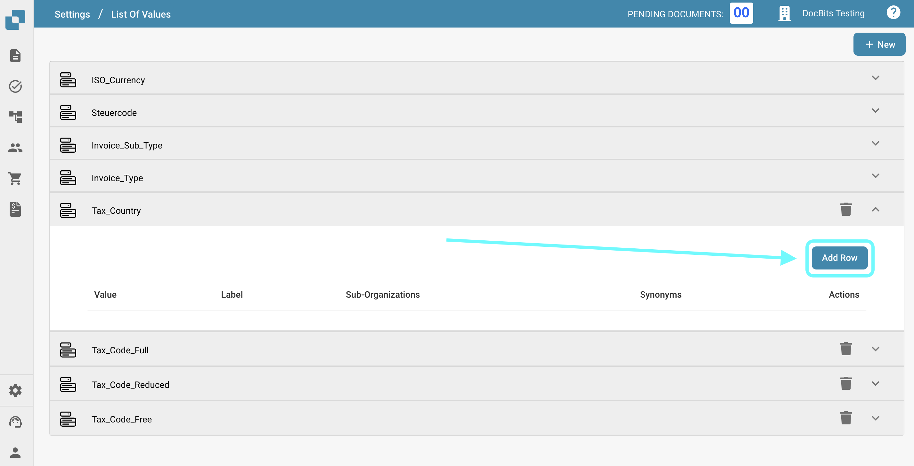
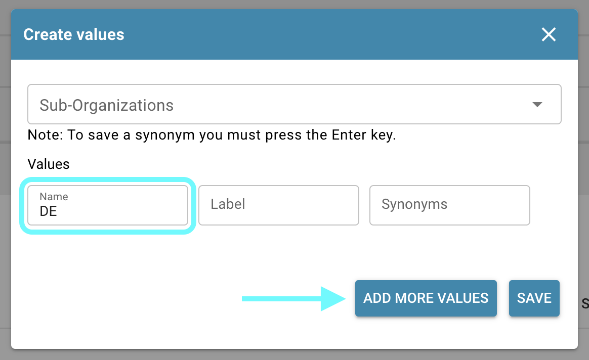
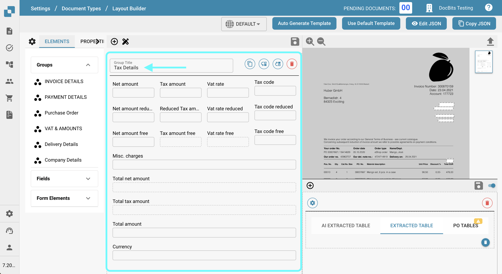

# Export Tax Codes to LN

## **Overview:**

\
This guide will walk you through the setup process to ensure tax codes are correctly exported from DocBits to LN.

### **Step 1: Set Up List of Values**

1.  Go to **Settings** -> **Document Processing** -> **List of Values**.

    <figure><figcaption></figcaption></figure>
2.  Click **New**.

    <figure><figcaption></figcaption></figure>
3.  Create a list with the name `Tax_Country` and click **Save**.

    <figure><figcaption></figcaption></figure>
4.  Create the following three additional lists:

    * `Tax_Code_Full`
    * `Tax_Code_Reduced`
    * `Tax_Code_Free`

    
<figure><figcaption></figcaption></figure> <figure><figcaption></figcaption></figure> <figure><figcaption></figcaption></figure>

5.  Click on one of the newly created lists to open it. Then, press the **Add Row** button to add a new row.

    <figure><figcaption></figcaption></figure>
6.  Enter the desired respective values from **LN** and press **Save** to save the changes.

    * If you have multiple values, you can click **Add More Values** to add them.

    
<figure><figcaption></figcaption></figure> <figure><figcaption></figcaption></figure>

    * **NOTE:** You can find the Tax Codes in LN under: **Common** → **Taxation** → **Master Data** → **Tax Codes** → **Tax Codes by Country**

    <figure><figcaption></figcaption></figure>

### **Step 2: Add Fields in DocBits**

1.  Navigate to **Settings** -> **Global Settings** -> **Document Types**.

    <figure><figcaption></figcaption></figure>
2.  Choose the Fields menu corresponding to the Document Type where you wish to add the fields.

    <figure><figcaption></figcaption></figure>
3.  Under **VAT & Amounts**, create six new fields as follows:

    <figure><figcaption></figcaption></figure>

<table data-header-hidden><thead><tr><th width="241"></th><th width="160"></th><th width="119"></th><th></th></tr></thead><tbody><tr><td><strong>Name</strong></td><td><strong>Title</strong></td><td><strong>Field Type</strong></td><td><strong>Value</strong></td></tr><tr><td><code>tax_country_full</code></td><td>Tax Country</td><td>Dropdown</td><td>Tax_Country</td></tr><tr><td><code>tax_country_reduced</code></td><td>Tax Country Reduced</td><td>Dropdown</td><td>Tax_Country</td></tr><tr><td><code>tax_country_free</code></td><td>Tax Country Free</td><td>Dropdown</td><td>Tax_Country</td></tr><tr><td><code>tax_code_1_dropdown</code></td><td>Tax Code</td><td>Dropdown</td><td>Tax_Code_Full</td></tr><tr><td><code>tax_code_2_dropdown</code></td><td>Tax Code Reduced</td><td>Dropdown</td><td>Tax_Code_Reduced</td></tr><tr><td><code>tax_code_3_dropdown</code></td><td>Tax Code Free</td><td>Dropdown</td><td>Tax_Code_Free</td></tr></tbody></table>

<figure><figcaption></figcaption></figure> <figure><figcaption></figcaption></figure> <figure><figcaption></figcaption></figure>

<figure><figcaption></figcaption></figure> <figure><figcaption></figcaption></figure> <figure><figcaption></figcaption></figure>

4.  After saving each field, click on **Save Settings** to apply the changes.

    <figure><figcaption></figcaption></figure>

### **Step 3: Edit Layout**

1.  Go to **Settings** -> **Global Settings** -> **Document Types**.

    <figure><figcaption></figcaption></figure>
2.  Open the **Layout** menu for the Document Type you want to edit.

    <figure><figcaption></figcaption></figure>
3.  Select the appropriate **Document Origin** for which you want to apply the Tax Codes

    <figure><figcaption></figcaption></figure>
4.  Scroll down to the **Tax Details** section.

    <figure><figcaption></figcaption></figure>
5. Expand the **Form Elements** dropdown menu.
6.  In the **Tax Types** section, use the **Horizontal Separator Tool**. Drag and drop it between the sub-sections within the tax section to clearly separate them and reduce confusion.

    <figure><figcaption></figcaption></figure>
7. Expand the **Form** dropdown menu.
8. Search for **Tax Country** and drag and drop the field into its respective area.
9.

    <figure><figcaption></figcaption></figure>
10. Search for **Tax Code** and drag and drop the field into its corresponding area.

    <figure><figcaption></figcaption></figure>
11. Save the template.

    <figure><figcaption></figcaption></figure>

### Step 4: Verify that Everything Worked

After uploading a new document into DocBits with the correct document settings selected, you should now be able to select the tax codes you added to the lists in Step 1.

<figure><figcaption></figcaption></figure>
