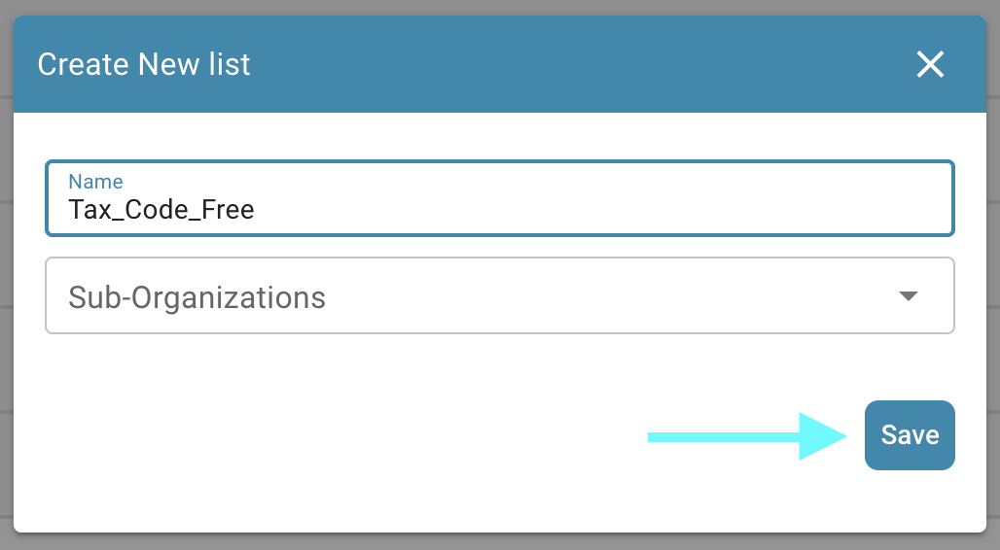
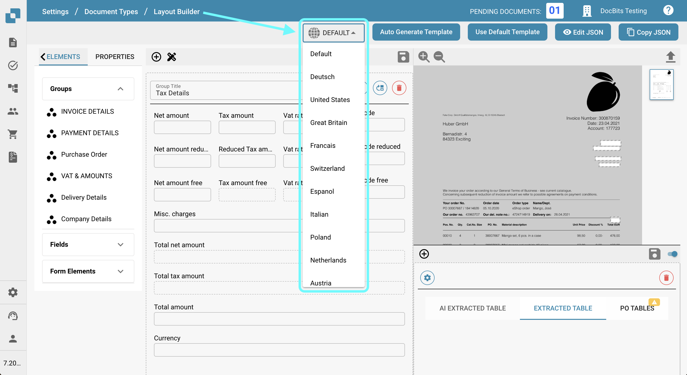
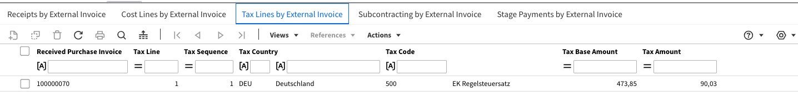

# Export Tax Codes to LN

## **Overview:**

\
This guide will walk you through the setup process to ensure tax codes are correctly exported from DocBits to LN.


## **Single Tax Codes**

### **Step 1: Set Up List of Values**

1.  Go to **Settings** -> **Document Processing** -> **List of Values**.

    <figure><figcaption></figcaption></figure>
2.  Click **New**.

    <figure><figcaption></figcaption></figure>
3.  Create a list with the name `Tax_Country` and click **Save**.


    <figure><figcaption></figcaption></figure>
4.  Create the following three additional lists:

    * `Tax_Code_Full`
    * `Tax_Code_Reduced`
    * `Tax_Code_Free`

    <div align="left"><figure><figcaption></figcaption></figure> <figure><figcaption></figcaption></figure> <figure><figcaption></figcaption></figure></div>
5.  Click on one of the newly created lists to open it. Then, press the **Add Row** button to add a new row.


    <figure><figcaption></figcaption></figure>
6.  Enter the desired respective values from **LN** and press **Save** to save the changes.

    * If you have multiple values, you can click **Add More Values** to add them.

    <div align="left"><figure><figcaption></figcaption></figure> <figure><figcaption></figcaption></figure></div>

    * **NOTE:** You can find the Tax Codes in LN under: **Common** → **Taxation** → **Master Data** → **Tax Codes** → **Tax Codes by Country**

    <figure><figcaption></figcaption></figure>

### **Step 2: Add Fields in DocBits**

1.  Navigate to **Settings** -> **Global Settings** -> **Document Types**.

    <figure><figcaption></figcaption></figure>
2.  Choose the Fields menu corresponding to the Document Type where you wish to add the fields.

    <figure><figcaption></figcaption></figure>
3.  Under **VAT & Amounts**, create six new fields as follows:

    <figure><figcaption></figcaption></figure>

<table data-header-hidden><thead><tr><th width="306"></th><th width="139"></th><th width="119"></th><th></th></tr></thead><tbody><tr><td><strong>Name</strong></td><td><strong>Title</strong></td><td><strong>Field Type</strong></td><td><strong>Value</strong></td></tr><tr><td><code>tax_country</code></td><td>Tax Country</td><td>Dropdown</td><td>Tax_Country</td></tr><tr><td><code>tax_country_2</code></td><td>Tax Country Reduced</td><td>Dropdown</td><td>Tax_Country</td></tr><tr><td><code>tax_country_3</code></td><td>Tax Country Free</td><td>Dropdown</td><td>Tax_Country</td></tr><tr><td><code>tax_code_without_country</code></td><td>Tax Code</td><td>Dropdown</td><td>Tax_Code_Full</td></tr><tr><td><code>tax_code_without_country_2</code></td><td>Tax Code Reduced</td><td>Dropdown</td><td>Tax_Code_Reduced</td></tr><tr><td><code>tax_code_without_country_3</code></td><td>Tax Code Free</td><td>Dropdown</td><td>Tax_Code_Free</td></tr></tbody></table>

<div><figure><figcaption></figcaption></figure> <figure><figcaption></figcaption></figure> <figure><figcaption></figcaption></figure></div>

<div><figure><figcaption></figcaption></figure> <figure><figcaption></figcaption></figure> <figure><figcaption></figcaption></figure></div>

4.  After saving each field, click on **Save Settings** to apply the changes.

    <figure><figcaption></figcaption></figure>

### **Step 3: Edit Layout**

1.  Go to **Settings** -> **Global Settings** -> **Document Types**.

    <figure><figcaption></figcaption></figure>
2.  Open the **Layout** menu for the Document Type you want to edit.

    <figure><figcaption></figcaption></figure>
3.  Select the appropriate **Document Origin** for which you want to apply the Tax Codes

    <figure><figcaption></figcaption></figure>
4.  Scroll down to the **Tax Details** section.

    <figure><figcaption></figcaption></figure>
5. Expand the **Form Elements** dropdown menu.
6.  In the **Tax Details** section, use the **Horizontal Separator Tool**. Drag and drop it between the sub-sections within the tax section to clearly separate them and reduce confusion.

    <figure><figcaption></figcaption></figure>
7. Expand the **Form Fields** dropdown menu.
8.  Search for **Tax Country** and drag and drop the field into its respective area.

    <figure><figcaption></figcaption></figure>
9.  Search for **Tax Code** and drag and drop the field into its corresponding area.

    <figure><figcaption></figcaption></figure>
10. Save the template.

    <figure><figcaption></figcaption></figure>

### Step 4: Verify that Everything Worked

After uploading a new document into DocBits with the correct document settings selected, you should now be able to select the tax codes you added to the lists in Step 1.

<figure><figcaption></figcaption></figure>

## Multi Tax Code

### **Step 1: Set Up List of Values**

1.  Go to **Settings** -> **Document Processing** -> **List of Values**.

    <figure><figcaption></figcaption></figure>
2.  Click **New**.

    <figure><figcaption></figcaption></figure>
3.  Create a list with the name `Tax_Country` and click **Save**.


    <figure><figcaption></figcaption></figure>
4.  Create the following three additional lists:

    * `Tax_Code_Full`
    * `Tax_Code_Reduced`
    * `Tax_Code_Free`

    <div align="left"><figure><figcaption></figcaption></figure> <figure><figcaption></figcaption></figure> <figure><figcaption></figcaption></figure></div>
5.  Click on one of the newly created lists to open it. Then, press the **Add Row** button to add a new row.


    <figure><figcaption></figcaption></figure>
6.  Enter the desired respective values from **LN** and press **Save** to save the changes.

    * If you have multiple values, you can click **Add More Values** to add them.

    <div align="left"><figure><figcaption></figcaption></figure> <figure><figcaption></figcaption></figure></div>

    * **NOTE:** You can find the Tax Codes in LN under: **Common** → **Taxation** → **Master Data** → **Tax Codes** → **Tax Codes by Country**

    <figure><figcaption></figcaption></figure>

### **Step 2: Add Fields in DocBits**

1.  Navigate to **Settings** -> **Global Settings** -> **Document Types**.

    <figure><figcaption></figcaption></figure>
2.  Choose the Fields menu corresponding to the Document Type where you wish to add the fields.

    <figure><figcaption></figcaption></figure>
3.  Under **VAT & Amounts**, create six new fields as follows:

    <figure><figcaption></figcaption></figure>

<table data-header-hidden><thead><tr><th width="306"></th><th width="139"></th><th width="119"></th><th></th></tr></thead><tbody><tr><td><strong>Name</strong></td><td><strong>Title</strong></td><td><strong>Field Type</strong></td><td><strong>Value</strong></td></tr><tr><td><code>tax_country</code></td><td>Tax Country</td><td>Dropdown</td><td>Tax_Country</td></tr><tr><td><code>tax_country_2</code></td><td>Tax Country Reduced</td><td>Dropdown</td><td>Tax_Country</td></tr><tr><td><code>tax_country_3</code></td><td>Tax Country Free</td><td>Dropdown</td><td>Tax_Country</td></tr><tr><td><code>tax_code_without_country</code></td><td>Tax Code</td><td>Dropdown</td><td>Tax_Code_Full</td></tr><tr><td><code>tax_code_without_country_2</code></td><td>Tax Code Reduced</td><td>Dropdown</td><td>Tax_Code_Reduced</td></tr><tr><td><code>tax_code_without_country_3</code></td><td>Tax Code Free</td><td>Dropdown</td><td>Tax_Code_Free</td></tr></tbody></table>

<div><figure><figcaption></figcaption></figure> <figure><figcaption></figcaption></figure> <figure><figcaption></figcaption></figure></div>

<div><figure><figcaption></figcaption></figure> <figure><figcaption></figcaption></figure> <figure><figcaption></figcaption></figure></div>

4.  After saving each field, click on **Save Settings** to apply the changes.

    <figure><figcaption></figcaption></figure>

### **Step 3: Edit Layout**

1.  Go to **Settings** -> **Global Settings** -> **Document Types**.

    <figure><figcaption></figcaption></figure>
2.  Open the **Layout** menu for the Document Type you want to edit.

    <figure><figcaption></figcaption></figure>
3.  Select the appropriate **Document Origin** for which you want to apply the Tax Codes

    <figure><figcaption></figcaption></figure>
4.  Scroll down to the **Tax Details** section.

    <figure><figcaption></figcaption></figure>
5. Expand the **Form Elements** dropdown menu.
6.  In the Tax Details section use the **Sub Group** Tool. Drag and Drop it next to an existing field

    <figure><figcaption></figcaption></figure>
7.  To name your subgroup, click on the subgroup and enter your desired name in the **Label** field.

    <div><figure><figcaption></figcaption></figure> <figure><figcaption></figcaption></figure></div>
8.  Drag and drop the fields that correspond to this group into the **Sub Group** field.

    <figure><figcaption></figcaption></figure>
9. Expand the **Fields** dropdown menu.
10. Search for **Tax** and drag and drop the respective fields, such as **Tax Country** and **Tax Code**, into the corresponding subgroup.

    <figure><figcaption></figcaption></figure>
11. Repeat steps 5 through 10 2 times to reach the following state:

    <figure><figcaption></figcaption></figure>
12. Save the template.

    <figure><figcaption></figcaption></figure>

### Step 4: Verify that Everything Worked and resulting changes

After uploading a new document into DocBits with the correct document settings selected, you will be able to select the tax codes you added in Step 1 and add multiple tax codes configured in Step 3.

* The document will begin with three distinct sections: one for Tax Full amounts, one for Tax Reduced amounts, and one for Tax Free amounts.

<figure><figcaption></figcaption></figure>

* Clicking the plus button within a section will create a duplicate, allowing multiple submissions at the selected tax rate.

<figure><figcaption></figcaption></figure>

* Sections can be deleted by clicking the remove button.
* Total Amounts will be calculated as a sum of all sections
* Validation of Total Amount will be modified based on all tax-sections
* Scripts for new sections can only be applied once fields have been added to the view.

### Note for LN:

In **LN** USt Position will be filled out based on the position number from the Tax Code/Tax Country dropdown menu. Only the Position number will be sent to export.

<figure><figcaption></figcaption></figure>

<figure><figcaption></figcaption></figure>

#### **Export Mapping**

* To link Tax Line with Cost line\
  Add `TaxLine` in InvoiceCostFields list
* Add Following in below list ICF\_TaxLine=TF\_position
* **Example:**

```
InvoiceCostFields=TaxLine,LineNumber,LedgerAccount,DebitCredit,Amount,TransactionReference,Dimension1,Dimension2,Dimension3,Dimension4,Dimension5,Dimension6,Dimension7,Dimension8,Dimension9,Dimension10,Dimension11,Dimension12
ICF_LineNumber=auto
ICF_TaxLine=TF_position
ICF_LedgerAccount=TF_ledger_account
ICF_DebitCredit=invoice_type
ICF_Amount=TF_amount
ICF_Dimension1=TF_dimension_1
ICF_Dimension2=TF_dimension_2
ICF_Dimension3=TF_dimension_3
ICF_Dimension4=TF_dimension_4
ICF_Dimension5=TF_dimension_5
ICF_Dimension6=TF_dimension_6
ICF_Dimension7=TF_dimension_7
ICF_Dimension8=TF_dimension_8
ICF_Dimension9=TF_dimension_9
ICF_Dimension10=TF_dimension_10
ICF_Dimension11=TF_dimension_11
ICF_Dimension12=TF_dimension_12
ICF_Quantity1=TF_quantity
ICF_Quantity2=TF_quantity2
ICF_TransactionReference=TF_Buchungsreferenz
```
