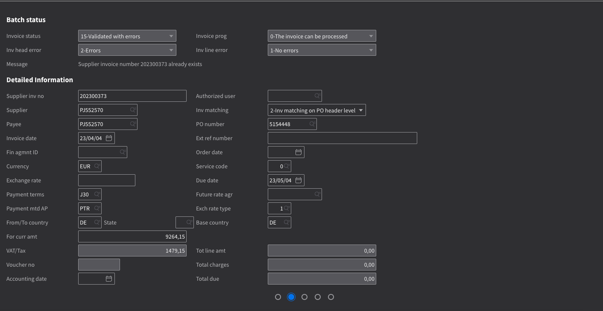
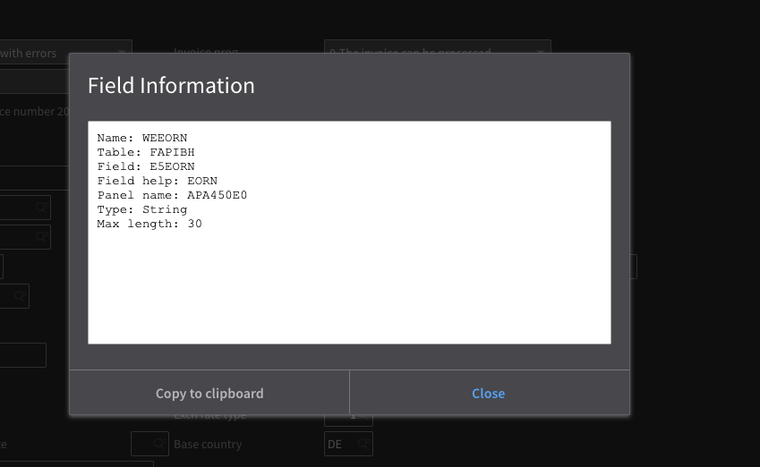
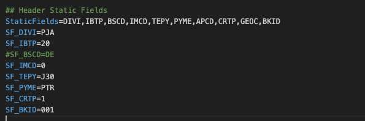

# Exportar para Mapeamento M3 (API)

### Seções

O arquivo de mapeamento de exportação M3 é dividido em 5 seções e cada seção é ainda dividida em 2 seções

* Cabeçalho
* Campos Estáticos do Cabeçalho
* Campos do Cabeçalho
* Linhas de Imposto
* Campos Estáticos da Linha de Imposto
* Campos da Linha de Imposto
* Linhas de Recibo
* Campos Estáticos da Linha de Recibo
* Campos da Linha de Recibo
* Linhas de Cobrança do Pedido (Valores Adicionais)
* Campos Estáticos da Cobrança do Pedido
* Campos da Cobrança do Pedido
* Linhas de Custo
* Campos Estáticos da Linha de Custo
* Campos da Linha de Custo

### Adicionar e Remover Campos

Adicionar Novo Campo:

* Primeiro, precisamos adicionar o **nome do campo da API M3** à lista de campos da seção relevante (por exemplo, CamposEstáticos, CamposCabeçalho, CamposImpostoFatura)
* Definir o valor estático ou nome do campo do documento para o campo da API com o prefixo apropriado para a seção
* Exemplo 1: Para definir um valor estático de **AAA** para o campo da API M3 **DIVI.** Primeiro adicionamos DIVI à propriedade **CamposEstáticos**. Em seguida, adicionamos uma linha **SF\_DIVI = AAA** pois SF\_ é o prefixo para campos estáticos
* Exemplo 2: Para mapear o campo do cabeçalho **IVDT (data da fatura)** para o campo invoice\_date do DocBits. Primeiro adicionamos IVDT à propriedade **CamposCabeçalho**. Em seguida, adicionamos uma linha HF\_IVDT = invoice\_date pois HF\_ é o prefixo para campos do cabeçalho

Remover Campo:

* Apenas remova o campo da lista de campos da seção e remova a linha que define o valor para o campo.

#### **Campos da API M3 Disponíveis:**

* Os campos disponíveis do M3 podem ser verificados abrindo a tela apropriada no M3.

<figure><figcaption></figcaption></figure>

<figure><figcaption></figcaption></figure>

* Da mesma forma, você pode obter os nomes dos campos para as linhas

### Cabeçalho:

<figure><figcaption></figcaption></figure>

Propriedade da Lista de Campos: CamposEstáticos

Prefixo dos Campos da Seção: SF\_

Campos Disponíveis: Você pode mapear qualquer campo da API M3 com qualquer valor estático

#### **Campos do Cabeçalho**

Propriedade da Lista de Campos: CamposCabeçalho

Prefixo dos Campos da Seção: HF\_

Campos Disponíveis: Você pode mapear qualquer campo do DocBits com qualquer campo da API M3

### Linha de Imposto:

#### Campos Estáticos da Linha de Imposto:

Propriedade da Lista de Campos: CamposEstáticosImpostoFatura

Prefixo dos Campos da Seção: IT\_SF\_

Campos M3 Disponíveis: Por favor, verifique a API ou UI do M3

Campos DocBits Disponíveis: Você pode colocar qualquer valor, pois são campos estáticos

#### Campos da Linha de Imposto:

Propriedade da Lista de Campos: CamposImpostoFatura

Prefixo dos Campos M3: ITF\_

Prefixo do Campo da Tabela DocBits: TF\_

Campos M3 Disponíveis: Por favor, verifique a API ou UI do M3

Campos DocBits Disponíveis: line\_number, tax\_amount, tax\_rate, net\_amount, gross\_amount, tax\_code\_full, tax\_code, tax\_country

### Linha de Recibo:

#### Campos Estáticos da Linha de Recibo:

Propriedade da Lista de Campos: CamposEstáticosReciboFatura

Prefixo dos Campos da Seção: IR\_SF\_

Campos M3 Disponíveis: Por favor, verifique a API ou UI do M3

Campos DocBits Disponíveis: Você pode colocar qualquer valor, pois são campos estáticos

#### Campos da Linha de Recibo:

Propriedade da Lista de Campos: CamposReciboFatura

Prefixo dos Campos M3: IRF\_

Prefixo do Campo da Tabela DocBits: TF\_

Campos M3 Disponíveis: Por favor, verifique a API ou UI do M3

Campos DocBits Disponíveis: packing\_slip, purchase\_order, line\_number, line\_sequence, delivery\_number, delivery\_line, amount, quantity, total\_net\_amount

### Linha de Cobrança do Pedido:

#### Campos Estáticos da Cobrança do Pedido:

Propriedade da Lista de Campos: CamposEstáticosCobrançaPedido

Prefixo dos Campos da Seção: OC\_SF\_

Campos M3 Disponíveis: Por favor, verifique a API ou UI do M3

Campos DocBits Disponíveis: Você pode colocar qualquer valor, pois são campos estáticos

#### Campos da Cobrança do Pedido:

Propriedade da Lista de Campos: CamposCobrançaPedido

Prefixo dos Campos M3: OCF\_

Prefixo do Campo da Tabela DocBits: TF\_

Campos M3 Disponíveis: Por favor, verifique a API ou UI do M3

Campos DocBits Disponíveis: ledger\_account, dimension\_2-7, amount, quantity, quantity2, position

### Linha de Custo:

#### Campos Estáticos da Linha de Custo:

Propriedade da Lista de Campos: CamposEstáticosCustoFatura

Prefixo dos Campos da Seção: IC\_SF\_

Campos M3 Disponíveis: Por favor, verifique a API ou UI do M3

Campos DocBits Disponíveis: Você pode colocar qualquer valor, pois são campos estáticos

#### Campos da Linha de Custo:

Propriedade da Lista de Campos: CamposCustoFatura

Prefixo dos Campos M3: ICF\_

Prefixo do Campo da Tabela DocBits: TF\_

Campos M3 Disponíveis: Por favor, verifique a API ou UI do M3

Campos DocBits Disponíveis: ledger\_account, dimension\_1-12, amount, quantity, quantity2, position

Nova atualização
```
###########################
# Header
###########################

## Header Static Fields
StaticFields=DIVI,IBTP,BSCD,IMCD,TEPY,PYME,APCD,CRTP,GEOC,CONO,BKID
SF_DIVI=AAA
SF_IBTP=20
SF_CONO=780
#SF_BSCD=DE
SF_IMCD=0
SF_TEPY=N00
SF_PYME=SCT
SF_APCD=FABCEO
SF_CRTP=1
SF_GEOC=60290522

## Header Fields
HeaderFields=SUNO,IVDT,SINO,SPYN,CUCD,CUAM,VTAM,ACDT,SERS,FTCO,BSCD,PUNO,TXAP,CORI,PAIN,BKID
HF_SUNO=supplier_id
HF_IVDT=invoice_date
HF_SINO=invoice_id
HF_SPYN=supplier_id
HF_CUCD=currency
HF_CUAM=total_net_amount
#HF_VTAM=total_tax_amount
HF_ACDT=invoice_date
#HF_SERS=invoice_sub_type
HF_FTCO=supplier_country_code
HF_PUNO=purchase_order
HF_TXAP=tax_country_1
HF_CORI = correlation_id
HF_PAIN = sqr_field_esr_reference
HF_BKID = custom_field_1


###########################
# Tax Line
###########################

# ## Tax Line Static Fields
# InvoiceTaxStaticFields=RDTP,DIVI,VTCD,CONO
# IT_SF_RDTP=3
# IT_SF_DIVI=AAA
# IT_SF_CONO=780

# ## Tax Line Fields
# InvoiceTaxFields=VTCD,VTA1,VTP1,CLAM
# ITF_VTCD=TF_tax_code
# ITF_VTA1=TF_tax_amount
# ITF_VTP1=TF_tax_rate
# ITF_CLAM=TF_gross_amount

###########################
# Receipt Line
###########################

InvoiceReceipt=invoice_table

## Receipt Line Static Fields
InvoiceReceiptStaticFields=RDTP,DIVI,SERS,RELP,VTCD,CONO
IR_SF_RDTP=1
IR_SF_DIVI=AAA
IR_SF_SERS=0
IR_SF_RELP=1
#IR_SF_VTCD=52
IR_SF_CONO=780

## Receipt Line Fields
InvoiceReceiptFields=IVQA,PUUN,PUNO,PNLI,ITNO,POPN,SUDO,NEPR,GRPR,PPUN,NLAM,GLAM
IRF_IVQA = TF_quantity
IRF_PUUN = TF_unit
IRF_PUNO = TF_purchase_order
IRF_PNLI = TF_line_number
IRF_ITNO = TF_item_number
IRF_POPN = TF_item_number
IRF_SUDO = TF_packing_slip
#IRF_NEPR = TF_net_unit_price
IRF_GRPR = TF_gross_unit_price
IRF_PPUN = TF_unit
#IRF_NLAM = TF_net_amount
IRF_GLAM = TF_total_amount

###########################
# Order Charge Line
###########################

OrderCharge=order_charges

## Order Charge Static Fields
OrderChargeStaticFields=RDTP,DIVI,CONO
OC_SF_RDTP=2
OC_SF_DIVI=AAA
OC_SF_CONO=780

## Order Charge Fields
OrderChargeFields=NLAM,CHGT,CEID
OCF_NLAM=TF_amount
OCF_CHGT=TF_voucher_text
OCF_CEID=TF_ledger_account


###########################
# Cost Line
###########################

InvoiceCost=cost_lines

## Cost Line Static Fields
InvoiceCostStaticFields=RDTP,DIVI,CONO
IC_SF_RDTP=8
IC_SF_DIVI=AAA
IC_SF_CONO=780

## Cost Line Fields
InvoiceCostFields=NLAM,VTXT,AO01,AO02,AO03,AO04,AO05,AO06,AO07,VTCD,AIT1,AIT2,AIT3,AIT4,AIT5,AIT6,AIT7,VTP1,VTP2
ICF_NLAM=TF_amount
ICF_VTXT=TF_voucher_text
ICF_AIT1=TF_ledger_account
ICF_AIT2=TF_dimension_2
ICF_AIT3=TF_dimension_3
ICF_AIT4=TF_dimension_4
ICF_AIT5=TF_dimension_5
ICF_AIT6=TF_dimension_6
ICF_AIT7=TF_dimension_7
ICF_AO01=TF_accounting_object_1
ICF_AO02=TF_accounting_object_2
ICF_AO03=TF_accounting_object_3
ICF_AO04=TF_accounting_object_4
ICF_AO05=TF_accounting_object_5
ICF_AO06=TF_accounting_object_6
ICF_AO07=TF_accounting_object_7
```

