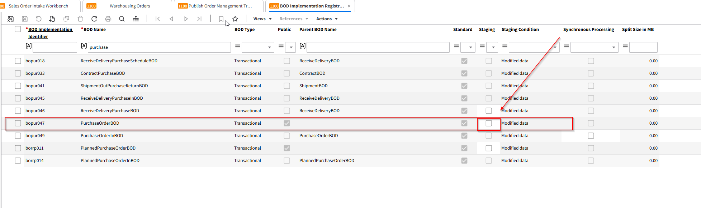

# Purchase Order - FAQ

**Where do I check if the PurchaseOrderBOD synchronization updates are correctly implemented?**

Navigate to the _BOD Implementation Registration (bobod1100m000)_ session in LN. This session allows you to review, modify, and register both standard and custom BOD implementations, including the PurchaseOrderBOD.

\

<figure><figcaption></figcaption></figure>

**How can I identify the specific BOD implementation I need to verify?**

Look for the BOD Implementation Identifier and BOD Name fields. The BOD Name typically indicates the type of BOD (e.g., PurchaseOrderBOD). The BOD Implementation Identifier is a unique identifier for that BOD configuration.

\

**What does the ‘Public’ checkbox mean in the BOD Implementation Registration session?**

The Public checkbox indicates whether the BOD implementation is available for external communication.

• Selected: The BOD can be exchanged outside LN (public and protected interface).

• Cleared: The BOD is for internal LN processing only (protected interface).

\

**I see a ‘Parent BOD Name’ field. What is it used for?**

The Parent BOD Name field shows the parent BOD if the current BOD is a derived or dependent version. If the Public checkbox is selected, this field will be empty. Otherwise, it helps you understand the hierarchy of BOD implementations.

\

**How do I know if the BOD implementation is a standard or a custom one?**

Check the Standard checkbox.

• Selected: The BOD is a standard, LN-delivered implementation.

• Cleared: The BOD is a custom implementation that your team or a partner has defined.

\

**What is the purpose of the ‘Staging’ checkbox?**

The Staging checkbox, if selected, means BODs are first staged rather than immediately published. They can then be published from the _Publish Staged BODs (bobod2200m000)_ session.

Note: For the ProjectBudgetBOD, staging is mandatory and cannot be changed. For standard master data BODs, staging can be enabled manually, and for custom BODs, it can always be configured.

\

**How does the ‘Synchronous Processing’ checkbox affect incoming BOD handling?**

Synchronous Processing determines the action if a follow-up process after receiving a BOD fails.

• Selected: The incoming BOD and the follow-up process must both succeed, or neither will be processed.

• Cleared: The incoming BOD is processed, but if the follow-up process fails, it must be handled manually.

\

**Where do I verify if the ‘Stage’ feature is active or not for my BOD?**

In the _BOD Implementation Registration (bobod1100m000)_ session, check the Staging checkbox. If it is not selected, staging is not active for that particular BOD.

\

**If the PurchaseOrderBOD is not triggered on all updates, what else should I consider?**

• Confirm that the Staging option is set as intended. If staging is off, the BOD should publish immediately.

• Verify that the Synchronous Processing setting is correct for your workflow.

• Ensure that the BOD Implementation Identifier and BOD Name are correct and that you’re working on the proper BOD configuration.

• Check if the BOD is standard or custom and verify if any custom settings override standard behavior.

\

**Are there any scenarios where I might not see the PurchaseOrderBOD updates as expected?**

Yes. If the BOD is not configured properly (wrong settings in Public, Staging, or Synchronous Processing) or if it’s a custom BOD implementation not aligned with your process requirements, updates may not trigger as expected. Review your configuration in the _bobod1100m000_ session and ensure all parameters match your intended process flow.
