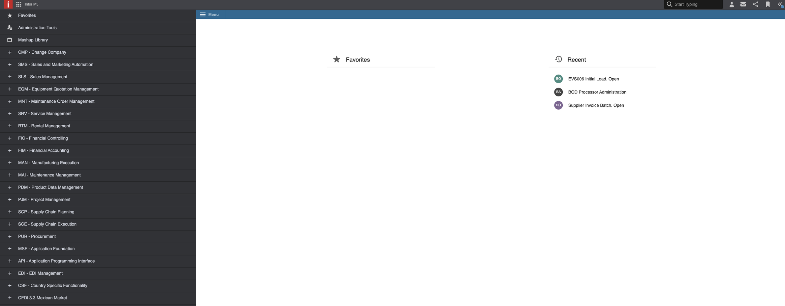
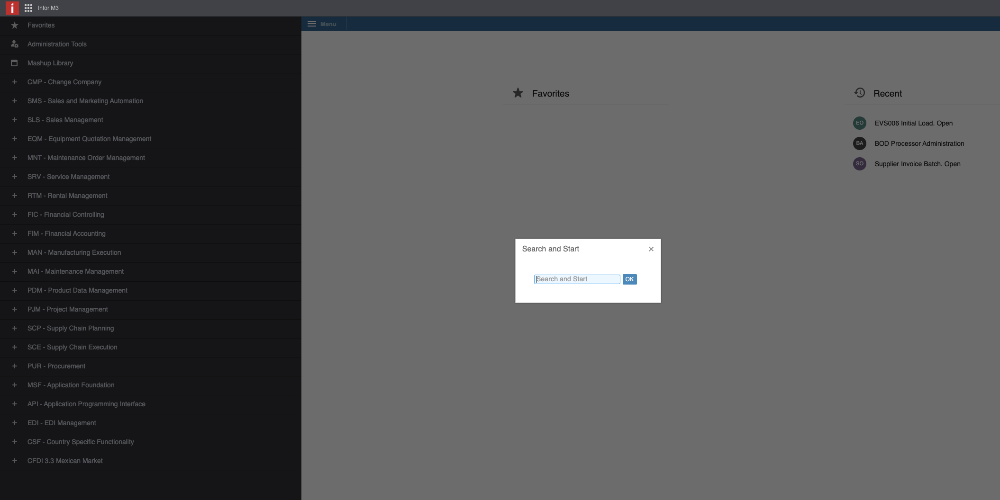
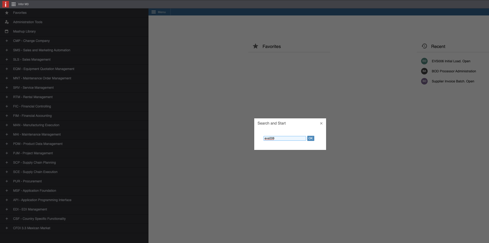
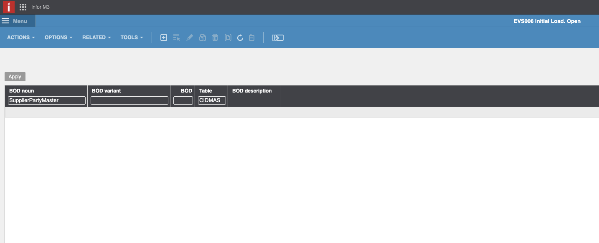
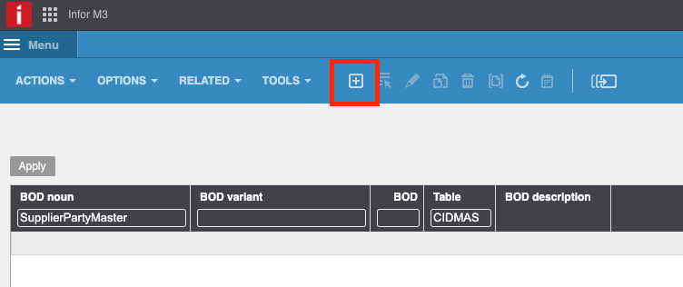
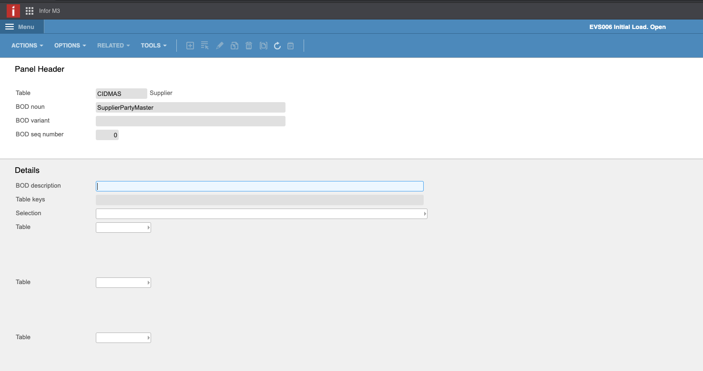
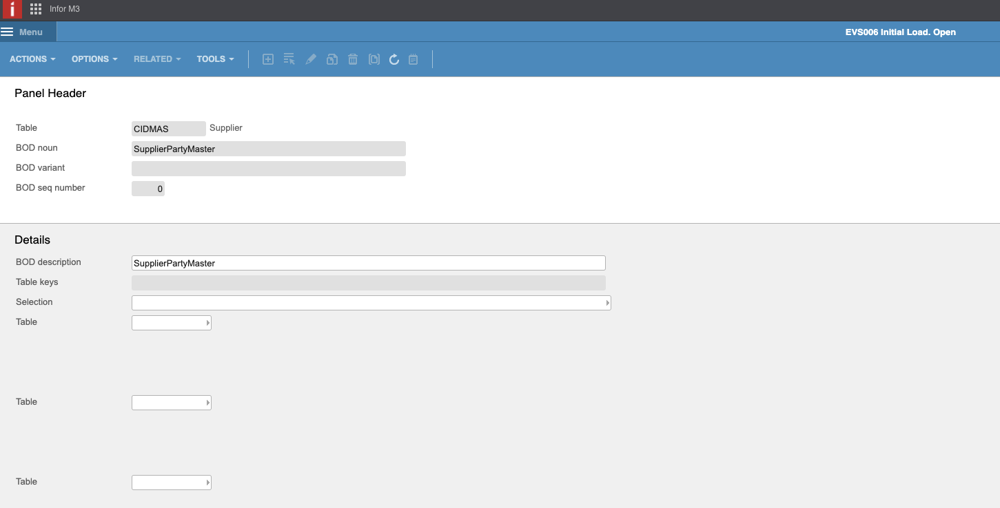
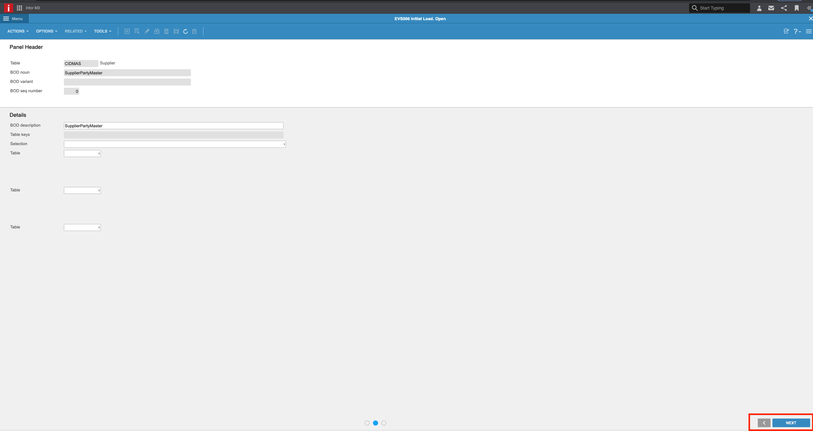
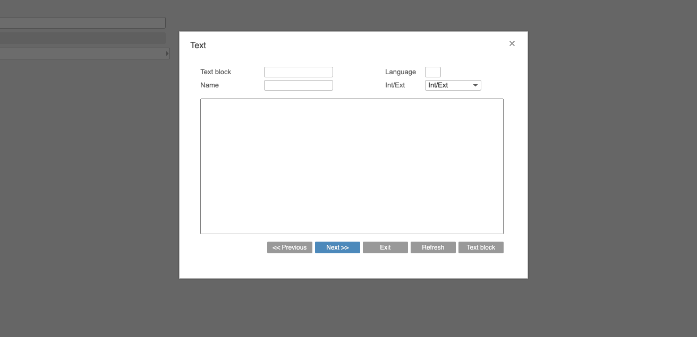
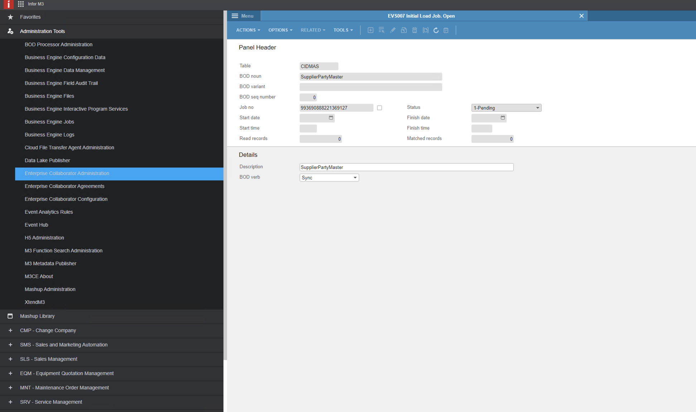

# How to import all suppliers

* [ ] Log yourself into the Infor OS environment and go to the M3 application. Recommendation: Make sure you have admin rights in order to be able to run all the programs.

<figure><figcaption></figcaption></figure>

* [ ] Run the program _**evs006**_. Press command + R and you will see the open tab to search and start.

<figure><figcaption>
<em><strong>evs006</strong></em>
</figcaption></figure>

* [ ] When _**evs006**_ is open you will see an empty table. Please fill the columns of “BOD noun” and “Table”. For “BOD noun” introduce “SupplierPartyMaster” and for “Table” we are going to use the M3 supplier table called “CIDMAS”.

<figure><figcaption></figcaption></figure>

<figure><figcaption></figcaption></figure>

* [ ] When you have filled these columns, just click on CREATE button (on the upper bar side of the screen). You will come to following screen.

<figure><figcaption></figcaption></figure>

<figure><figcaption></figcaption></figure>

* [ ] Fill the “BOD Description” with SupplierPartyMaster.

<figure><figcaption></figcaption></figure>

* [ ] Click on Next. (On the down left side of the screen).

<figure><figcaption></figcaption></figure>

* [ ] Click Next in this window.

<figure><figcaption></figcaption></figure>

* [ ] Now when you see this screen with the filled table with the BOD SupplierPartyMaster make right click on the BOD and choose Related > Run.

<figure><figcaption></figcaption></figure>

* [ ] In this next window select “Sync” and next.

<figure><figcaption></figcaption></figure>

After finishing all these steps you have activated the BOD to import all suppliers from table CIDMAS. After some minutes you should see the supplier in Docbits. \

