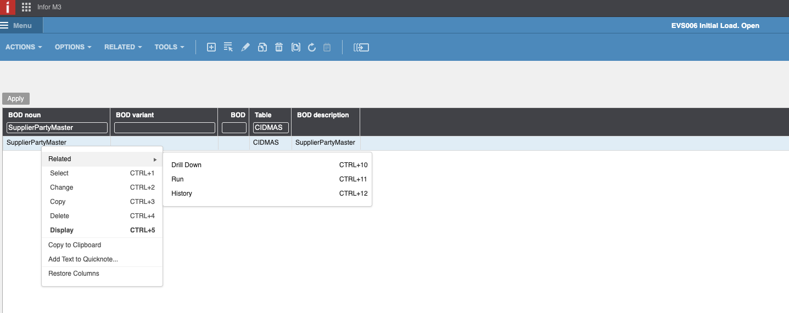

# Tüm tedarikçileri nasıl içe aktarılır

* [ ] Kendinizi Infor OS ortamına giriş yapın ve M3 uygulamasına gidin. Tavsiye: Tüm programları çalıştırabilmek için yönetici haklarına sahip olduğunuzdan emin olun.

<figure><figcaption></figcaption></figure>

* [ ] _**evs006**_ programını çalıştırın. Komut + R'ye basın ve aramak ve başlatmak için açık sekme göreceksiniz.

<figure><figcaption>
<em><strong>evs006</strong></em>
</figcaption></figure>

* [ ] _**evs006**_ açıldığında boş bir tablo göreceksiniz. Lütfen "BOD ismi" ve "Tablo" sütunlarını doldurun. "BOD ismi" için "SupplierPartyMaster" ve "Tablo" için "CIDMAS" adlı M3 tedarikçi tablosunu kullanacağız.

<figure><figcaption></figcaption></figure>

<figure><figcaption></figcaption></figure>

* [ ] Bu sütunları doldurduğunuzda, ekranın üst çubuğunda bulunan CREATE düğmesine tıklayın. Aşağıdaki ekrana geleceksiniz.

<figure><figcaption></figcaption></figure>

<figure><figcaption></figcaption></figure>

* [ ] "BOD Açıklaması"nı SupplierPartyMaster olarak doldurun.

<figure><figcaption></figcaption></figure>

* [ ] Sonraki'ye tıklayın (ekranın sol alt tarafında).

<figure><figcaption></figcaption></figure>

* [ ] Bu pencerede Next'e tıklayın.

<figure><figcaption></figcaption></figure>

* [ ] Şimdi, BOD SupplierPartyMaster ile doldurulmuş tabloyu gördüğünüzde, BOD üzerinde sağ tıklayın ve İlgili > Çalıştır'ı seçin.

<figure><figcaption></figcaption></figure>

* [ ] Bu sonraki pencerede "Senkronize" seçeneğini seçin ve devam edin.

<figure><figcaption></figcaption></figure>

Tüm bu adımları tamamladıktan sonra, CIDMAS tablosundan tüm tedarikçileri içe aktarmak için BOD'u etkinleştirmiş olacaksınız. Birkaç dakika sonra tedarikçileri DocBits'te görmelisiniz. \
