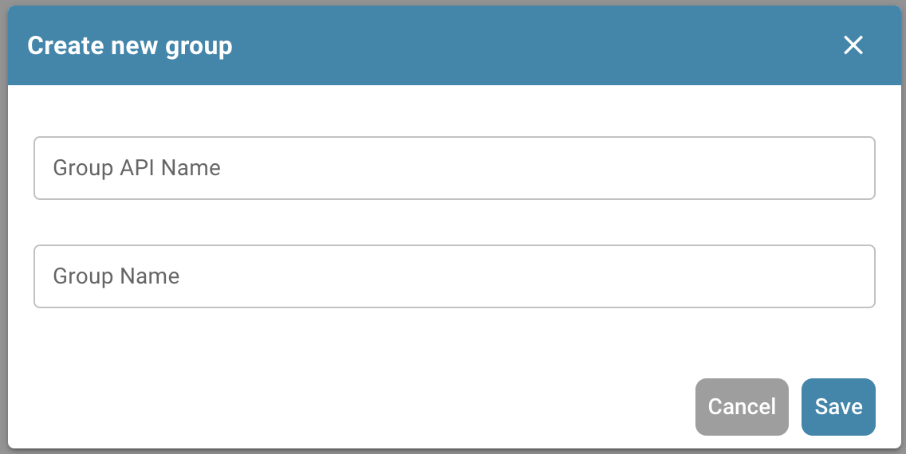
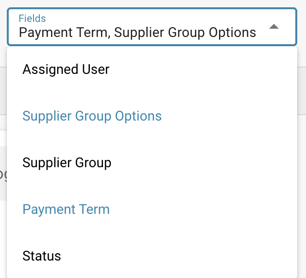

# Lieferantenportal

## Lieferantenportal

#### Aktivierung 

Wählen Sie im Dashboard die Einstellungen aus.

<figure><figcaption></figcaption></figure>

Dokumentenverarbeitung → Modul

<figure><figcaption></figcaption></figure>

Aktivieren Sie anschließend das Lieferantenportal, indem Sie den Schieberegler aktivieren.

<figure><figcaption></figcaption></figure>

#### Lieferanteneinstellungen 

Sobald die Funktion Lieferantenportal aktiviert ist, steht ein neuer Bereich der Einstellungen zur Verfügung. Wenn Sie zum Ende der Liste der Einstellungen scrollen, sehen Sie Folgendes.

<figure><figcaption></figcaption></figure>

In diesem Abschnitt haben Sie Zugriff auf Folgendes.

<figure><figcaption></figcaption></figure>

**Lieferantenberechtigungen**

Hier können Sie alle Anbieter verwalten, indem Sie sie gruppieren, was die Verwaltung aller Lieferanten erleichtert. Benutzern können auch die verschiedenen Lieferantengruppen zugewiesen werden, die Sie in diesem Bereich erstellen.

**Lieferantengruppe**

Um die Verwaltung aller Anbieter zu erleichtern, können Sie in diesem Abschnitt Gruppen erstellen und Lieferanten basierend auf ihrem geografischen Standort, Typ des Anbieters usw. diesen Gruppen zuweisen. Die Wahl liegt bei Ihnen!

<figure><figcaption></figcaption></figure>

Um eine neue Lieferantengruppe zu erstellen, klicken Sie auf die Schaltfläche +Neu in der oberen rechten Ecke Ihres Bildschirms.

<figure><figcaption></figcaption></figure>

Geben Sie dieser Gruppe einfach einen Namen, der die Lieferanten, die dieser Gruppe zugewiesen werden, genau beschreibt.

<figure><figcaption></figcaption></figure>

**Benutzer- und Lieferantengruppenzuordnung**

Alle Lieferantengruppen, die Sie erstellt haben, werden hier angezeigt, da Sie hier in der Lage sind, DocBits-Benutzer den Lieferantengruppen zuzuweisen, die Sie erstellen.

<figure><figcaption></figcaption></figure>

Um einen neuen Benutzer einer Lieferantengruppe zuzuweisen, klicken Sie auf die Schaltfläche +Neu und wählen Sie den Benutzer aus, den Sie zuweisen möchten.

<figure><figcaption></figcaption></figure>

Wählen Sie den Benutzer aus, den Sie der Lieferantengruppe aus der Dropdown-Liste zuweisen möchten, und klicken Sie dann auf Hinzufügen, um diesen Benutzer zuzuweisen.

**Richtlinie und Datenschutzerklärung**

Hier können Sie Ihre Richtlinie und Datenschutzerklärung für die Anbieter hochladen, die Sie über das Lieferantenportal einladen werden. Um ein Dokument hochzuladen, klicken Sie einfach auf Dokument hochladen in der oberen rechten Ecke Ihres Bildschirms.

<figure><figcaption></figcaption></figure>

**E-Mail-Vorlagen**

In diesem Abschnitt können Sie verschiedene E-Mail-Vorlagen hochladen, da dies die Struktur der E-Mails sein wird, die der Lieferant erhält, wenn Sie ihn einladen, dem Lieferantenportal beizutreten. Die erforderlichen Vorlagen umfassen: Einladung, Genehmigung, Abschluss der Registrierung und Ablehnung, da dies alle möglichen E-Mails sind, die ein Lieferant erhalten könnte. Um eine Vorlage hochzuladen, klicken Sie auf +Neu.

<figure><figcaption></figcaption></figure>

**Lieferantenlayout**

Sie können das Layout des Registrierungsformulars anpassen, das die Anbieter, die Sie einladen, sehen werden, wenn sie sich für das Lieferantenportal registrieren. Das bedeutet, dass Sie Felder je nach den Anforderungen der eingeladenen Lieferanten hinzufügen oder entfernen können. Der Lieferantenlayout-Builder funktioniert genau wie der Layout-Builder für Dokumenttypen. Für weitere Informationen klicken Sie hier.

Unten sehen Sie, dass Sie mehrere Layouts je nach Ihren Bedürfnissen konfigurieren können.

<figure><figcaption></figcaption></figure>

Innerhalb des Layouts können Sie Dropdown-Listen hinzufügen, die mit der Funktion Werteliste erstellt werden können.

<figure><figcaption></figcaption></figure>

**BITTE BEACHTEN**

Nur Werte, die in INFOR existieren, dürfen in diesen Listen verwendet werden, damit der Export funktioniert. Im obigen Beispiel existieren die auswählbaren Werte für das Feld „Lieferantengruppe“ alle innerhalb von INFOR. Dasselbe Prinzip gilt für alle Listen, sei es für Zahlungsbedingungen, Währungen usw. Um sicherzustellen, dass es beim Export keine Probleme gibt, konsultieren Sie zuerst die in INFOR gespeicherten Werte, bevor Sie diese Listen konfigurieren.

**Allgemeine Lieferanteneinstellungen**

Hier können Sie Ihr Firmenlogo oder eine Alternative hochladen, das im Kopfbereich aller gesendeten E-Mail-Vorlagen sowie auf dem DocBits-Login-Bildschirm angezeigt wird, sobald die Lieferanten den Registrierungsprozess beginnen. Wenn dieses Feld leer bleibt, wird das Standard-DocBits-Logo angezeigt.

Zusätzliche Einladungsfelder für das Lieferantenportal: Diese Option ermöglicht es Ihnen, zusätzliche Felder zu der Einladung hinzuzufügen, die Sie an die Anbieter senden. Eine Liste von Feldern steht Ihnen wie unten gezeigt zur Verfügung.

<figure><figcaption></figcaption></figure>

**Exportkonfiguration**

Laden Sie hier Ihre ION-API sowie Ihre IDM-Zuordnungsdatei hoch, und Ihre M3-Zuordnungsdatei wird rechts generiert.

<figure><figcaption></figcaption></figure>


