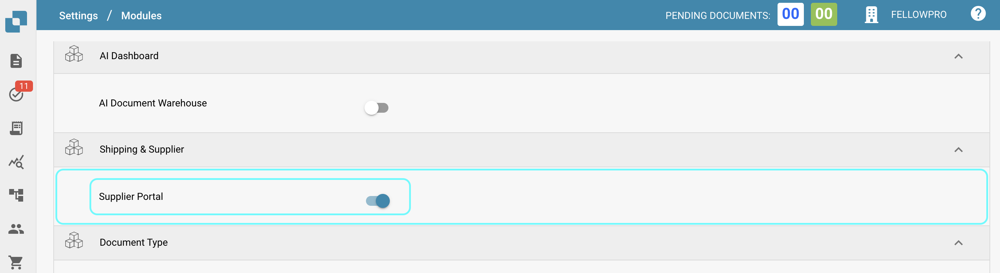

# Portail Fournisseur

### Activation 

Depuis le tableau de bord, sélectionnez Paramètres.

<figure><figcaption></figcaption></figure>

Traitement des documents → Module

<figure><figcaption></figcaption></figure>

Ensuite, activez le Portail Fournisseur en activant le curseur.

<figure><figcaption></figcaption></figure>

### Paramètres Fournisseur 

Une fois la fonctionnalité Portail Fournisseur activée, une nouvelle zone de Paramètres devient disponible. Si vous faites défiler jusqu'en bas de la liste des Paramètres, vous verrez ce qui suit.

<figure><figcaption></figcaption></figure>

Dans cette section, vous avez accès à ce qui suit.

<figure><figcaption></figcaption></figure>

### **Permissions Fournisseur**

C'est ici que vous pouvez gérer tous les fournisseurs en les regroupant, ce qui facilite la gestion de tous les fournisseurs. Des utilisateurs peuvent également être assignés aux différents groupes de fournisseurs que vous créez dans cette zone.

### **Groupe de Fournisseurs**

Afin de faciliter la gestion de tous les fournisseurs, dans cette section, vous pouvez créer des groupes et assigner des fournisseurs à ces groupes en fonction de leur localisation géographique, type de fournisseur, etc. Le choix vous appartient !

<figure><figcaption></figcaption></figure>

Pour créer un nouveau groupe de fournisseurs, cliquez sur le bouton +Nouveau dans le coin supérieur droit de votre écran.

<figure><figcaption></figcaption></figure>

Puis, attribuez simplement à ce groupe un nom qui décrit précisément les fournisseurs qui seront assignés à ce groupe.

<figure><figcaption></figcaption></figure>

### **Mapping Utilisateur et Groupe de Fournisseurs**

Tous les groupes de fournisseurs que vous avez créés seront affichés ici, car c'est ici que vous pouvez assigner des utilisateurs DocBits aux groupes de fournisseurs que vous créez.

<figure><figcaption></figcaption></figure>

Pour assigner un nouvel utilisateur à un groupe de fournisseurs, cliquez sur le bouton +Nouveau et sélectionnez l'utilisateur que vous souhaitez assigner.

<figure><figcaption></figcaption></figure>

Sélectionnez l'utilisateur que vous souhaitez assigner au groupe de fournisseurs dans la liste déroulante, puis cliquez sur Ajouter pour assigner cet utilisateur.

### **Politique et Déclaration de Confidentialité**

C'est ici que vous pouvez télécharger votre politique et votre déclaration de confidentialité pour les fournisseurs que vous inviterez via le portail fournisseur. Pour télécharger un document, cliquez simplement sur Télécharger Document dans le coin supérieur droit de votre écran.

<figure><figcaption></figcaption></figure>

### **Modèles d'Email**

Dans cette section, vous pouvez télécharger divers modèles d'email, car ce seront la structure des emails reçus par le fournisseur lorsque vous l'invitez à rejoindre le portail fournisseur. Les modèles requis incluent : invitation, approbation, complétion d'inscription et rejet, car ce sont tous les emails possibles qu'un fournisseur pourrait recevoir. Pour télécharger un modèle, cliquez sur +Nouveau.

<figure><figcaption></figcaption></figure>

### **Mise en Page Fournisseur**

Vous pouvez personnaliser la mise en page du formulaire d'inscription que les fournisseurs que vous invitez verront lors de leur inscription au portail fournisseur. Cela signifie que vous pouvez ajouter ou supprimer des champs en fonction de ce qui est requis par les fournisseurs que vous invitez. Le constructeur de mise en page des fournisseurs fonctionne exactement de la même manière que le constructeur de mise en page des types de documents, pour plus d'informations à ce sujet, cliquez ici.

Vous pouvez voir ci-dessous que vous êtes en mesure de configurer plusieurs mises en page en fonction de vos besoins.

<figure><figcaption></figcaption></figure>

Dans la mise en page, vous pouvez ajouter des listes déroulantes qui peuvent être créées à l'aide de la fonctionnalité Liste de Valeurs.

<figure><figcaption></figcaption></figure>

### **À GARDER À L'ESPRIT**

Seules les valeurs qui existent dans INFOR peuvent être utilisées dans ces listes afin que l'exportation fonctionne. Dans l'exemple montré ci-dessus, les valeurs sélectionnables pour le champ "Groupe de Fournisseurs" existent toutes dans INFOR. Le même principe s'applique à toutes les listes, qu'il s'agisse de conditions de paiement, de devises, etc. Pour éviter tout problème lors de l'exportation, consultez d'abord les valeurs stockées dans INFOR avant de configurer ces listes.

### **Paramètres Généraux du Fournisseur**

C'est ici que vous pouvez télécharger votre logo d'entreprise ou un autre qui sera affiché en haut de tous les modèles d'email envoyés ainsi que sur l'écran de connexion DocBits une fois que les fournisseurs commencent le processus d'inscription. Si laissé vide, le logo standard de DocBits sera affiché.

Champs d'invitation supplémentaires du Portail Fournisseur : Cette option vous permet d'ajouter des champs supplémentaires à l'invitation que vous envoyez aux fournisseurs, une liste de champs vous est mise à disposition comme indiqué ci-dessous.

<figure><figcaption></figcaption></figure>

### **Configuration d'Exportation**

Téléchargez votre API ION ainsi que votre fichier de mapping IDM ici et votre fichier de mapping M3 sera généré à droite.

<figure><figcaption></figcaption></figure>
