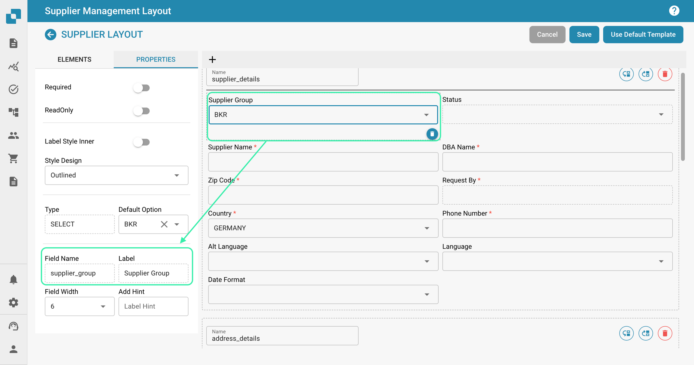

# Portal do Fornecedor

### Ativação 

No Painel, selecione Configurações.

<figure><figcaption></figcaption></figure>

Processamento de Documentos → Módulo

<figure><figcaption></figcaption></figure>

Em seguida, ative o Portal do Fornecedor ativando o controle deslizante.

<figure><figcaption></figcaption></figure>

### Configurações do Fornecedor 

Uma vez que o recurso do Portal do Fornecedor foi ativado, uma nova área de Configurações se torna disponível. Se você rolar até o final da lista de Configurações, verá o seguinte.

<figure><figcaption></figcaption></figure>

Nesta seção, você tem acesso ao seguinte.

<figure><figcaption></figcaption></figure>

### **Permissões do Fornecedor**

Aqui é onde você pode gerenciar todos os fornecedores agrupando-os, facilitando a gestão de todos os fornecedores. Os usuários também podem ser atribuídos aos vários grupos de fornecedores que você criar nesta área.

### **Grupo de Fornecedores**

Para facilitar a gestão de todos os fornecedores, nesta seção, você pode criar grupos e atribuir fornecedores a esses grupos com base em sua localização geográfica, tipo de fornecedor, etc. A escolha é sua!

<figure><figcaption></figcaption></figure>

Para criar um novo grupo de fornecedores, clique no botão +Novo no canto superior direito da sua tela.

<figure><figcaption></figcaption></figure>

Em seguida, simplesmente atribua a este grupo um nome que descreva com precisão os fornecedores que serão atribuídos a este grupo.

<figure><figcaption></figcaption></figure>

### **Mapeamento de Usuário e Grupo de Fornecedores**

Todos os grupos de fornecedores que você criou serão mostrados aqui, pois é onde você pode atribuir usuários do DocBits aos grupos de fornecedores que você criar.

<figure><figcaption></figcaption></figure>

Para atribuir um novo usuário a um grupo de fornecedores, clique no botão +Novo e selecione o usuário que você gostaria de atribuir.

<figure><figcaption></figcaption></figure>

Selecione o usuário que você gostaria de atribuir ao grupo de fornecedores na lista suspensa e, em seguida, clique em Adicionar para atribuir esse usuário.

### **Política e Declaração de Privacidade**

Aqui é onde você pode fazer o upload da sua política e declaração de privacidade para os fornecedores que você convidará através do portal do fornecedor. Para fazer o upload de um documento, basta clicar em Fazer Upload do Documento no canto superior direito da sua tela.

<figure><figcaption></figcaption></figure>

### **Modelos de Email**

Nesta seção, você pode fazer o upload de vários modelos de email, pois estes serão a estrutura dos emails recebidos pelo fornecedor quando você o convidar para se juntar ao portal do fornecedor. Os modelos necessários incluem: convite, aprovação, conclusão de registro e rejeição, pois estes são todos os possíveis emails que um fornecedor pode receber. Para fazer o upload de um modelo, clique em +Novo.

<figure><figcaption></figcaption></figure>

### **Layout do Fornecedor**

Você pode personalizar o layout do formulário de registro que os fornecedores que você convidar verão ao se registrarem para o portal do fornecedor. Isso significa que você pode adicionar ou remover campos dependendo do que é necessário dos fornecedores que você convidar. O construtor de layout do fornecedor funciona exatamente como o construtor de layout do tipo de documento; para mais informações sobre isso, clique aqui.

Abaixo, você pode ver que é possível configurar vários layouts dependendo das suas necessidades.

<figure><figcaption></figcaption></figure>

Dentro do layout, você pode adicionar listas suspensas que podem ser criadas usando o recurso Lista de Valores.

<figure><figcaption></figcaption></figure>

### **LEMBRE-SE**

Apenas valores que existem no INFOR podem ser usados nessas listas para que a exportação funcione. No exemplo mostrado acima, os valores selecionáveis para o campo “Grupo de Fornecedores” existem todos dentro do INFOR. O mesmo princípio se aplica a todas as listas, seja para condições de pagamento, moedas, etc. Para garantir que não haja problemas durante a exportação, consulte primeiro os valores armazenados no INFOR antes de configurar essas listas.

### **Configurações Gerais do Fornecedor**

Aqui é onde você pode fazer o upload do logotipo da sua empresa ou alternativa, que será exibido no cabeçalho de todos os modelos de email enviados, bem como na tela de login do DocBits assim que os fornecedores começarem o processo de registro. Se deixado em branco, o logotipo padrão do DocBits será exibido.

Campos Adicionais de Convite do Portal do Fornecedor: Esta opção permite que você adicione campos adicionais ao convite que você envia aos fornecedores; uma lista de campos é disponibilizada para você, conforme mostrado abaixo.

<figure><figcaption></figcaption></figure>

### **Configuração de Exportação**

Faça o upload da sua API ION, bem como do seu arquivo de mapeamento IDM aqui, e seu arquivo de mapeamento M3 será gerado à direita.

<figure><figcaption></figcaption></figure>
