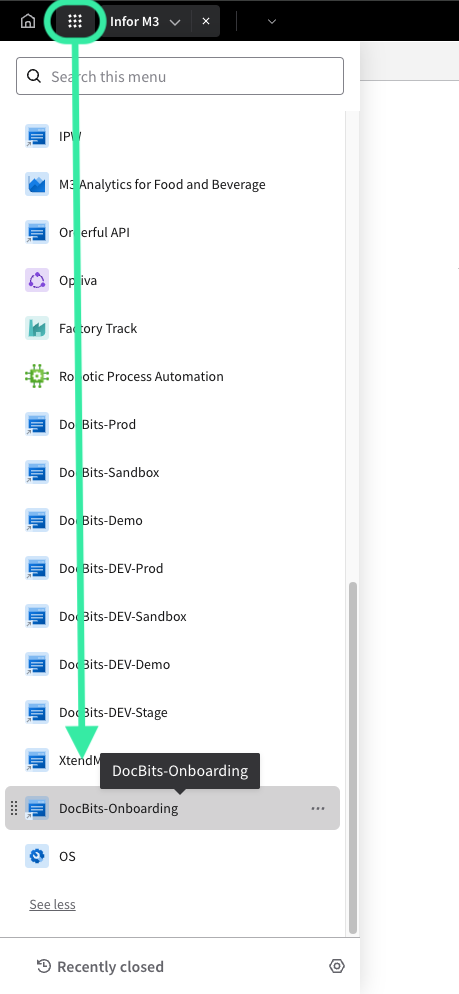

# V2

## Prerequisites

| Required Information           | Description                                                                                                                                       |
| ------------------------------ | ------------------------------------------------------------------------------------------------------------------------------------------------- |
| Login Details to Cloud         | Credentials are mandatory for accessing the Infor Cloud environment. The user should have the roles "Infor-SystemAdministrator" and "UserAdmin".  |
| Config Admin Details (DocBits) | You should have received an email from FellowPro AG with the login details for the DocBits SSO Settings page. You will need a login and password. |
| Certificate                    | You can download the certificate in DocBits under SSO Service Provider Settings                                                                   |

## Get access to the Cloud and check your access

URL starts with https://mingle-portal.eu1.inforcloudsuite.com/\<TENANT\_NAME> followed by your personal extension

Choose the option Cloud Identities and use your login details

On the new Portal, the way you access this menu now is by selecting the OS option in the left menu. If you do not see it in the menu, click on See More to view all applications.

## Adding a new Service Provider

Select Security, in the OS menu, to be taken to the area for adding a new service provider. The steps are the same from this point on.

Then you need to select in the left hand side menu the option Security Administration and Service Provider.

You will see this window with the Service Providers.

Now click on the “+” sign and add our DocBits as Service Provider.&#x20;

## Access the SSO SERVICE PROVIDER SETTINGS in DocBits

* Log in on URL https://app.docbits.com/ with the login details you received from us.
* Go to SETTINGS (on top bar) and select INTEGRATION, under SSO Service Provider Settings you will find all the information you need for the following steps.
* Download the certificate

Filling the Service Provider with the help of SSO Service Provider Settings in DocBits&#x20;

| Field                      | Value                                                                                      |
| -------------------------- | ------------------------------------------------------------------------------------------ |
| Application Type           | DEFAULT\_SAML                                                                              |
| Display Name               | DocBits                                                                                    |
| Entity ID                  | See Entity ID under SSO SERVICE SETTINGS                                                   |
| SSO Endpoint               | Copy the SSO URL from SSO SERVICE SETTINGS and paste it in the SSO Endpoint field.         |
| SLO Endpoint               | Copy the SLO URL from SSO SERVICE SETTINGS and paste it in the SSO Endpoint field.         |
| Signing Certificate        | Upload the appropriate .cer file you have downloaded in step 3c) from SSO SERVICE SETTINGS |
| Name ID Format and Mapping | email address                                                                              |

* When you have filled out everything remember to save it with the disk icon above Application Type
* Enter the service provider DocBits again.
* Click on view the Identity Provider Information underneath.

## Export the SAML METADATA.

File looks like this: ServiceProviderSAMLMetadata\_10\_20\_2021.xml

Import the SAML METADATA in the SSO Settings.

Go to IDENTITY SERVICE PROVIDER SETTINGS, which is located under INTEGRATIONS in SETTINGS. Enter your Tenant ID (e.g. FELLOWPRO\_DEV) and underneath that line you see the Upload file and the IMPORT Button, where you need to upload the previously exported SAML METADATA file.

* Click on IMPORT and then choose the METADATA file that you have already downloaded from the SSO SERVICE PROVIDER SETTINGS
* Click on CONFIGURE

## Add New Application in INFOR Ming.le

Click on OS in the left menu (like before), you will be taken to a menu where you need to select Portal. Next, click on + Add Application on the right.\
\
\
Fill in the following information, the URL field is the SSO Endpoint URL from the Integration area in your DocBits settings. A Logical ID will also be generated for you, when done click save.&#x20;

**Final Step**

* Log out of DocBits.
* Go back to the left menu in Infor and select the application you just created.

<figure><figcaption></figcaption></figure>

* You will be taken to the Dashboard of DocBits.

