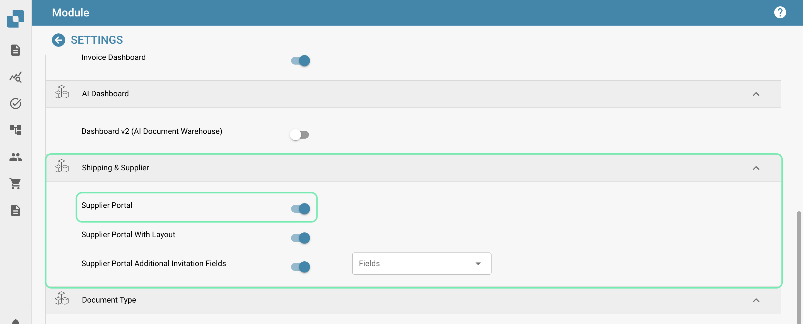
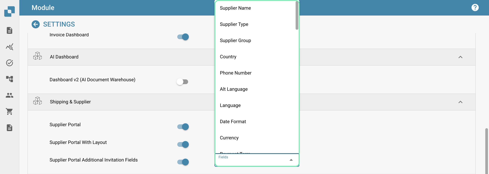

# Portail Fournisseur

### Activation 

Depuis le tableau de bord, sélectionnez Paramètres.

Traitement des documents → Module

<figure><figcaption></figcaption></figure>

Ensuite, activez le Portail Fournisseur en activant le curseur.

<figure><figcaption></figcaption></figure>

De plus, il existe également des curseurs pour le Portail Fournisseur avec Mise en page ainsi que pour les Champs d'invitation supplémentaires du Portail Fournisseur.

Portail Fournisseur avec Mise en page : L'activation de cette option vous permet de créer des mises en page personnalisées pour le portail fournisseur, ce qui signifie que vous pouvez personnaliser les informations requises en fonction de la localisation géographique ou d'autres critères des fournisseurs que vous souhaitez inviter. Cela sera discuté plus en détail plus tard.

Champs d'invitation supplémentaires du Portail Fournisseur : Cette option vous permet d'ajouter des champs supplémentaires à l'invitation que vous envoyez aux fournisseurs, une liste de champs vous est mise à disposition comme indiqué ci-dessous.

<figure><figcaption></figcaption></figure>

### Paramètres Fournisseur 

Une fois la fonctionnalité Portail Fournisseur activée, une nouvelle zone de Paramètres devient disponible. Si vous faites défiler vers le bas de la liste des Paramètres, vous verrez ce qui suit.

<figure><figcaption></figcaption></figure>

Dans cette section, vous avez accès à ce qui suit.

<figure><figcaption></figcaption></figure>

#### Permissions Fournisseur 

C'est ici que vous pouvez gérer tous les fournisseurs en les regroupant, ce qui facilite la gestion de tous les fournisseurs. Des utilisateurs peuvent également être assignés aux différents groupes de fournisseurs que vous créez dans cette zone.

**Groupe de Fournisseurs**

Afin de faciliter la gestion de tous les fournisseurs, dans cette section, vous pouvez créer des groupes et assigner des fournisseurs à ces groupes en fonction de leur localisation géographique, type de fournisseur, etc. Le choix vous appartient !

<figure><figcaption></figcaption></figure>

Pour créer un nouveau groupe de fournisseurs, cliquez sur le bouton +Nouveau dans le coin supérieur droit de votre écran.

<figure><figcaption></figcaption></figure>

Puis, attribuez simplement à ce groupe un nom qui décrit précisément les fournisseurs qui seront assignés à ce groupe.

<figure><figcaption></figcaption></figure>

**Mapping Utilisateur et Groupe de Fournisseurs**

Tous les groupes de fournisseurs que vous avez créés seront affichés ici, car c'est ici que vous pouvez assigner des utilisateurs DocBits aux groupes de fournisseurs que vous créez.

<figure><figcaption></figcaption></figure>

Pour assigner un nouvel utilisateur à un groupe de fournisseurs, cliquez sur le bouton +Nouveau et sélectionnez l'utilisateur que vous souhaitez assigner.

<figure><figcaption></figcaption></figure>

Sélectionnez l'utilisateur que vous souhaitez assigner au groupe de fournisseurs dans la liste déroulante, puis cliquez sur Ajouter pour assigner cet utilisateur.

#### Politique et Déclaration de Confidentialité 

C'est ici que vous pouvez télécharger votre politique et votre déclaration de confidentialité pour les fournisseurs que vous inviterez via le portail fournisseur. Pour télécharger un document, cliquez simplement sur Télécharger le document dans le coin supérieur droit de votre écran.

<figure><figcaption></figcaption></figure>

#### Modèles d'Email 

Dans cette section, vous pouvez télécharger divers modèles d'email, car ceux-ci constitueront la structure des emails reçus par le fournisseur lorsque vous les invitez à rejoindre le portail fournisseur. Les modèles requis incluent : invitation, approbation, achèvement de l'enregistrement et rejet, car ce sont tous les emails possibles qu'un fournisseur pourrait recevoir. Pour télécharger un modèle, cliquez sur +Nouveau.

<figure><figcaption></figcaption></figure>

#### Mise en Page Fournisseur 

Vous pouvez personnaliser la mise en page du formulaire d'inscription que les fournisseurs que vous invitez verront lors de leur inscription au portail fournisseur. Cela signifie que vous pouvez ajouter ou supprimer des champs en fonction de ce qui est requis des fournisseurs que vous invitez. Le constructeur de mise en page du fournisseur fonctionne exactement de la même manière que le constructeur de mise en page du type de document, pour plus d'informations à ce sujet, cliquez [ici](document-types/layout-builder.md).

Ci-dessous, vous pouvez voir que vous êtes en mesure de configurer plusieurs mises en page en fonction de vos besoins.

<figure><figcaption></figcaption></figure>

Dans la mise en page, vous pouvez ajouter des listes déroulantes qui peuvent être créées à l'aide de la fonctionnalité [Liste de Valeurs](../settings/document-processing/list-of-values.md).

<figure><figcaption></figcaption></figure>

**À GARDER À L'ESPRIT**

Seules les valeurs qui existent dans INFOR peuvent être utilisées dans ces listes afin que l'exportation fonctionne. Dans l'exemple montré ci-dessus, les valeurs sélectionnables pour le champ "Groupe de Fournisseurs" existent toutes dans INFOR. Le même principe s'applique à toutes les listes, qu'il s'agisse de conditions de paiement, de devises, etc. Pour éviter tout problème lors de l'exportation, consultez d'abord les valeurs stockées dans INFOR avant de configurer ces listes.

#### Paramètres Généraux du Fournisseur 

C'est ici que vous pouvez télécharger votre logo d'entreprise ou un autre qui sera affiché en haut de tous les modèles d'email envoyés ainsi que sur l'écran de connexion DocBits une fois que les fournisseurs commenceront le processus d'inscription. Si laissé vide, le logo standard de DocBits sera affiché.

#### Configuration d'Exportation 

Téléchargez votre API ION ainsi que votre fichier de mapping IDM ici et votre fichier de mapping M3 sera généré à droite.

<figure><figcaption></figcaption></figure>

&#x20;