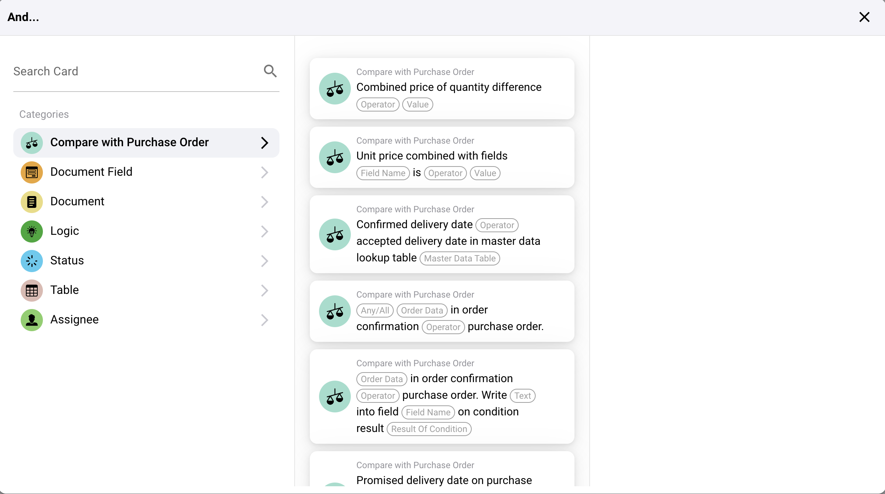
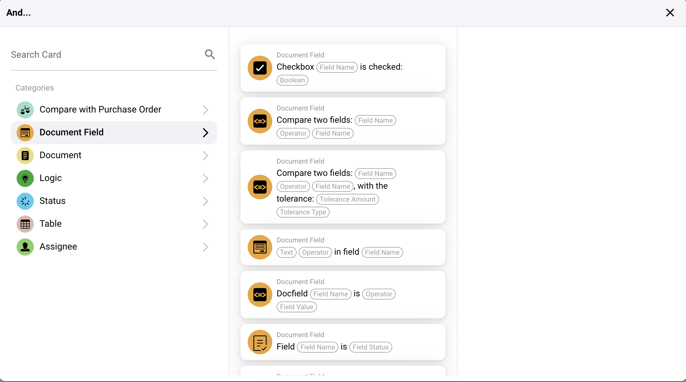
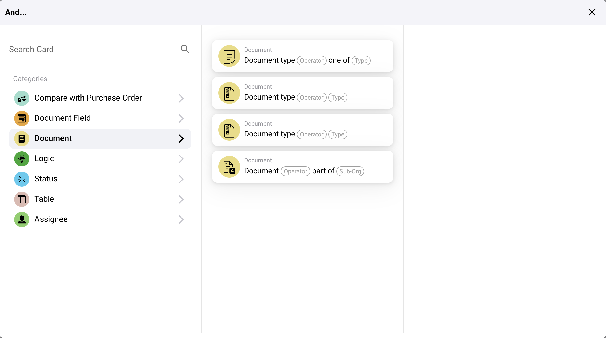
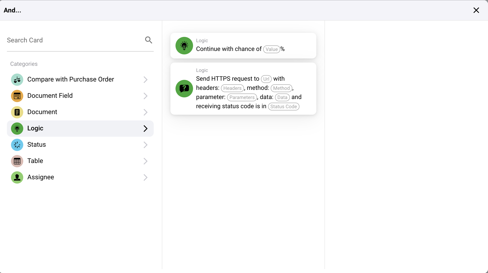
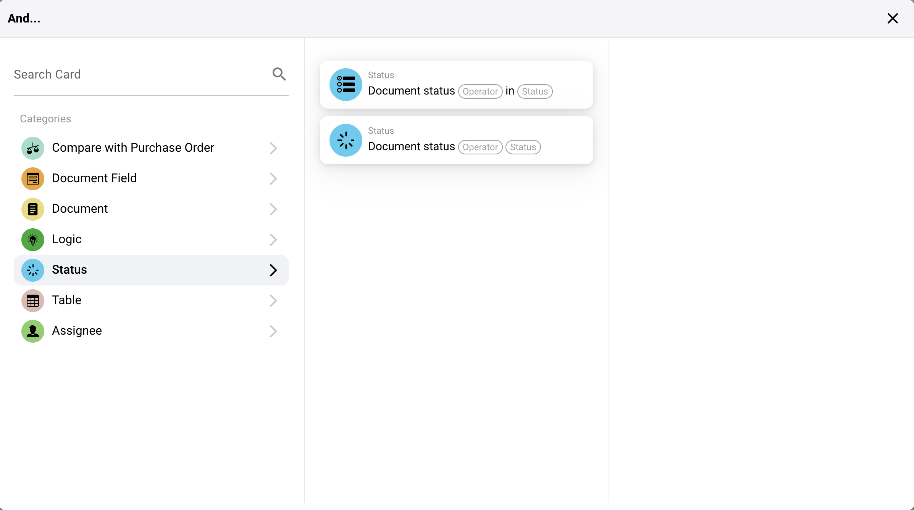
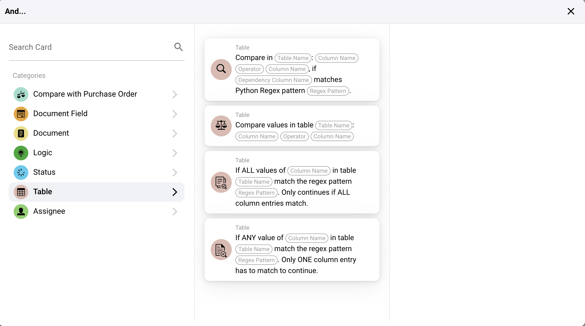
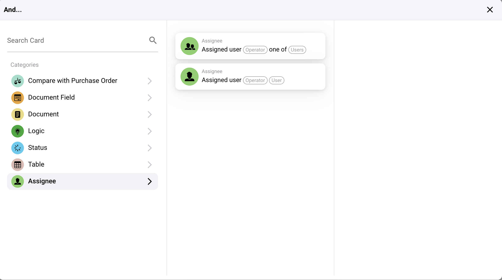

# I

## Razumevanje "And" kartica

### **Svrha 'And' kartica:**

* **And** kartice služe kao kartice uslova koje specificiraju kriterijume koji moraju biti ispunjeni da bi se radni tok nastavio. One efikasno deluju kao logički "AND" operatori, što znači da svi uslovi navedeni u ovim karticama moraju biti ispunjeni da bi sledeća akcija bila pokrenuta.

#### Kategorije 'And' kartica

Sa slika je jasno da ove kartice pokrivaju širok spektar uslova, koji uključuju:

*   **Uporedi sa Narudžbenicom**:

* Uslovi koji se odnose na validaciju i upoređivanje sa narudžbenicama, kao što su upoređivanje datuma isporuke, jediničnih cena ili razlika u količini. Ovi uslovi su ključni za osiguravanje da transakcije budu u skladu sa dogovorenim uslovima.

<figure><figcaption></figcaption></figure>

*   **Polje Dokumenta**:

* Ovi uslovi se odnose na uslove zasnovane na specifičnim poljima unutar dokumenata, kao što su označavanje polja za potvrdu, upoređivanje vrednosti polja ili osiguravanje da polje dokumenta zadovoljava određenu toleranciju. Ovo je posebno važno za integritet podataka i automatske provere unutar formi ili sistema za upravljanje dokumentima.

<figure><figcaption></figcaption></figure>

* **Dokument**:
* Uslovi zasnovani na karakteristikama dokumenata, kao što su tip ili povezanost sa određenom podorganizacijom. Ovi uslovi mogu usmeriti radne tokove na osnovu kategorizacije dokumenata ili uključenosti odeljenja.

<figure><figcaption></figcaption></figure>

* **Logika**:
* Logički uslovi koji mogu uključivati evaluacije poput "Nastavi sa šansom od X%" ili izvršavanje HTTPS zahteva, što je ključno za integracije i probabilističko donošenje odluka unutar radnih tokova.

<figure><figcaption></figcaption></figure>

*   **Status**:

* Fokusiranje na status dokumenata ili zadataka, ovi uslovi osiguravaju da samo stavke u određenim stanjima pokreću određene radne tokove, što je ključno za upravljanje procesima vođenim statusom.

<figure><figcaption></figcaption></figure>

* **Tabela**:
* Ovi uslovi se odnose na podatke tabele, poput podudaranja regex obrazaca ili upoređivanja vrednosti unutar tabele. Takvi uslovi su ključni za validaciju i manipulaciju velikih skupova podataka.

<figure><figcaption></figcaption></figure>

*   **Zaduženi**:

* Uslovi zasnovani na zaduženima za zadatak ili dokument. Ovo osigurava da se akcije preduzimaju samo kada su uključeni određeni korisnici, unapređujući odgovornost i specifičnost zadatka.

<figure><figcaption></figcaption></figure>

### Praktična Primena

Ove "And" kartice se konfigurišu unutar radnog toka kako bi vršile provere i validacije koje osiguravaju da proces strogo poštuje poslovna pravila i standarde integriteta podataka. Na primer:

* **Radni tok može koristiti 'And' karticu da proveri da li ukupan iznos fakture odgovara narudžbenici pre pokretanja plaćanja.**
* **Drugi radni tok može koristiti 'And' karticu da osigura da dokument pregledaju određeni članovi tima pre nego što pređe na sledeći korak.**

### Zaključak

"And" kartice su osnovna komponenta sistema radnih tokova koji zahtevaju preciznu kontrolu nad izvršenjem procesa na osnovu više uslova. One osiguravaju da svaki korak radnog toka napreduje samo kada su svi potrebni kriterijumi temeljno ispunjeni, automatizujući kompleksna stabla odlučivanja unutar poslovnih procesa.

Razumevanje i pravilna konfiguracija ovih kartica su ključni za iskorišćavanje punih mogućnosti vašeg sistema upravljanja radnim tokovima radi unapređenja efikasnosti, tačnosti i usaglašenosti unutar organizacionih procesa.
