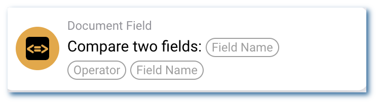

# Comparación de Campos de Documentos

<figure><figcaption></figcaption></figure>

**Propósito**

Esta tarjeta de flujo de trabajo está diseñada para comparar automáticamente los valores de dos campos especificados dentro de un documento basado en un operador definido. Se utiliza para hacer cumplir la integridad de los datos y garantizar que los datos del documento cumplan con las reglas comerciales o condiciones.

**Componentes de la Tarjeta**

1. **Nombres de los Campos**
* **Descripción**: Especifica los nombres de los dos campos dentro del documento que se compararán.
* **Detalle**: Los usuarios deben ingresar los nombres exactos de los campos tal como aparecen en el sistema. Estos campos pueden ser de cualquier tipo de datos que admita comparación, como campos numéricos, de fecha o de texto.
2. **Operador**
* **Descripción**: El operador de comparación utilizado para evaluar la relación entre los valores de los dos campos.
* **Opciones**:
* **Igual (==)**: Comprueba si el valor del primer campo es igual al valor del segundo campo.
* **No Igual (!=)**: Comprueba si el valor del primer campo no es igual al valor del segundo campo.
* **Mayor Que (>)**: Comprueba si el valor del primer campo es mayor que el valor del segundo campo.
* **Mayor Que o Igual (>=)**: Comprueba si el valor del primer campo es mayor o igual al valor del segundo campo.
* **Menor Que (<)**: Comprueba si el valor del primer campo es menor que el valor del segundo campo.
* **Menor Que o Igual (<=)**: Comprueba si el valor del primer campo es menor o igual al valor del segundo campo.

**Funcionalidad**

* **Selección de Campos**: Los usuarios ingresan o seleccionan los nombres de los dos campos a comparar. Esto se hace típicamente a través de un formulario o un menú desplegable dentro de la configuración de la tarjeta.
* **Selección de Operador**: Los usuarios eligen un operador de una lista de opciones disponibles que define cómo deben compararse los campos.
* **Ejecución de la Comparación**:
* El sistema lee los valores de los campos especificados y aplica el operador seleccionado para evaluar la relación entre ellos.
* Según el resultado de la comparación (verdadero o falso), pueden desencadenarse acciones posteriores. Por ejemplo, si una comparación falla, el sistema podría marcar el documento para su revisión, bloquear el procesamiento adicional o notificar a las partes responsables.

**Interacciones del Usuario**

* **Configuración y Configuración**: Los usuarios configuran la comparación ingresando los nombres de los campos y seleccionando un operador. Esta configuración debe ser sencilla y guiada, posiblemente con texto de ayuda o ejemplos.
* **Monitoreo e Informes**: El sistema puede proporcionar comentarios sobre los resultados de las comparaciones, como registrar todas las comparaciones realizadas, sus resultados y cualquier acción tomada en respuesta a los resultados de la comparación.
* **Manejo de Errores y Notificaciones**: Los usuarios reciben alertas si la comparación no se puede ejecutar (por ejemplo, si uno de los campos no se encuentra en el documento o no está en un formato comparable).

#### Conclusión

La tarjeta de flujo de trabajo "Comparación de Campos de Documentos" es vital para mantener la precisión y consistencia de los datos en los documentos de un sistema ERP. Ayuda a automatizar comprobaciones que de otro modo serían manuales, propensas a errores y consumirían mucho tiempo, mejorando la eficiencia y confiabilidad en el procesamiento de documentos. Documentar claramente esta tarjeta en el manual de su sistema ERP ayudará a los usuarios a emplear esta función de manera efectiva, garantizando que los datos en los documentos permanezcan consistentes y de acuerdo con las reglas comerciales.
