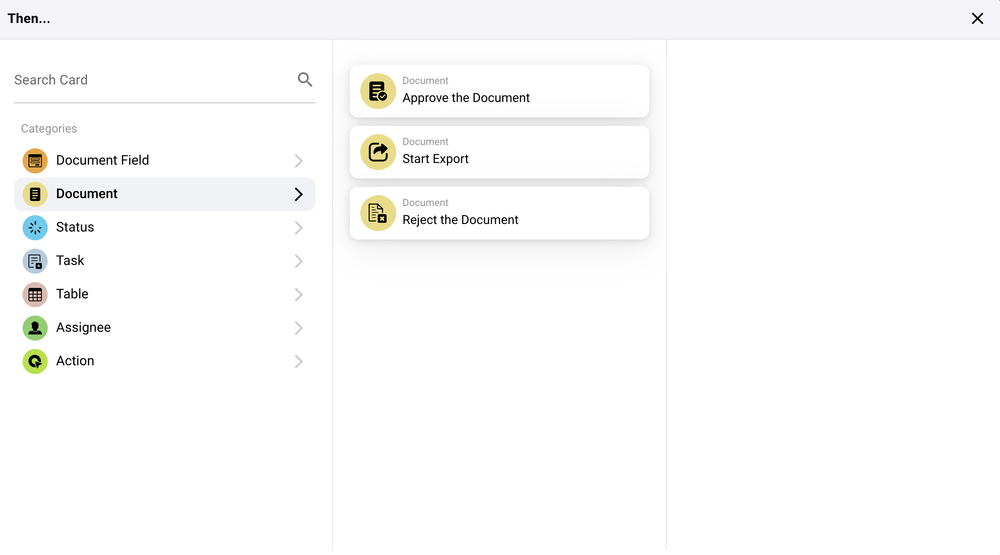

# Onda

## Pregled kartica akcija "Onda..."

### **1. Akcije polja dokumenata:**

* **Invertuj Checkbox:** Ova akcija menja stanje polja za potvrdu u dokumentu.
* **Postavi Checkbox:** Postavlja stanje polja za potvrdu na tačno (označeno) ili netačno (neoznačeno).
* **Postavi Polje na Tekst:** Ova akcija postavlja određeno polje dokumenta na datu tekstualnu vrednost.

<figure><figcaption></figcaption></figure>

### **2. Akcije Dokumenata:**

* **Odobri Dokument:** Označava dokument kao odobren unutar sistema.
* **Pokreni Izvoz:** Pokreće proces izvoza za dokument.
* **Odbaci Dokument:** Označava dokument kao odbačen.

<figure><figcaption></figcaption></figure>

### **3. Akcije Statusa:**

* **Promeni Status:** Menja status dokumenta ili zadatka na određeni novi status.

<figure><figcaption></figcaption></figure>

### **4. Akcije Zadatka:**

* Dodeljivanje i obaveštenja:
* **Dodeli Zadatak:** Kreira i dodeljuje zadatak sa specifičnim detaljima pojedincu ili grupi, uključujući opcije za obaveštavanje putem e-pošte.
* **Kreiraj Novi Zadatak:** Slično kao dodela, ali fokusirano na postavljanje potpuno novog zadatka unutar sistema.

<figure><figcaption></figcaption></figure>

### **5. Akcije Tabele:**

* **Izračunaj u Tabeli:** Vrši izračunavanja na podacima tabele na osnovu određenih uslova i čuva rezultate u određenoj koloni.
* **Promeni Unose:** Ažurira unose u tabeli na osnovu određenih uslova.

<figure><figcaption></figcaption></figure>

### **6. Akcije Dodeljenih:**

* **Dodeli Korisnika iz Polja:** Dodeljuje korisnika zadatku ili dokumentu na osnovu podataka o korisniku sačuvanim u određenom polju, sa opcijom za rezervnog korisnika ako primarni nije dostupan.
* **Dodeli Dokument Korisniku ili Grupi:** Direktno dodeljuje dokument korisniku ili grupi, osiguravajući da je odgovornost određena na odgovarajući način.

<figure><figcaption></figcaption></figure>

### **7. Akcije Spoljne Interakcije:**

* **Pozovi API:** Šalje zahtev spoljnom API-ju, koji se može prilagoditi sa specifičnim metodama, parametrima i podacima.
* **Pošalji HTTPS Zahtev:** Slično kao pozivi API-ja, ali posebno formatirano za HTTPS protokole.

<figure><figcaption></figcaption></figure>

### **8. Napredna Obrada:**

* **Pokreni Radni Tok:** Pokreće drugi radni tok unutar sistema, omogućavajući kompleksno povezivanje procesa.

#### Praktična Primena

Ove kartice akcija se koriste za automatizaciju odgovora na osnovu specifičnih okidača identifikovanih u ranijim delovima postavke radnog toka. Na primer:

* Ako se dokument identifikuje kao potreban za pregled, akcija "Odobri Dokument" može automatski biti pokrenuta kada prođe sve navedene uslove.
* Za zadatke upravljanja podacima, akcije "Postavi Checkbox" ili "Postavi Polje na Tekst" osiguravaju automatsko ažuriranje polja dokumenata, smanjujući ručni unos podataka i mogućnost grešaka.
* Kompleksni zadaci poput interakcija sa API-jem ili promena statusa optimizuju interakcije ne samo unutar ERP sistema već i sa spoljnim uslugama i alatima, poboljšavajući integraciju i funkcionalnost.

### Zaključak

Odeljak "Onda..." u vašem sistemu radnog toka pruža snažne alate za definisanje preciznih akcija koje treba da se dese kao rezultat ispunjenja uslova u radnom toku. Efikasnom upotrebom ovih akcija, preduzeća mogu automatizovati rutinske procese, osigurati tačnost podataka i dinamički odgovoriti na promenljive informacije i stanja sistema. Razumevanje kako konfigurisati i koristiti ove akcije ključno je za maksimiziranje efikasnosti i efektivnosti mogućnosti radnog toka vašeg ERP sistema.
