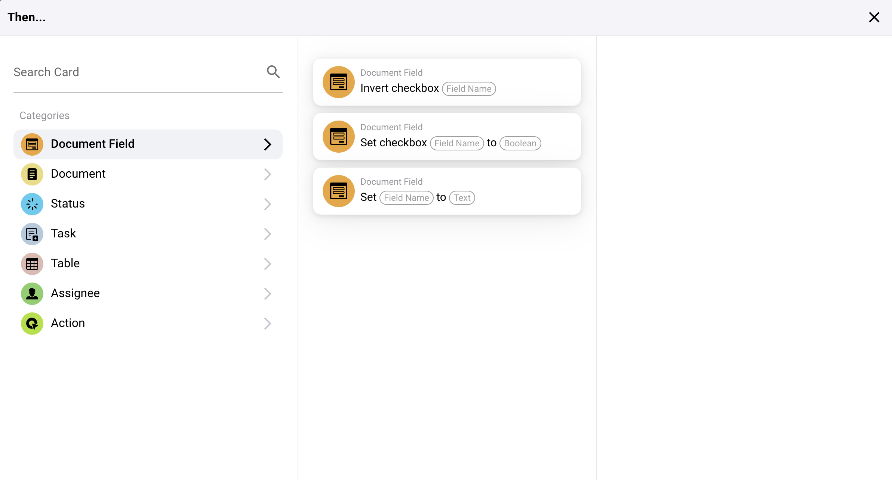
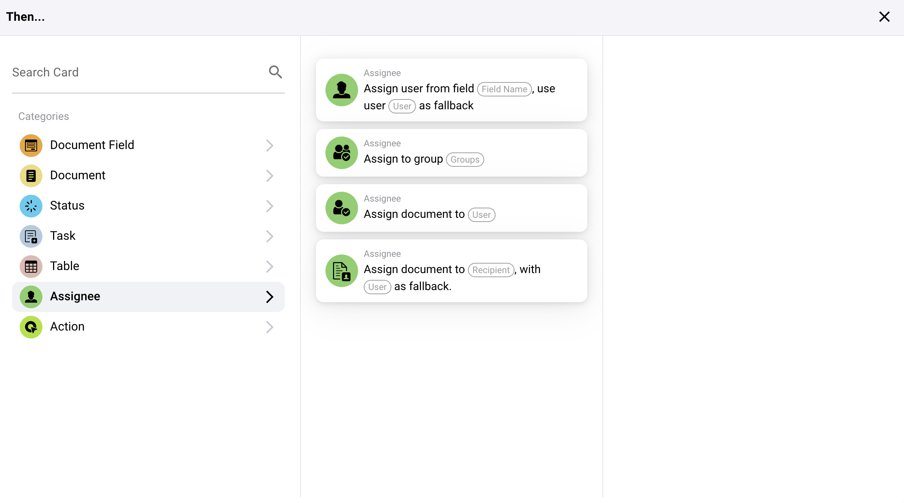

# Ensuite

## Aperçu des cartes d'action "Ensuite..."

**1. Actions de champ de document :**

* **Inverser la case à cocher :** Cette action bascule l'état d'un champ de case à cocher dans un document.
* **Définir la case à cocher :** Cela définit l'état d'un champ de case à cocher soit à vrai (coché) soit à faux (non coché).
* **Définir le champ en texte :** Cette action définit un champ de document spécifié à une valeur textuelle donnée.

<figure><figcaption></figcaption></figure>

**2. Actions de document :**

* **Approuver le document :** Marque un document comme approuvé dans le système.
* **Démarrer l'exportation :** Lance le processus d'exportation pour un document.
* **Rejeter le document :** Marque un document comme rejeté.

<figure><figcaption></figcaption></figure>

**3. Actions d'état :**

* **Changer l'état :** Modifie l'état d'un document ou d'une tâche vers un nouvel état spécifié.

<figure><figcaption></figcaption></figure>

**4. Actions de tâche :**

* Affectations et notifications :
* **Affecter une tâche :** Crée et affecte une tâche avec des détails spécifiques à un individu ou un groupe, y compris des options pour les notifier par e-mail.
* **Créer une nouvelle tâche :** Similaire à l'affectation mais axé sur la configuration d'une toute nouvelle tâche dans le système.

<figure><figcaption></figcaption></figure>

**5. Actions de tableau :**

* **Calculer dans le tableau :** Effectue des calculs sur les données du tableau en fonction de conditions spécifiées et stocke les résultats dans une colonne désignée.
* **Modifier les entrées :** Met à jour les entrées dans un tableau en fonction de conditions spécifiées.

<figure><figcaption></figcaption></figure>

**6. Actions d'assignation :**

* **Affecter un utilisateur à partir du champ :** Affecte un utilisateur à une tâche ou un document en fonction des données utilisateur stockées dans un champ spécifique, avec une option pour un utilisateur de secours si le principal est indisponible.
* **Affecter un document à un utilisateur ou un groupe :** Affecte directement un document à un utilisateur ou un groupe, garantissant que la responsabilité est désignée de manière appropriée.

<figure><figcaption></figcaption></figure>

**7. Actions d'interaction externe :**

* **Appeler une API :** Envoie une requête à une API externe, qui peut être personnalisée avec des méthodes spécifiques, des paramètres et des données.
* **Envoyer une requête HTTPS :** Similaire aux appels API mais spécifiquement formatée pour les protocoles HTTPS.

<figure><figcaption></figcaption></figure>

**8. Traitement avancé :**

* **Exécuter le workflow :** Déclenche un autre workflow dans le système, permettant un enchaînement de processus complexes.

#### Application pratique

Ces cartes d'action sont utilisées pour automatiser les réponses en fonction de déclencheurs spécifiques identifiés dans les premières parties de la configuration du workflow. Par exemple :

* Si un document est identifié comme nécessitant une révision, l'action "Approuver le document" peut être automatiquement déclenchée une fois qu'il satisfait toutes les conditions spécifiées.
* Pour les tâches de gestion des données, les actions "Définir la case à cocher" ou "Définir le champ en texte" garantissent que les champs de document sont mis à jour automatiquement, réduisant la saisie manuelle de données et le risque d'erreurs.
* Des tâches complexes telles que les interactions API ou les changements d'état rationalisent les interactions non seulement au sein du système ERP mais aussi avec des services externes et des outils, améliorant l'intégration et la fonctionnalité.

#### Conclusion

La section "Ensuite..." de votre système de workflow fournit des outils robustes pour définir des actions précises qui doivent se produire en réponse à des conditions remplies dans le workflow. En utilisant efficacement ces actions, les entreprises peuvent automatiser les processus routiniers, garantir l'exactitude des données et répondre de manière dynamique aux informations changeantes et aux états du système. Comprendre comment configurer et utiliser ces actions est essentiel pour maximiser l'efficacité et l'efficience des capacités de workflow de votre système ERP.
