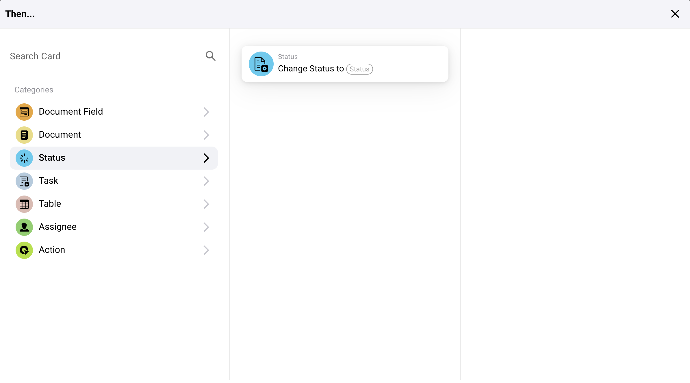

# Poi

## Panoramica delle Carte Azione "Poi..."

**1. Azioni Campo Documento:**

* **Inverti Casella di Controllo:** Questa azione inverte lo stato di una casella di controllo in un documento.
* **Imposta Casella di Controllo:** Imposta lo stato di una casella di controllo come vero (selezionato) o falso (non selezionato).
* **Imposta Campo su Testo:** Questa azione imposta un campo documento specificato su un valore testuale dato.

<figure><figcaption></figcaption></figure>

**2. Azioni Documento:**

* **Approva il Documento:** Contrassegna un documento come approvato all'interno del sistema.
* **Avvia Esportazione:** Avvia il processo di esportazione per un documento.
* **Rifiuta il Documento:** Contrassegna un documento come rifiutato.

<figure><figcaption></figcaption></figure>

**3. Azioni di Stato:**

* **Cambia Stato:** Cambia lo stato di un documento o di un compito in uno stato nuovo specificato.

<figure><figcaption></figcaption></figure>

**4. Azioni di Compito:**

* Assegnazioni e notifiche:
* **Assegna Compito:** Crea e assegna un compito con dettagli specifici a un individuo o gruppo, inclusa l'opzione di notificarli via email.
* **Crea un Nuovo Compito:** Simile all'assegnazione ma focalizzato sulla creazione di un nuovo compito completo all'interno del sistema.

<figure><figcaption></figcaption></figure>

**5. Azioni Tabella:**

* **Calcola nella Tabella:** Esegue calcoli sui dati della tabella basati su condizioni specificate e memorizza i risultati in una colonna designata.
* **Modifica Voci:** Aggiorna voci in una tabella basandosi su condizioni specificate.

<figure><figcaption></figcaption></figure>

**6. Azioni Assegnatario:**

* **Assegna Utente da Campo:** Assegna un utente a un compito o documento basandosi sui dati dell'utente memorizzati in un campo specifico, con un'opzione per un utente di riserva se il principale non è disponibile.
* **Assegna Documento a Utente o Gruppo:** Assegna direttamente un documento a un utente o gruppo, garantendo che la responsabilità sia designata in modo appropriato.

<figure><figcaption></figcaption></figure>

**7. Azioni di Interazione Esterna:**

* **Chiama API:** Invia una richiesta a un'API esterna, che può essere personalizzata con metodi specifici, parametri e dati.
* **Invia Richiesta HTTPS:** Simile alle chiamate API ma specificamente formattata per protocolli HTTPS.

<figure><figcaption></figcaption></figure>

**8. Elaborazione Avanzata:**

* **Esegui Workflow:** Attiva un altro workflow all'interno del sistema, consentendo concatenazioni di processi complessi.

#### Applicazione Pratica

Queste carte azione sono utilizzate per automatizzare risposte basate su trigger specifici identificati nelle fasi precedenti della configurazione del workflow. Ad esempio:

* Se un documento viene identificato come necessario per la revisione, l'azione "Approva il Documento" può essere attivata automaticamente una volta che supera tutte le condizioni specificate.
* Per compiti di gestione dati, le azioni "Imposta Casella di Controllo" o "Imposta Campo su Testo" garantiscono che i campi del documento vengano aggiornati automaticamente, riducendo l'inserimento manuale dei dati e il potenziale per errori.
* Compiti complessi come interazioni API o cambiamenti di stato ottimizzano le interazioni non solo all'interno del sistema ERP ma anche con servizi esterni e strumenti, migliorando l'integrazione e la funzionalità.

#### Conclusione

La sezione "Poi..." nel sistema di workflow fornisce strumenti robusti per definire azioni precise che dovrebbero verificarsi come risultato del soddisfacimento delle condizioni nel workflow. Utilizzando efficacemente queste azioni, le aziende possono automatizzare processi di routine, garantire l'accuratezza dei dati e rispondere dinamicamente alle informazioni in evoluzione e agli stati del sistema. Comprendere come configurare e utilizzare queste azioni è fondamentale per massimizzare l'efficienza e l'efficacia delle capacità di workflow del sistema ERP.
