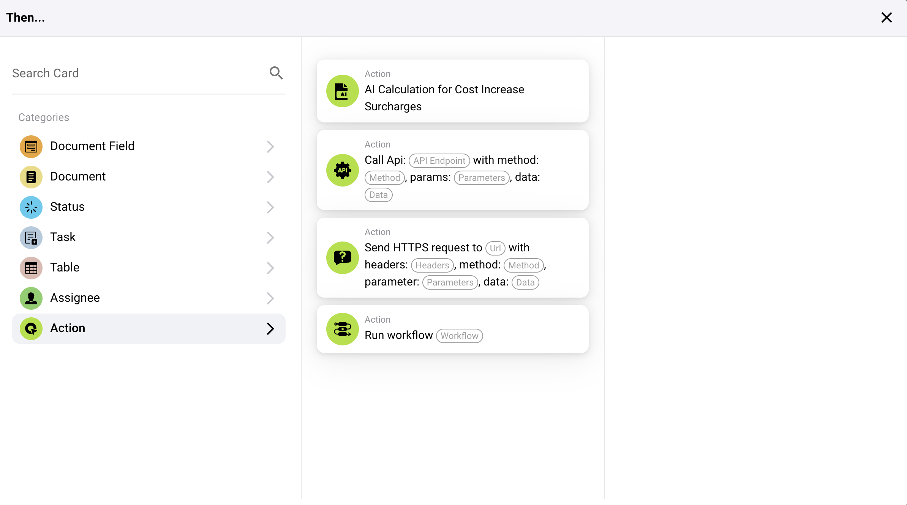

# Então

## Visão geral das Cartas de Ação "Então..."

### **1. Ações de Campo de Documento:**

* **Inverter Caixa de Seleção:** Esta ação alterna o estado de um campo de caixa de seleção em um documento.
* **Definir Caixa de Seleção:** Define o estado de um campo de caixa de seleção como verdadeiro (marcado) ou falso (desmarcado).
* **Definir Campo para Texto:** Esta ação define um campo de documento especificado para um determinado valor de texto.

<figure><figcaption></figcaption></figure>

### **2. Ações de Documento:**

* **Aprovar o Documento:** Marca um documento como aprovado no sistema.
* **Iniciar Exportação:** Inicia o processo de exportação de um documento.
* **Rejeitar o Documento:** Marca um documento como rejeitado.

<figure><figcaption></figcaption></figure>

### **3. Ações de Status:**

* **Alterar Status:** Altera o status de um documento ou tarefa para um novo status especificado.

<figure><figcaption></figcaption></figure>

### **4. Ações de Tarefa:**

* Atribuições e notificações:
* **Atribuir Tarefa:** Cria e atribui uma tarefa com detalhes específicos a um indivíduo ou grupo, incluindo opções para notificá-los por e-mail.
* **Criar uma Nova Tarefa:** Semelhante a atribuir, mas focado em configurar uma nova tarefa completamente dentro do sistema.

<figure><figcaption></figcaption></figure>

### **5. Ações de Tabela:**

* **Calcular na Tabela:** Realiza cálculos em dados de tabela com base em condições especificadas e armazena os resultados em uma coluna designada.
* **Alterar Entradas:** Atualiza entradas em uma tabela com base em condições especificadas.

<figure><figcaption></figcaption></figure>

### **6. Ações de Responsável:**

* **Atribuir Usuário do Campo:** Atribui um usuário a uma tarefa ou documento com base em dados do usuário armazenados em um campo específico, com uma opção para um usuário substituto se o principal não estiver disponível.
* **Atribuir Documento a Usuário ou Grupo:** Atribui diretamente um documento a um usuário ou grupo, garantindo que a responsabilidade seja designada adequadamente.

<figure><figcaption></figcaption></figure>

### **7. Ações de Interação Externa:**

* **Chamar API:** Envia uma solicitação para uma API externa, que pode ser personalizada com métodos específicos, parâmetros e dados.
* **Enviar Solicitação HTTPS:** Semelhante às chamadas de API, mas formatadas especificamente para protocolos HTTPS.

<figure><figcaption></figcaption></figure>

### **8. Processamento Avançado:**

* **Executar Fluxo de Trabalho:** Aciona outro fluxo de trabalho dentro do sistema, permitindo encadeamento de processos complexos.

#### Aplicação Prática

Essas cartas de ação são usadas para automatizar respostas com base em gatilhos específicos identificados nas partes anteriores da configuração do fluxo de trabalho. Por exemplo:

* Se um documento for identificado como necessitando de revisão, a ação "Aprovar o Documento" pode ser acionada automaticamente assim que ele passar por todas as condições especificadas.
* Para tarefas de gerenciamento de dados, ações como "Definir Caixa de Seleção" ou "Definir Campo para Texto" garantem que os campos do documento sejam atualizados automaticamente, reduzindo a entrada manual de dados e a possibilidade de erros.
* Tarefas complexas como interações com API ou alterações de status simplificam as interações não apenas dentro do sistema ERP, mas também com serviços e ferramentas externas, aprimorando a integração e funcionalidade.

### Conclusão

A seção "Então..." em seu sistema de fluxo de trabalho fornece ferramentas robustas para definir ações precisas que devem ocorrer como resultado de condições atendidas no fluxo de trabalho. Ao usar efetivamente essas ações, as empresas podem automatizar processos rotineiros, garantir a precisão dos dados e responder dinamicamente a informações em constante mudança e estados do sistema. Compreender como configurar e utilizar essas ações é fundamental para maximizar a eficiência e eficácia das capacidades de fluxo de trabalho do seu sistema ERP.
