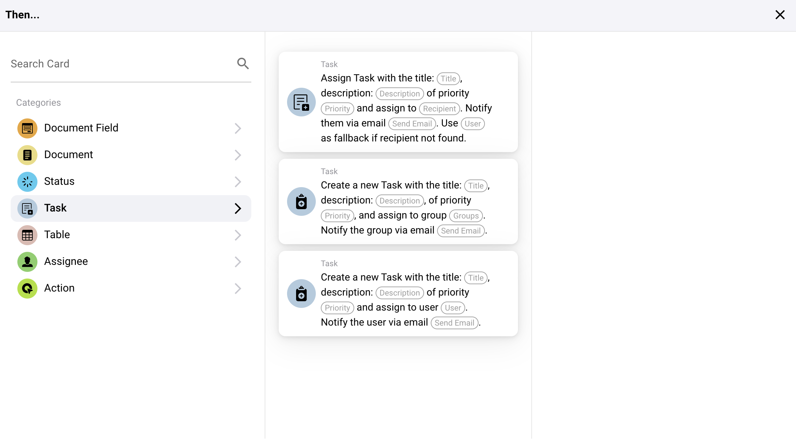

# Sonra

## "Sonra..." Eylem Kartlarının Genel Bakışı

**1. Belge Alan Eylemleri:**

* **Onay Kutusunu Ters Çevir:** Bu eylem, bir belgedeki bir onay kutusunun durumunu değiştirir.
* **Onay Kutusunu Ayarla:** Bu eylem, bir onay kutusu alanının durumunu ya doğru (işaretli) ya da yanlış (işaretsiz) olarak ayarlar.
* **Alanı Metne Ayarla:** Bu eylem, belirli bir belge alanını belirli bir metin değerine ayarlar.

<figure><figcaption></figcaption></figure>

**2. Belge Eylemleri:**

* **Belgeyi Onayla:** Bir belgeyi sistem içinde onaylanmış olarak işaretler.
* **Dışa Aktarmayı Başlat:** Bir belge için dışa aktarma işlemini başlatır.
* **Belgeyi Reddet:** Bir belgeyi reddedilmiş olarak işaretler.

<figure><figcaption></figcaption></figure>

**3. Durum Eylemleri:**

* **Durumu Değiştir:** Bir belgenin veya görevin durumunu belirli yeni bir duruma değiştirir.

<figure><figcaption></figcaption></figure>

**4. Görev Eylemleri:**

* Atamalar ve bildirimler:
* **Görev Ata:** Belirli ayrıntılara sahip bir görev oluşturur ve bir bireye veya gruba atar, e-posta yoluyla bildirim gönderme seçenekleri de içerir.
* **Yeni Bir Görev Oluştur:** Atamaya benzer ancak tamamen yeni bir görev oluşturmaya odaklanır.

<figure><figcaption></figcaption></figure>

**5. Tablo Eylemleri:**

* **Tabloda Hesapla:** Belirli koşullara dayalı olarak tablo verilerinde hesaplamalar yapar ve sonuçları belirlenmiş bir sütuna kaydeder.
* **Girişleri Değiştir:** Belirli koşullara dayalı olarak tablodaki girişleri günceller.

<figure><figcaption></figcaption></figure>

**6. Atanan Eylemler:**

* **Alan Kullanıcısını Ata:** Belirli bir alanda depolanan kullanıcı verilerine dayanarak bir kullanıcıyı bir göreve veya belgeye atar, birincil kullanıcı uygun değilse yedek kullanıcı seçeneği sunar.
* **Belgeyi Kullanıcıya veya Gruba Ata:** Bir belgeyi doğrudan bir kullanıcıya veya gruba atar, sorumluluğun uygun şekilde belirlendiğinden emin olur.

<figure><figcaption></figcaption></figure>

**7. Harici Etkileşim Eylemleri:**

* **API Çağrısı Yap:** Dış bir API'ye özel yöntemler, parametreler ve verilerle özelleştirilebilen bir istek gönderir.
* **HTTPS İsteği Gönder:** API çağrılarına benzer ancak özellikle HTTPS protokolleri için biçimlendirilmiştir.

<figure><figcaption></figcaption></figure>

**8. Gelişmiş İşleme:**

* **İş Akışını Çalıştır:** Sistem içinde başka bir iş akışını tetikler, karmaşık işlem zincirlemesine olanak tanır.

#### Uygulamada Kullanım

Bu eylem kartları, iş akışı kurulumunun daha önce belirlenen belirli tetikleyicilere dayalı olarak otomatik yanıtlar oluşturmak için kullanılır. Örneğin:

* Bir belgenin gözden geçirilmesi gerektiği belirlendiğinde, "Belgeyi Onayla" eylemi, belirtilen tüm koşulları karşıladığında otomatik olarak tetiklenebilir.
* Veri yönetimi görevleri için, "Onay Kutusunu Ayarla" veya "Alanı Metne Ayarla" eylemleri, belge alanlarının otomatik olarak güncellendiğinden emin olur, bu da manuel veri girişini azaltır ve hataların potansiyelini en aza indirir.
* API etkileşimleri veya durum değişiklikleri gibi karmaşık görevler, ERP sistemi içindeki etkileşimleri sadece kolaylaştırmakla kalmaz, aynı zamanda dış hizmetler ve araçlarla da etkileşimi artırarak entegrasyonu ve işlevselliği artırır.

#### Sonuç

İş akışınızın "Sonra..." bölümü, iş akışında belirli koşulların karşılanmasının sonucunda gerçekleşmesi gereken kesin eylemleri tanımlamak için güçlü araçlar sağlar. Bu eylemleri etkili bir şekilde kullanarak, işletmeler rutin süreçleri otomatikleştirebilir, veri doğruluğunu sağlayabilir ve değişen bilgi ve sistem durumlarına dinamik bir şekilde yanıt verebilir. Bu eylemleri yapılandırmayı ve kullanmayı anlamak, ERP sisteminizin iş akışı yeteneklerinin verimliliğini ve etkinliğini en üst düzeye çıkarmak için önemlidir.
