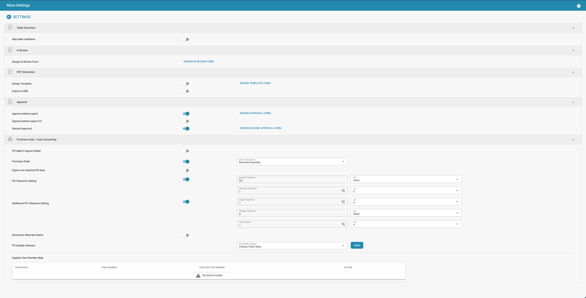

# Exemplo de Fluxo de Trabalho: Acionador de Exportação Condicional


<figure><figcaption></figcaption></figure>

Este fluxo de trabalho descreve as condições sob as quais um processo de exportação deve ser iniciado. Ele garante que apenas documentos que atendam a todos os critérios especificados sejam processados para exportação, aprimorando a integridade dos dados e o alinhamento com as regras de negócios.

### Quando:

* Um documento dentro do sistema é avaliado quanto à elegibilidade para exportação.

### Lógica:

1. **Verificação do Tipo de Documento**
* O documento deve ser de um determinado tipo (por exemplo, "Fatura" ou "Recibo"). Especifique o tipo de documento que se qualifica para o processo de exportação.
2. **Verificação de Status**
* O status atual do documento deve atender a critérios predefinidos (por exemplo, "Aprovado" ou "Pronto para Exportação"), indicando que está pronto para processamento adicional.
3. **Condições Contextuais**
* Verificações adicionais são realizadas para garantir que os detalhes do documento estejam alinhados com requisitos específicos. Essas verificações podem envolver a verificação de informações dentro de confirmações de pedidos ou ordens de compra. Especifique as condições particulares que precisam ser atendidas. Por exemplo:
* Todos os itens listados na confirmação do pedido correspondem aos da ordem de compra.
* O valor total na confirmação do pedido corresponde ao valor total na ordem de compra.
* As datas de entrega especificadas na confirmação do pedido estão alinhadas com as da ordem de compra.

### Então:

#### Ação:

* **Iniciar Exportação**
* Se todas as condições acima forem atendidas, o sistema inicia automaticamente o processo de exportação para o documento.
* Isso pode envolver a geração de um arquivo de exportação, o envio de dados para um sistema externo ou a ativação de um fluxo de trabalho em outra aplicação.

#### Exemplo de Implementação:
```yaml
rules:
- description: "Conditional Export Trigger"
conditions:
- type: "DocumentType"
criteria: "<SpecifyDocumentType>"
- type: "Status"
criteria: "<SpecifyStatus>"
- type: "DetailMatch"
criteria:
- "ItemMatch"
- "AmountMatch"
- "DateMatch"
actions:
- operation: "StartExport"
```

