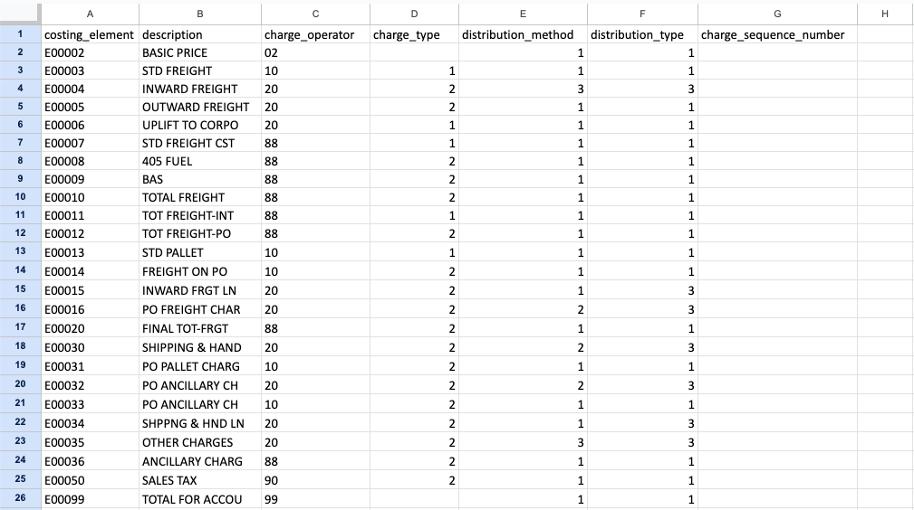
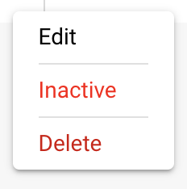

# İş Akışı Belgeleri

**İş Akışı Belgeleri**

Genel bir bakışı korumak için iş akışlarına farklı başlıklar verebilirsiniz, böylece bu iş akışının hangi görevle ilgili olduğunu hemen bilebilirsiniz.

Yeni bir İş Akışı Oluşturun: + İŞ AKIŞI EKLE'ye tıklayın

.png>)

Bu iş akışlarını (Test 1,2,3) kullanarak çeşitli belgeleri doğru çalışan şirketteki doğru çalışana otomatik olarak atayabilirsiniz.

.png>)

Fatura veya diğer belgeler belirli bir toplam tutarı aştığında ve önceden incelenip onaylanması gerektiğinde, bu belgeler doğru kişiye hemen atanabilir.

<figure><figcaption></figcaption></figure>

**Test 1:              Mantık Kartı**

Ne Zaman:             **Atanan:**                    Amier Haider

Ve:                **Belge türü:**        Fatura

O Zaman:              **Belgeyi Ata:**   Stefan Reppermund

.png>)

**Test 2:              Mantık Kartı**

Ne Zaman:              **Atanan:**                    Amier Haider

Ve:                 **Belge türü:**        Teslimat Notu

O Zaman:               **Belgeyi Ata:**   James Edwards

.png>)

**Test 3:             Mantık Kartı**

**Ne Zaman:**             **Atanan:**                    Amier Haider

**Ve:**                **Belge türü:**        Sipariş Onayı

**O Zaman:**              **Belgeyi Ata:**   Anian Sollinger

.png>)

Ayrıca, belgeyi tek bir kişiye atamıyorsanız, başlangıçta belgeyi belirli bir çalışana atamak da mümkündür.

<figure><figcaption></figcaption></figure>

Bir belgenin ne olması gerektiğini daha kolay anlamak için bu iş akışında gelen belgeler için durumu ayarlayabilirsiniz. Bu iş akışı, örneğin bekleyen bir onay olup olmadığını hemen görmeyi mümkün kılar.

**Test 4:             Mantık Kartı**

**Ne Zaman:**             **Belge türü:**         Teslimat Notu

**Ve:**                **Atanan:**                     Amier Haider

**O Zaman:**              **Durumu Değiştir:**         Onay Bekliyor

<figure><figcaption></figcaption></figure>

.png>)

**Test 5:                Mantık Kartı**

Ne Zaman:                **Belge türü:**           Fatura

Ve:                   **Atanan:**                       Stefan Reppermund

O Zaman:                 **Durumu Değiştir:**           İkinci Onay Bekliyor

<figure><figcaption></figcaption></figure>

.png>)

Fatura veya diğer belgeler belirli bir toplam tutarı aştığında ve önceden incelenip onaylanması gerektiğinde, bu belgeler doğru kişiye hemen atanabilir.

.png>)

**Test 6:                    Mantık Kartı**

Ne Zaman:                   **Atanan:**                   Amier Haider

Ve:                      Docfield        **toplam\_miktar**     şu değerden büyük      500

O Zaman:                    **Belgeyi Ata:**   Asad Usman Khan

<figure><figcaption></figcaption></figure>

.png>)

Ayrıca, belgeye durumu iş akışına girmek de mümkündür, böylece atanan kişi belgenin durumunu hemen görebilir ve sonraki adımların ne olması gerektiğini görebilir.

**Test 7:                 Mantık Kartı**

**Ne Zaman:** **Atanan:**                     Amier Haider

**Ve:**                   Docfield           **toplam\_miktar**      şu değerden büyük        500

**O Zaman:**                 **Belgeyi Ata:**     Asad Usman Khan

&#x20;                            **Durumu Değiştir:**          Onay Bekliyor

<figure><figcaption></figcaption></figure>

<figure><figcaption></figcaption></figure>

Örneğin, bir belgeden belirli veya önemli bilgiler eksikse, ancak önemli ve işleme devam etmek için eklenmesi gerekiyorsa, bu belgelerin hemen alıcıya ve bir yedek (yerine) iletilmesi için iş akışını kurabilirsiniz.

<figure><figcaption></figcaption></figure>

**Test 9:**

Bu mantık kartlarıyla tasarlanan İş Akışı, sipariş onayında belirtilen miktarın, birim fiyatın veya indirimin, satın alma siparişindeki karşılık gelen rakamlarla eşleşip eşleşmediğini otomatik olarak doğrulamak üzere tasarlanmıştır. Bu doğrulama, sipariş edilen ve tedarikçinin teslim etmeyi onayladığı şey arasındaki tutarlılık ve doğruluğu sağlar.

Bu belgelere belirli bir durum verebilir veya belirli bir çalışana atayabilirsiniz.

<figure><figcaption></figcaption></figure>

<figure><figcaption></figcaption></figure>

**Mantık Kartı: Miktar veya Birim Fiyat veya İndirim Eşleşmesi**

Bu mantık kartı, sipariş onayında belirtilen miktarın, birim fiyatın veya indirimin, satın alma siparişindeki karşılık gelen rakamlarla eşleşip eşleşmediğini otomatik olarak doğrulamak üzere tasarlanmıştır. Bu doğrulama, sipariş edilen ve tedarikçinin teslim etmeyi onayladığı şey arasındaki tutarlılık ve doğruluğu sağlar.

**Tetikleme Koşulu**

Mantık, sipariş onayında aşağıdaki koşullardan herhangi biri karşılandığında etkinleştirilir:

* **Miktar**: Sipariş edilen ürünlerin miktarı, tedarikçi tarafından onaylanan miktarla eşleşir.
* **Birim Fiyat**: Kabul edilen fiyat başına ürün fiyatı, tedarikçinin onayıyla eşleşir.
* **İndirim**: Uygulanan indirimler, satın alma siparişi ile sipariş onayı arasında tutarlıdır.

* **Karşılaştırma Parametrelerini Tanımlayın**: Mantık kartının eşleşmeyi kontrol edeceği belirli alanları (miktar, birim fiyat, indirim) ayarlayın.
* **Doğrulamayı Otomatikleştirin**: Bir sipariş onayı alındığında bu ayrıntıları otomatik olarak karşılaştırmak için sistemi yapılandırın.
* **Uyarıları Özelleştirin**: Farklılıkların ele alınması için iş akışını belirleyin, manuel inceleme için uyarıları özelleştirin.

Bu mantık kartı, sipariş onayındaki ayrıntıların orijinal satın alma siparişiyle uyumlu olduğundan emin olmak için hayati öneme sahiptir, tedarik döngüsünün bütünlüğünü korur.

**Test 10:**

Ek ücretler için farklı bir hesaplama yapmanız gerekiyorsa veya bunları yalnızca bazı öğelerde kullanıyorsanız, genel tablo hesaplama kartlarını kullanabilirsiniz, bazıları ayrıca düzenli ifadeler için filtreleme yapmanıza olanak tanır.

<figure><figcaption></figcaption></figure>

Yukarıda, 01, 06, 9, 001 veya 000 ile başlayan öğe numaraları için bir filtre olan MTZ için bir hesaplama örneği bulunmaktadır.

Yeni sütunlara bağlı hesaplamaları manuel olarak yapılandırırken, bu hesaplamaları ayrı bir iş akışına bölmeyi öneririz. Hesaplama işlemine devam etmek için Çalıştır İş Akışı kartını kullanabilirsiniz.

**İş Akışını Çalıştır**

<figure><figcaption></figcaption></figure>

Bu kart ile, mevcut iş akışının koşulları karşılandığında ve mevcut iş akışının önceki ardından kartlarından sonra çalıştırılacak bir iş akışının adını belirtebilirsiniz. Çalışabilir, etkin iş akışlarını önceliklendirirken, belge belirli iş akışlarının koşullarını karşılarsa devre dışı bırakılmış iş akışlarını da çalıştırmanıza olanak tanır.
### **Mevcut bir sütuna hesaplanmış ek ücretler eklemek** 

<figure><figcaption></figcaption></figure>

Eğer tüm ek ücretleri indirim sütununa negatif bir indirim olarak eklemek istiyorsanız, hesaplama kartını kullanabilirsiniz. Bu sütunda girişler olabilir, bunu karttaki değişkenlerden biri olarak ayarlayabilir, MTZ'yi çıkarabilir ve sonucu tekrar bu sütuna ekleyebilirsiniz. Boş alanlar varsa (sadece bazı öğeler için ek ücretler) hesaplaması için 0 olarak kabul edilecektir.

**Kullanıcıyı DocBits'te sipariş onayını yetkilendirmesi konusunda bilgilendirin**

Ek ücretleri hesaplama işleminden sonra belirli bir kullanıcıyı sipariş onayını yetkilendirmesi için bilgilendirmek isteyebilirsiniz. Bunun için bildirim kartını kullanabilirsiniz

<figure><figcaption></figcaption></figure>

Ayarlarınıza bağlı olarak, kullanıcıya DocBits'te yeni bir görev atanır ve isteğe bağlı olarak yeni görevlerinden haberdar etmek için bir e-posta alırlar.
