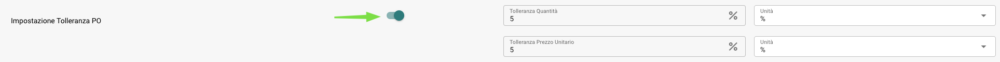

# Documentation du flux de travail

**Documentation du flux de travail**

Pour garder une vue d'ensemble, vous pouvez donner aux flux de travail des titres différents afin de savoir immédiatement de quelle tâche il s'agit.

Créer un nouveau flux de travail : Cliquez sur + AJOUTER UN FLUX DE TRAVAIL

.png>)

Vous pouvez utiliser ces flux de travail (Test 1,2,3) pour attribuer automatiquement divers documents au bon employé de l'entreprise.

.png>)

Si une facture ou un autre document dépasse un certain montant total nécessitant une révision et une approbation préalables, ces documents peuvent être immédiatement attribués à la bonne personne.

<figure><figcaption></figcaption></figure>

**Test 1:              Carte logique**

Quand:             **Le destinataire est :**                    Amier Haider

Et:                **Le type de document est :**        Facture

Alors:              **Attribuer le document à :**   Stefan Reppermund

.png>)

**Test 2:              Carte logique**

Quand:              **Le destinataire est :**                    Amier Haider

Et:                 **Le type de document est :**        Bon de livraison

Alors:               **Attribuer le document à :**   James Edwards

.png>)

**Test 3:             Carte logique**

**Quand :**             **Le destinataire est :**                    Amier Haider

**Et :**                **Le type de document est :**        Confirmation de commande

**Alors :**              **Attribuer le document à :**   Anian Sollinger

.png>)

Il est également possible, si le document n'est pas attribué à une seule personne, de l'attribuer à un employé spécifique dès le départ.

<figure><figcaption></figcaption></figure>

Pour une meilleure vue d'ensemble de ce qui doit arriver à un document, vous pouvez définir le statut des documents entrants dans ce flux de travail. Ce flux de travail permet de voir immédiatement s'il y a, par exemple, une approbation en attente.

**Test 4:             Carte logique**

**Quand :**             **Le type de document est :**         Bon de livraison

**Et :**                **Le destinataire est :**                     Amier Haider

**Alors :**              **Changer le statut en :**         Approbation en attente

<figure><figcaption></figcaption></figure>

.png>)

**Test 5:                Carte logique**

Quand :                **Le type de document est :**           Facture

Et :                   **Le destinataire est :**                       Stefan Reppermund

Alors :                 **Changer le statut en :**           Deuxième approbation en attente

<figure><figcaption></figcaption></figure>

.png>)

Si une facture ou un autre document dépasse un certain montant total nécessitant une révision et une approbation préalables, ces documents peuvent être attribués à la bonne personne immédiatement.

.png>)

**Test 6:                    Carte logique**

Quand :                   **Le destinataire est :**                   Amier Haider

Et :                      Champ de document        **total\_amount**     est      **Supérieur à       500**

Alors :                    **Attribuer le document à :**   Asad Usman Khan

<figure><figcaption></figcaption></figure>

.png>)

Il est également possible d'entrer le statut dans le flux de travail, afin que la personne attribuée puisse immédiatement voir le statut de ce document et ce qui doit arriver ensuite.

**Test 7:                 Carte logique**

**Quand :** **Le destinataire est :**                     Amier Haider

**Et :**                   Champ de document           **total\_amount**      est        **Supérieur à      500**

**Alors :**                 **Attribuer le document à :**     Asad Usman Khan

&#x20;                            **Changer le statut en :**          Approbation en attente

<figure><figcaption></figcaption></figure>

<figure><figcaption></figcaption></figure>

Par exemple, si certaines informations importantes manquent d'un document, mais sont importantes et doivent être incluses pour un traitement ultérieur, vous pouvez configurer le flux de travail pour que ces documents soient immédiatement transmis à l'acheteur et à un substitut.

<figure><figcaption></figcaption></figure>

**Test 9:**

Le flux de travail avec ces cartes logiques est conçu pour vérifier automatiquement que la quantité, le prix unitaire ou la remise détaillés dans une confirmation de commande correspondent aux chiffres correspondants dans le bon de commande. Cette vérification garantit la cohérence et l'exactitude entre ce qui a été commandé et ce que le fournisseur confirme de livrer.

Vous pouvez attribuer un statut spécifique à ces documents ou les attribuer à un employé spécifique.

<figure><figcaption></figcaption></figure>

<figure><figcaption></figcaption></figure>

**Carte logique : Correspondance de la quantité, du prix unitaire ou de la remise**

Cette carte logique est conçue pour vérifier automatiquement que la quantité, le prix unitaire ou la remise détaillés dans une confirmation de commande correspondent aux chiffres correspondants dans le bon de commande. Cette vérification garantit la cohérence et l'exactitude entre ce qui a été commandé et ce que le fournisseur confirme de livrer.

**Condition de déclenchement**

La logique est activée lorsque l'une des conditions suivantes est remplie dans une confirmation de commande par rapport au bon de commande original :

* **Quantité** : La quantité d'articles commandés correspond à la quantité confirmée par le fournisseur.
* **Prix unitaire** : Le prix par article convenu correspond à la confirmation du fournisseur.
* **Remise** : Les remises appliquées sont cohérentes entre le bon de commande et la confirmation de commande.

* **Définir les paramètres de comparaison** : Configurer les champs spécifiques (quantité, prix unitaire, remise) que la carte logique vérifiera pour une correspondance.
* **Automatiser la vérification** : Configurer le système pour comparer automatiquement ces détails dès réception d'une confirmation de commande.
* **Personnaliser les alertes** : Décider du flux de travail pour gérer les divergences, y compris la personnalisation des alertes pour examen manuel.

Cette carte logique est essentielle pour garantir que les détails d'une confirmation de commande correspondent au bon de commande original, protégeant ainsi l'intégrité du cycle d'approvisionnement.

**Test 10:**

Si vous avez un calcul différent pour les suppléments, ou si vous les avez uniquement sur certains articles, vous pouvez utiliser les cartes de calcul de tableau génériques, certaines d'entre elles permettent également de filtrer pour des expressions régulières.

<figure><figcaption></figcaption></figure>

Ci-dessus un exemple de calcul pour MTZ avec un filtre pour les numéros d'article commençant par 01, 06, 9, 001 ou 000.

Avec une configuration manuelle, il est conseillé de diviser les calculs qui dépendent de nouvelles colonnes dans un flux de travail séparé. Pour continuer avec le calcul, vous pouvez utiliser la carte Exécuter le flux de travail.

**Exécuter le flux de travail**

<figure><figcaption></figcaption></figure>

Avec cette carte, vous pouvez spécifier le nom d'un flux de travail qui doit être exécuté après le flux de travail actuel si ses conditions sont remplies et après les cartes then précédentes du flux de travail actuel. Bien qu'il privilégie les flux de travail exécutables et actifs, il vous permet également d'exécuter des flux de travail désactivés si le document remplit les conditions des flux de travail.
### **Ajout de frais supplémentaires calculés dans une colonne existante** 

<figure><figcaption></figcaption></figure>

Si vous souhaitez ajouter tous les frais supplémentaires en tant que remise négative dans la colonne de remise, vous pouvez utiliser la carte de calcul. Il peut y avoir des entrées dans cette colonne, vous pouvez le définir comme l'une des variables sur la carte, faire soustraire le MTZ et ajouter le résultat dans cette colonne. En cas de champs vides (frais supplémentaires uniquement pour certains articles), il supposera un 0 pour son calcul.

**Notifier l'utilisateur pour autoriser la confirmation de commande dans DocBits**

Après avoir calculé les frais supplémentaires, vous voudrez peut-être notifier un utilisateur spécifique pour autoriser la confirmation de commande. Pour cela, vous pouvez utiliser la carte de notification.

<figure><figcaption></figcaption></figure>

Selon les paramètres, l'utilisateur se voit attribuer une nouvelle tâche dans DocBits et éventuellement un e-mail pour les informer de leur nouvelle tâche.
