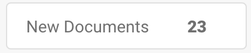
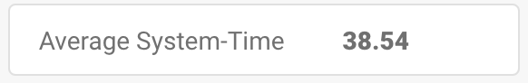
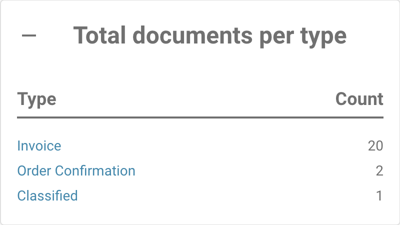

# Report Page



### 1. How enable the Report Page

Go to **Settings** → **Document Processing** → **Module** → **Document Type** → **Show Report**
Toggle the button to enable this setting.

<figure><figcaption></figcaption></figure>

### 2. **How to Access the Report Page**

Follow these steps to access the **Report Page** in DocBits:

1. **Login to DocBits**
   * Open DocBits and log in with your credentials.
2. **Click on the Report Icon**
   * On the left sidebar, find and click the **Report** icon (depicted as a graph or chart).

<figure><figcaption></figcaption></figure>

### **3. Using the Time Unit Filter**

*   At the top of the page, you can adjust the **Time Unit** filter to select the time range for your report:

    * **Last 30 Days**
    * **Last 7 Days**
    * **Custom Time Frame** (custom date range)

    <figure><figcaption></figcaption></figure>

### **4. New Documents Display**

* Next to the **Time Unit** filter, there is an information display labeled **New Documents**. This shows the number of new documents that were imported during the selected timeframe.

<figure><figcaption></figcaption></figure>

### **5. Average System Time Display**

* Following the **New Documents** label, you will find the **Average System Time** display. This shows the average time, in seconds, that the system took to process a new document during the selected timeframe.

<figure><figcaption></figcaption></figure>

### **6. Changed Fields Section**

* Below the time-related information, you will find the **Changed Fields** section. This section displays a diagram showing how frequently each document field was manually modified by users during the selected timeframe.
* Each field is displayed with the corresponding number of changes, shown as bars in the diagram.

<figure><figcaption></figcaption></figure>

* **Download Options for the Diagram**
  * On the right side of the **Changed Fields** diagram, there is a small menu that allows you to download the diagram in various formats. You can download the diagram as:
    * **SVG**
    * **PNG**
    * **CSV**
  * To download the diagram, click on the menu and select your preferred file format.

### **7. Additional Report Sections**

Below the **Changed Fields** section, you will find four additional buttons that provide more detailed information when clicked. Each button expands to show more information when clicked.

1.  **Total Documents per Type**

    * This button displays the total number of documents for each document type (e.g., Invoice, Purchase Order, etc.) during the selected timeframe.
    * When you click the button, it expands to show a list of document types and the corresponding count of how many documents of each type were processed in the selected timeframe.

    <figure><figcaption></figcaption></figure>
2.  **Daily Average per Doctype**

    * This button shows the daily average count of documents processed, categorized by document type.
    * When you click the button, it expands to show the document types and their corresponding daily average count.

    <figure><figcaption></figcaption></figure>
3.  **Status Statistic**

    * This button shows the status distribution for each document type (e.g., Invoice, Purchase Order, etc.). When clicked, it expands to display the status of documents within each document type, showing how many documents are in each status category.

    <figure><figcaption></figcaption></figure>
4.  **Export Statistic**

    * This button allows you to view export statistics for your documents. When clicked, it will expand to provide data related to document exports, such as the number of exports, success/failure rates, and other relevant information.

    <figure><figcaption></figcaption></figure>