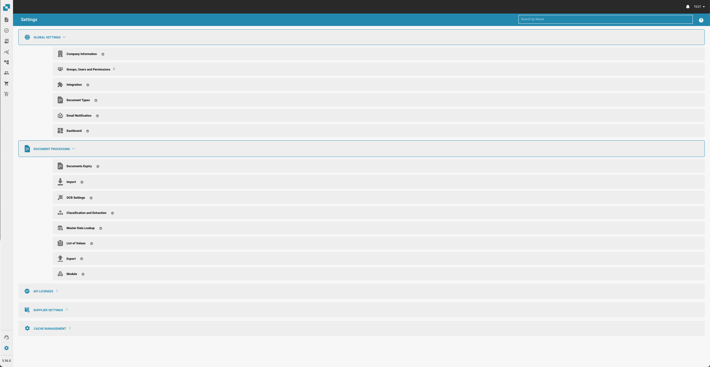

# Instellingen

<figure><figcaption></figcaption></figure>

1. **Globale Instellingen**:
   * **Bedrijfsinformatie**: Definieer en bewerk basisgegevens over het bedrijf, zoals naam, adres en andere identificatoren.
   * **Groepen, Gebruikers en Machtigingen**: Beheer gebruikersrollen en machtigingen, zodat verschillende niveaus van toegang tot verschillende functies binnen DocBits mogelijk zijn.
   * **Integratie**: Stel integraties met andere software of systemen in, waardoor de functionaliteit van DocBits wordt verbeterd met externe diensten.
   * **Documenttypes**: Specificeer en beheer verschillende soorten documenten die DocBits zal verwerken, zoals facturen, bestellingen, enz.
   * **E-mailnotificatie**: Configureer instellingen voor e-mailwaarschuwingen en meldingen met betrekking tot documentverwerkingsactiviteiten.
   * **Dashboard**: Pas de dashboardweergave aan met widgets en statistieken die belangrijk zijn voor de gebruikers.
2. **Documentverwerking**:
   * **Documentverval**: Stel regels in voor hoe lang documenten worden bewaard voordat ze worden gearchiveerd of verwijderd.
   * **Importeren**: Configureer hoe documenten in DocBits worden geïmporteerd, inclusief broninstellingen en bestandstypen.
   * **OCR-instellingen**: Pas instellingen aan voor Optical Character Recognition (OCR) die afbeeldingen van tekst omzet in machine-gecodeerde tekst.
   * **Classificatie en Extractie**: Definieer hoe documenten worden gecategoriseerd en hoe gegevens uit documenten worden geëxtraheerd.
   * **Masterdata Lookup**: Stel opzoekingen in voor het valideren of aanvullen van geëxtraheerde gegevens met reeds bestaande masterdata.
   * **Waardenlijst**: Beheer vooraf gedefinieerde lijsten die worden gebruikt bij gegevensinvoer en validatie.
   * **Exporteren**: Configureer hoe en waar verwerkte documenten en gegevens worden geëxporteerd.
   * **Module**: Extra modules die kunnen worden geconfigureerd om de functionaliteit uit te breiden.
3. **API-licenties**: Beheer API-sleutels en monitor gebruiksstatistieken voor API's die door DocBits worden gebruikt.
4. **Leverancierinstellingen**: Configureer en beheer instellingen die specifiek zijn voor leveranciers, mogelijk geïntegreerd met leveranciersbeheersystemen.
5. **Cachebeheer**: Pas instellingen aan die verband houden met het cachen van gegevens om de prestaties van het systeem te verbeteren.
