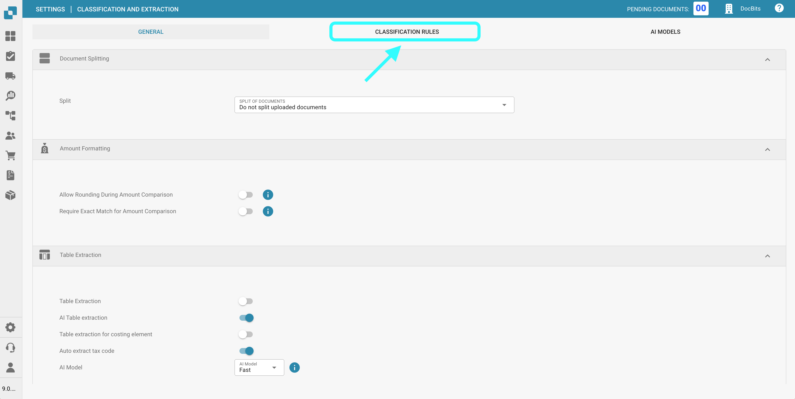
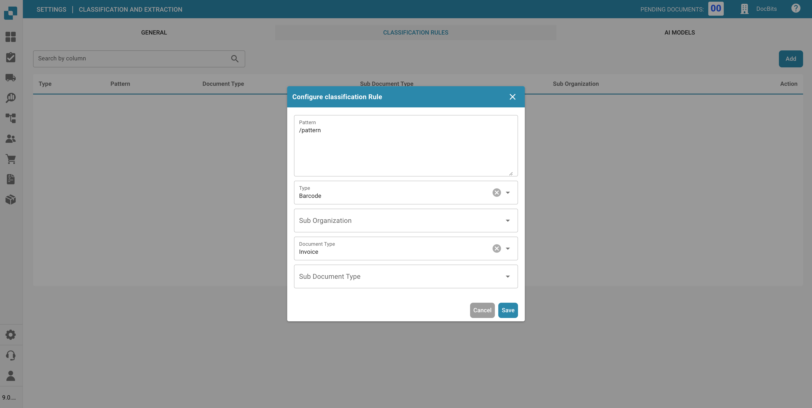
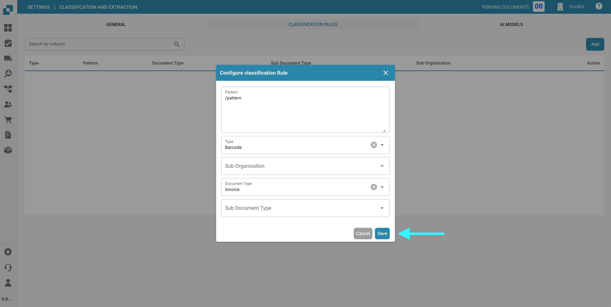
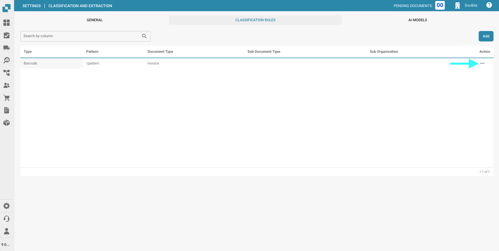
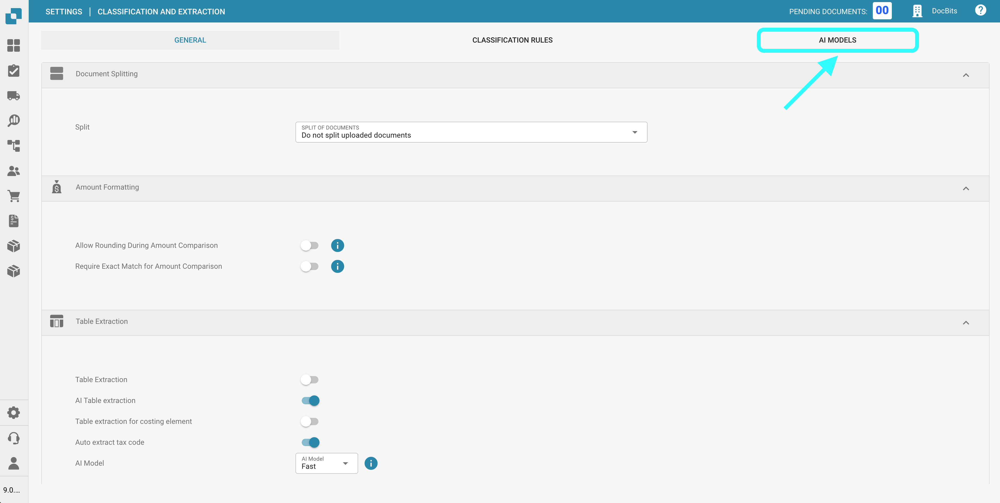
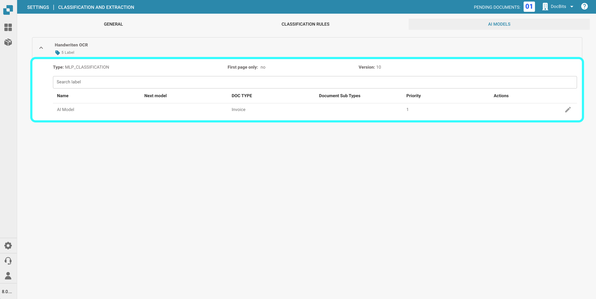
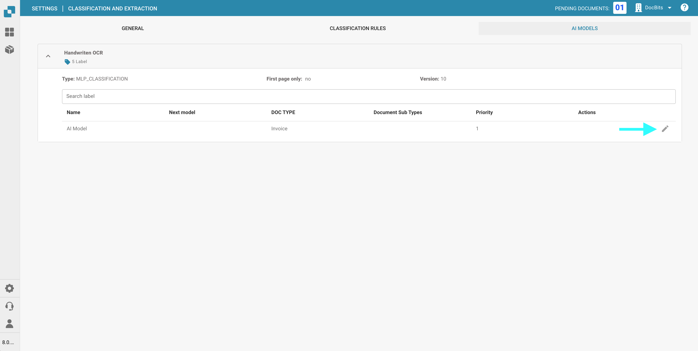
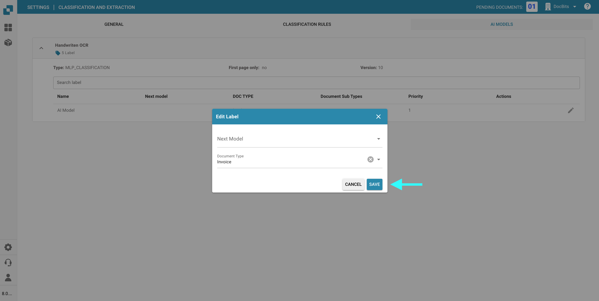

# Classification And Extraction

## Overview

In the **Classification and Extraction** settings, you can:

* Enable **Document Splitting** based on QR codes
* Configure **amount formatting**
* Set up **table extraction**
* Toggle processing of unsupported **ZUGFeRD** files
* Define special classification rules
* Monitor Custom-Trained **AI Models** used in the classification process

This page provides a detailed explanation of all available settings.

## **Accessing Classification and Extraction Settings**

To access the **Classification and Extraction** settings, go to:\
**Settings → Document Processing → Classification and Extraction**

<figure><figcaption></figcaption></figure>

## Document Splitting

In the **Document Splitting** section, you can configure whether an uploaded document should be split into multiple documents whenever a **barcode** appears on one of its pages.

To activate this feature:

1. Click **Split Documents**.
2. Select **Split by Barcode/QR Code**.

You will then have the option to:

* **Select one or more barcode types** to be detected.
* **Specify a regex pattern** that the barcode must match in order to trigger document splitting.

## Amount Formatting

In the **Amount Formatting** section, you have two options:

* **Allow Rounding During Amount Comparison:**\
  If enabled, a tolerance of ±0.5 is allowed during amount comparison.\
  If disabled, a default tolerance of ±0.05 applies.
* **Require Exact Match for Amount Comparison:**\
  If enabled, amounts must match exactly with zero tolerance.\
  If disabled, a tolerance of ±0.05 is allowed.

<mark style="color:red;">**Note**</mark>: Only one of these settings can be active at a time.

## Table Extraction

You can extract tables from documents by enabling either **Table Extraction** or **AI Table Extraction**. A trained table—whether AI-based or manual—will always be linked to a specific supplier.

**Table Extraction:** Activates manual **table extraction**. Tables must be trained manually.\
Learn more about manual training [here](../../../setup/document-training/training-line-fields-table-training/defining-tables-and-columns.md).

**AI Table Extraction:** Uses AI to automatically extract tables. If the results are not accurate enough, it's recommended to switch to manual **Table Extraction** for better control and training.

**Table Extraction for Costing Elements:** When enabled, DocBits can extract costing elements from tables at the line level and classify them accordingly.\
Detailed explanation available [here](table-extraction-for-costing-element.md).

**Auto Extract Tax Code:** When enabled, the system automatically fills the **Tax Code** field on the Validation Screen—provided that a tax code field is configured.\
More information on this setting [here](auto-extract-tax-code.md).

**AI Model:** Allows you to specify which **AI model** is used for table extraction.\
You’ll also see a table showing:

* Which **suppliers** are using which AI model
* Whether they use E-Text
* Options to delete an entry and reset training data

This setting is explained in detail [here](ai-model.md).

## Electronic Document

**Process Unsupported ZUGFeRD PDFs:** If enabled, unsupported ZUGFeRD versions will be processed as standard PDFs, and the embedded XML will be ignored.

The list of supported ZUGFeRD versions can be found [here](../../global-settings/document-types/edi/zugferd-1.0-2.1-and-2.3.md).

## **Classification Rules**

In the **Classification Rules** section, you can define specific **regex patterns** and criteria to help the system automatically classify documents during processing.

To access this section, click the **Classification Rules** tab at the top of the page.

<figure><figcaption></figcaption></figure>

#### **Add a New Classification Rule**

To create a new rule:

1.  Click **Add** in the top-right corner.

    <figure><figcaption></figcaption></figure>
2. Fill in the following fields:
   * **Pattern**: The regex pattern the system should search for to trigger classification.
   * **Type**: Where the pattern should be searched (e.g., **Barcode**).
   * **Sub-Organization** _(optional)_: Specify which sub-organization the rule applies to.
   * **Document Type**: Define the document type to assign when the pattern is matched.
   *   **Sub-Document Type** _(optional)_: Specify a sub-type for more detailed classification.

       <figure><figcaption></figcaption></figure>
3.  Click **Save** to save your classification rule.

    <figure><figcaption></figcaption></figure>

#### **Edit a Classification Rule**

To edit an existing rule:

1.  Click the three dots in the **Actions** column.

    <figure><figcaption></figcaption></figure>
2.  Select **Edit**.

    <figure><figcaption></figcaption></figure>
3. Make your desired changes.
4.  Click **Save** to apply the updates.

    <figure><figcaption></figcaption></figure>

#### **Delete a Classification Rule**

To delete a rule:

1.  Click the **three dots** in the **Actions** column.

    <figure><figcaption></figcaption></figure>
2.  Select **Delete**.

    <figure><figcaption></figcaption></figure>

## AI Models

The **AI Models** section displays all custom-trained models that have been specifically fine-tuned for your needs.

### Accessing the AI Models Section

To open this section, click the **AI Models** tab located at the top of the page.

<figure><figcaption></figcaption></figure>

### Model Categories

Models are organized into categories. Below each category name, the number of models it contains is shown.\
Click on a category to view its details.

<figure><figcaption></figcaption></figure>

At the top of the selected category page, you’ll see key information about each model:

* **Type**: The type of model.
* **First Page Only**: Indicates whether the model processes only the first page of a document.
* **Version**: The version number of the model.

### Model Table

All models within a category are listed in a table, which includes the following information:

* **Name**: The name of the model.
* **Next Model**: The model that will further process the output of the current model.
* **Document Type**: The primary document type assigned by the model during classification.
* **Document Sub-Types**: The sub-types into which the document is further classified.
* **Priority**: The priority level that determines the model’s position in the classification queue.

<figure><figcaption></figcaption></figure>

### Editing a Model

To edit a model:

1.  Click the pen icon in the **Actions** column next to the model you want to edit.

    <figure><figcaption></figcaption></figure>
2. Update the available fields:
   * **Next Model**: Select the model that should process the output from the current model.
   * **Document Type**: Choose the document type the model should classify the input as.
3.  Click **Save** to apply your changes.

    <figure><figcaption></figcaption></figure>
