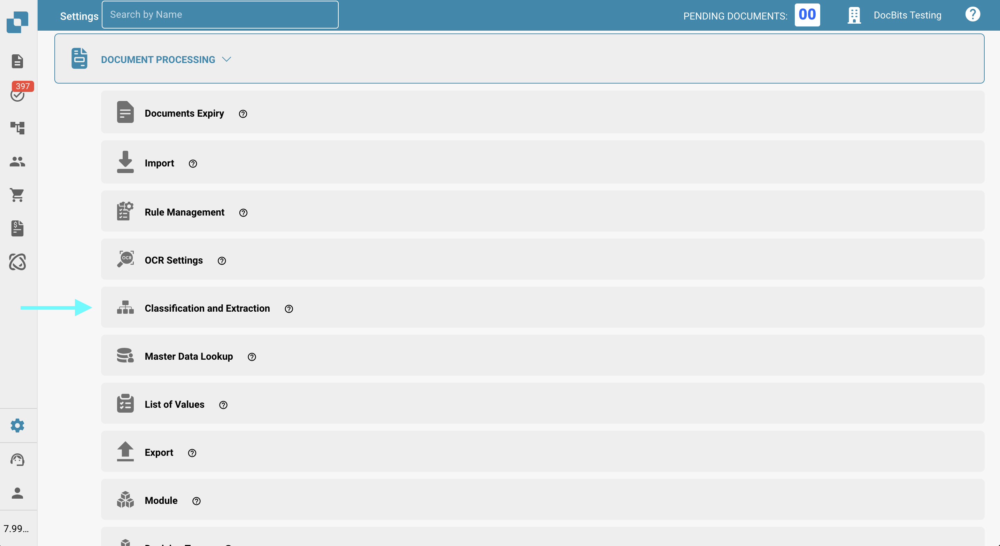
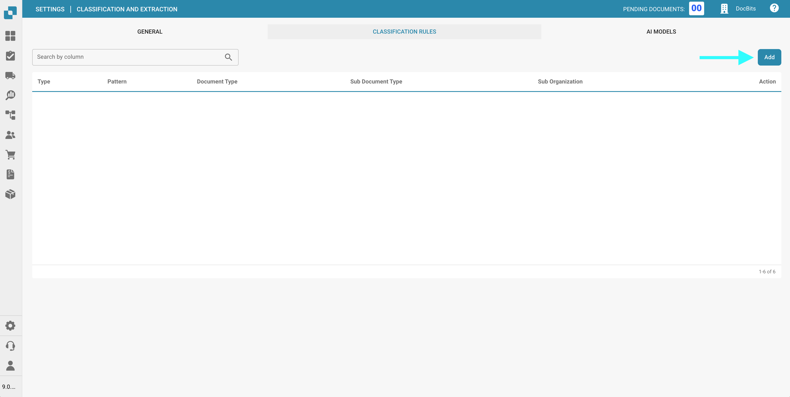
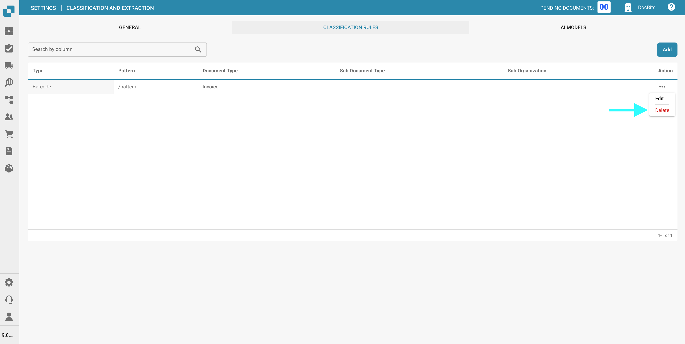

# Sınıflandırma ve Çıkarma

## Genel Bakış

**Sınıflandırma ve Çıkarma** ayarlarında şunları yapabilirsiniz:

* QR kodlarına dayalı **Belge Bölme** özelliğini etkinleştirme
* **Tutar biçimlendirmesini** yapılandırma
* **Tablo çıkarmayı** ayarlama
* Desteklenmeyen **ZUGFeRD** dosyalarının işlenmesini açıp kapatma
* Özel sınıflandırma kuralları tanımlama
* Sınıflandırma sürecinde kullanılan Özel Eğitilmiş **Yapay Zeka Modellerini** izleme

Bu sayfa, mevcut tüm ayarların ayrıntılı bir açıklamasını sağlar.

## **Sınıflandırma ve Çıkarma Ayarlarına Erişim**

**Sınıflandırma ve Çıkarma** ayarlarına erişmek için şuraya gidin:
**Ayarlar → Belge İşleme → Sınıflandırma ve Çıkarma**

<figure><figcaption></figcaption></figure>

## Belge Bölme

**Belge Bölme** bölümünde, yüklenen bir belgenin sayfalarından birinde bir **barkod** göründüğünde birden fazla belgeye bölünüp bölünmeyeceğini yapılandırabilirsiniz.

Bu özelliği etkinleştirmek için:

1. **Belge Bölme** bölümüne gidin.
2. Açılır menüyü açın.

    <figure><figcaption></figcaption></figure>
3. **Barkod/QR Kodu ile Böl**'ü seçin.

    <figure><figcaption></figcaption></figure>

Daha sonra şu seçeneklere sahip olacaksınız:

* Algılanacak bir veya daha fazla barkod türü seçin.
* Belge bölmeyi tetiklemek için barkodun eşleşmesi gereken bir regex deseni belirtin.

    <figure><figcaption></figcaption></figure>

## Tutar Biçimlendirme

**Tutar Biçimlendirme** bölümünde iki seçeneğiniz vardır:

* **Tutar Karşılaştırması Sırasında Yuvarlamaya İzin Ver:**
Etkinleştirilirse, tutar karşılaştırması sırasında ±0.5 toleransına izin verilir.
Devre dışı bırakılırsa, ±0.05 varsayılan toleransı uygulanır.
* **Tutar Karşılaştırması İçin Tam Eşleşme Gerektir:**
Etkinleştirilirse, tutarlar sıfır toleransla tam olarak eşleşmelidir.
Devre dışı bırakılırsa, ±0.05 toleransına izin verilir.

<mark style="color:red;">**Not**</mark>: Bu ayarlardan aynı anda yalnızca biri etkin olabilir.

## Tablo Çıkarma

**Tablo Çıkarma** veya **Yapay Zeka Tablo Çıkarma** özelliğini etkinleştirerek belgelerden tabloları çıkarabilirsiniz. Eğitilmiş bir tablo—ister yapay zeka tabanlı ister manuel olsun—her zaman belirli bir tedarikçiye bağlanacaktır.

**Tablo Çıkarma:** Manuel **tablo çıkarma** özelliğini etkinleştirir. Tablolar manuel olarak eğitilmelidir.
Manuel eğitim hakkında daha fazla bilgiyi [buradan](../../../setup/document-training/training-line-fields-table-training/defining-tables-and-columns.md) edinin.

**Yapay Zeka Tablo Çıkarma:** Tabloları otomatik olarak çıkarmak için yapay zeka kullanır. Sonuçlar yeterince doğru değilse, daha iyi kontrol ve eğitim için manuel **Tablo Çıkarma** özelliğine geçilmesi önerilir.

**Maliyet Öğesi için Tablo Çıkarma:** Etkinleştirildiğinde, DocBits maliyet öğelerini tablolardan satır düzeyinde çıkarabilir ve buna göre sınıflandırabilir.
Ayrıntılı açıklama [burada](table-extraction-for-costing-element.md) mevcuttur.

**Vergi Kodunu Otomatik Çıkar:** Etkinleştirildiğinde, sistem Doğrulama Ekranındaki **Vergi Kodu** alanını otomatik olarak doldurur—bir vergi kodu alanının yapılandırılmış olması koşuluyla.
Bu ayar hakkında daha fazla bilgi [burada](auto-extract-tax-code.md).

**Yapay Zeka Modeli:** Tablo çıkarma için hangi **Yapay Zeka modelinin** kullanılacağını belirtmenize olanak tanır.
Ayrıca şunları gösteren bir tablo göreceksiniz:

* Hangi **tedarikçilerin** hangi yapay zeka modelini kullandığı
* E-Metin kullanıp kullanmadıkları
* Bir girdiyi silme veya eğitim verilerini sıfırlama seçenekleri

Bu ayar [burada](ai-model.md) ayrıntılı olarak açıklanmıştır.

## Elektronik Belge

**Desteklenmeyen ZUGFeRD PDF'sini İşle:** Etkinleştirilirse, desteklenmeyen **ZUGFeRD** sürümleri standart PDF olarak işlenecek ve gömülü XML göz ardı edilecektir.

Desteklenen **ZUGFeRD** sürümlerinin listesi [burada](../../global-settings/document-types/edi/zugferd-1.0-2.1-and-2.3.md) bulunabilir.

## **Sınıflandırma Kuralları**

**Sınıflandırma Kuralları** bölümünde, sistemin işleme sırasında belgeleri otomatik olarak sınıflandırmasına yardımcı olmak için belirli **regex** desenleri ve kriterleri tanımlayabilirsiniz.

Bu bölüme erişmek için sayfanın üst kısmındaki **Sınıflandırma Kuralları** sekmesine tıklayın.

<figure><figcaption></figcaption></figure>

### **Yeni Bir Sınıflandırma Kuralı Ekleme**

Yeni bir kural oluşturmak için:

1. Sağ üst köşedeki **Ekle**'ye tıklayın.

    <figure><figcaption></figcaption></figure>
2. Aşağıdaki alanları doldurun:
   * **Desen**: Sistemin sınıflandırmayı tetiklemek için araması gereken regex deseni.
   * **Tür**: Desenin nerede aranacağı (örneğin, **Barkod**).
   * **Alt Organizasyon** _(isteğe bağlı)_: Kuralın hangi alt organizasyon için geçerli olduğunu belirtin.
   * **Belge Türü**: Desen eşleştiğinde atanacak belge türünü tanımlayın.
   * **Alt Belge Türü** _(isteğe bağlı)_: Daha ayrıntılı sınıflandırma için bir alt tür belirtin.

       <figure><figcaption></figcaption></figure>
3. Sınıflandırma kuralınızı kaydetmek için **Kaydet**'e tıklayın.

    <figure><figcaption></figcaption></figure>

### **Bir Sınıflandırma Kuralını Düzenleme**

Mevcut bir kuralı düzenlemek için:

1. **Eylemler** sütunundaki üç noktaya tıklayın.

    <figure><figcaption></figcaption></figure>
2. **Düzenle**'yi seçin.

    <figure><figcaption></figcaption></figure>
3. İstediğiniz değişiklikleri yapın.
4. Güncellemeleri uygulamak için **Kaydet**'e tıklayın.

    <figure><figcaption></figcaption></figure>

### **Bir Sınıflandırma Kuralını Silme**

Bir kuralı silmek için:

1. **Eylemler** sütunundaki üç noktaya tıklayın.

    <figure><figcaption></figcaption></figure>
2. **Sil**'i seçin.

    <figure><figcaption></figcaption></figure>

## Yapay Zeka Modelleri

**Yapay Zeka Modelleri** bölümü, ihtiyaçlarınız için özel olarak ince ayar yapılmış tüm özel eğitilmiş modelleri görüntüler.

### Yapay Zeka Modelleri Bölümüne Erişim

Bu bölümü açmak için sayfanın üst kısmında bulunan **Yapay Zeka Modelleri** sekmesine tıklayın.

<figure><figcaption></figcaption></figure>

### Model Kategorileri

Modeller kategoriler halinde düzenlenmiştir. Her kategori adının altında, içerdiği model sayısı gösterilir.
Ayrıntılarını görüntülemek için bir kategoriye tıklayın.

<figure><figcaption></figcaption></figure>

Seçilen kategori sayfasının üst kısmında, her model hakkında önemli bilgiler göreceksiniz:

* **Tür**: Modelin türü.
* **Yalnızca İlk Sayfa**: Modelin bir belgenin yalnızca ilk sayfasını işleyip işlemediğini belirtir.
* **Sürüm**: Modelin sürüm numarası.

### Model Tablosu

Bir kategorideki tüm modeller, aşağıdaki bilgileri içeren bir tabloda listelenir:

* **Ad**: Modelin adı.
* **Sonraki Model**: Mevcut modelin çıktısını daha fazla işleyecek model.
* **Belge Türü**: Sınıflandırma sırasında model tarafından atanan birincil belge türü.
* **Alt Belge Türleri**: Belgenin daha fazla sınıflandırıldığı alt türler.
* **Öncelik**: Modelin sınıflandırma kuyruğundaki konumunu belirleyen öncelik seviyesi.

<figure><figcaption></figcaption></figure>

### Bir Modeli Düzenleme

Bir modeli düzenlemek için:

1. Düzenlemek istediğiniz modelin yanındaki **Eylemler** sütunundaki kalem simgesine tıklayın.

    <figure><figcaption></figcaption></figure>
2. Mevcut alanları güncelleyin:
   * **Sonraki Model**: Mevcut modelden gelen çıktıyı işlemesi gereken modeli seçin.
   * **Belge Türü**: Modelin girdiyi sınıflandırması gereken belge türünü seçin.
3. Değişikliklerinizi uygulamak için **Kaydet**'e tıklayın.

    <figure><figcaption></figcaption></figure>
